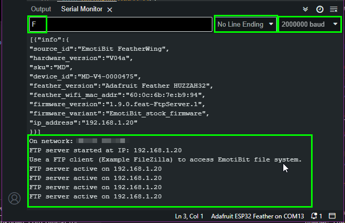
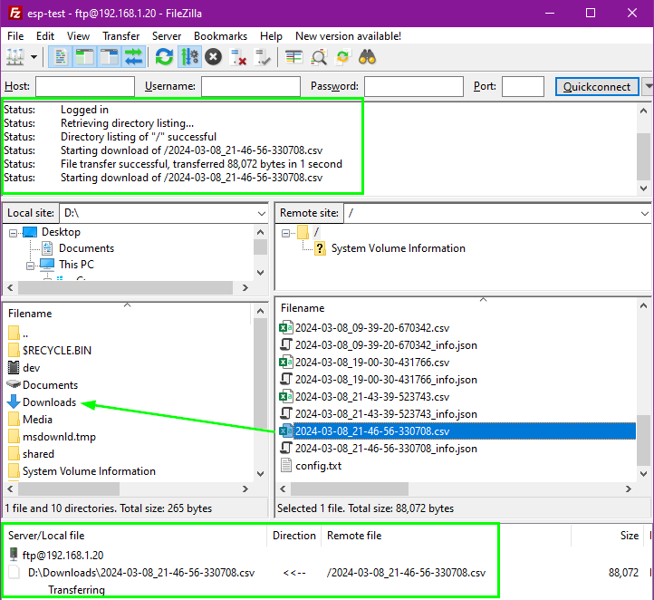
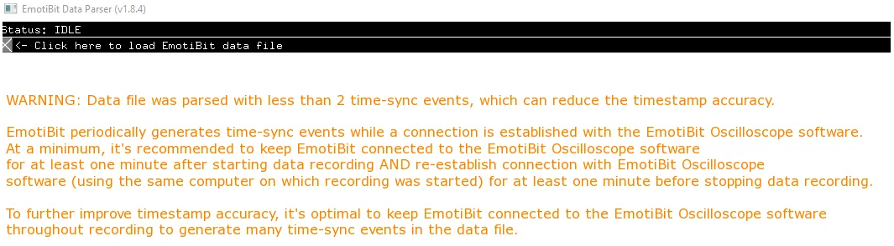

# EmotiBit DataParser
The DataParser is used to convert the raw recorded data into parsed data files.<br>
Start by opening the EmotiBit DataParser on your computer. If you need more help with opening the Emotibit DataParser, 
you may refer to the instructions on the [Getting Started](./Getting_Started.md/#Running-EmotiBit-software) page.

## Parse raw data using EmotiBit DataParser

### Transfer file from SD-Card to computer
The data recorded using EmotiBit is stored on the SD-Card. You can transfer the data from the EmotiBit to the computer in 2 ways.
1. **Using SD card reader**
    - Remove the SD card from the EmotiBit.
    - Plug it into the provided SD-Card reader provided with the Essentials kit or All-in-one-bundle.
    - Plug the SD card reader into the computer. Once the Card is detected on the computer, you can simply copy the files to a location on your computer.
2. <details><summary><b>Using a FTP server on EmotiBit (**only available on ESP32 Feather Huzzah**)</b></summary>

    - With the EmotiBit switched on and running, plug it into the computer using the provided USB cable.
    - Make sure the EmotiBit is not recording data.
    - Open a Arduino Serial monitor. For more details, check out this [FAQ](https://www.reddit.com/r/EmotiBit/comments/vmtz6w/how_i_use_the_arduino_serial_monitor_with_emotibit/).
    - Select `baud rate`=2000000 and `No line ending` from the dropdown options.
    - Type `F` into the input message bar and press Enter.
    - You will see that the EmotiBit will enter FTP mode (red, blue, and yellow LEDs light up on EmotiBit).
    - 
    - You you can trasnfer the files from EmotiBit using an FTP client.
    - Download and install [Filezilla Client](https://filezilla-project.org/), if you do not already have it.
    - Open Filezilla and follow the connection setup instructions as shown in this [link](https://mischianti.org/simple-ftp-server-library-now-with-support-for-wio-terminal-and-sd/#Configure_client)
      - The `Host` IP address will be printed on the serial monitor.
      - The default **user name** is `ftp` and the default **password** is `ftp`. You can change these values in the firmware. In the future, these credentials will be accessible using the `config` file.
    - Once you connect to the FTP server, you can then drag any file from EmotiBit to any location on your computer (inside the FileZilla interface), and it will we copied over the WiFi!
    - 
	- Reset the EmotiBit to exit the FTP mode and enter normal operation.
    </details>


### Parse raw data file

The steps below describe how you can use the DataParser to parse the raw data file to generate individual parsed data files.
- Click on the `Load file` button to open a file browser. Navigate to the raw data(**csv**) file which you want to parse and select that file.
- The parser will show the progress as it parses the data. The DataParser quits automatically on completion.
- The parsed data files are created in the same directory as the original **raw data file**.

![][EmotiBit-DataParser]

For more details on the file types check out the section [below]().


### Parsed data file format
- The parsed data is stored in the following format

|LocalTimestamp | EmotiBitTimestamp | PacketNumber | DataLength | TypeTag | ProtocolVersion | DataReliability | Data | 
|---------------|---------------|---------------|---------------|---------------|---------------|---------------|---------------|
|Epoch time in seconds | EmotiBit time in milli-seconds (emotibit time resets everytime emotibit is rebooted) | Packet number the data point was extracted from (sequentially increases) | Number of data points in the packet | TypeTag of the data (see below) | Reserved for future extensibility | Reserved for future extensibility | Data points |

- The format of the parsed data file can be changed by modifying the `parsedDataFormat.json` file. 
  - <details><summary>parsedDataFormat.json file location</summary>
  
    - On Windows: `C:\Program Files\EmotiBit\EmotiBit DataParser\data`
    - On macOS: `EmotiBitSoftware-macOS/EmotiBitDataParser.app/Contents/Resources`
    - On Linux: `EmotiBitSoftware-linux/ofxEmotiBit/EmotiBitDataParser/bin/data`
    </details>
  - **Note: If this file is erroneously modified, for example, the modified file does not conform to JSON standard (a missing `,` or `[` or `{`), the EmotiBitDataparser will skip loading this file. The parsed output, in this case, will be missing the `LocalTimestamp` column.**

- <details><summary>Adding LSL timestamp column by modifying parsedDataFormat</summary>
  
  To include the appropriate LSL time in the parsed output, just set the **addToOutput** to `true` in the `parsedDataFormat.json` file. 
  Note: LSL timestamps are only relevant if you are using a [LSL marker stream with EmotiBit Oscillosocpe](#timesync-with-lsl-using-marker-stream).
  - Setting **LslLocalTimestamp** to `true` adds timestamps acording to the time on the local LSL clock of the system.
  - Setting **LslMarkerSourceTimestamp** to `true` adds timestamps according to the time set on the 
marker source generator system.
  For example, if you want to add the timestamps as per your local LSL clock (the clock on the system running the EmotiBit Oscilloscope), the file should look like as shown below.
  ```
  {
    "timestampColumns": [
      {
        "identifier": "TL",
        "columnHeader": "LocalTimestamp",
        "addToOutput": true
      },
      {
        "identifier": "LC",
        "columnHeader": "LslLocalTimestamp",
        "addToOutput": true
      },
      {
        "identifier": "LM",
        "columnHeader": "LslMarkerSourceTimestamp",
        "addToOutput": false
      }
    ]
  }
  ```
  When **addToOutput** is set to `true`, an additional column is added to the parsed output, with the column header set as the `columnHeader` specified in the file above.
  </details>

See below for a sample of the a parsed file of typetag AX (Accelerometer X axis)
- <details><summary>Parsed data file example</summary>
  
  ```
  LocalTimestamp,EmotiBitTimestamp,PacketNumber,DataLength,TypeTag,ProtocolVersion,DataReliability,AX
  1726714786.598369,531473.000,17305,3,AX,1,100,-0.436
  1726714786.598369,531473.000,17305,3,AX,1,100,-0.434
  1726714786.598369,531473.000,17305,3,AX,1,100,-0.433
  1726714786.638383,531513.000,17322,3,AX,1,100,-0.434
  1726714786.678397,531553.000,17322,3,AX,1,100,-0.433
  1726714786.718411,531593.000,17322,3,AX,1,100,-0.434
  1726714786.758425,531633.000,17337,2,AX,1,100,-0.437
  1726714786.798439,531673.000,17337,2,AX,1,100,-0.436
  1726714786.838453,531713.000,17354,3,AX,1,100,-0.432
  1726714786.878467,531753.000,17354,3,AX,1,100,-0.434
  1726714786.918481,531793.000,17354,3,AX,1,100,-0.435
  1726714786.958495,531833.000,17370,2,AX,1,100,-0.432
  1726714786.998509,531873.000,17370,2,AX,1,100,-0.435
  1726714787.038523,531913.000,17388,3,AX,1,100,-0.434
  1726714787.078537,531953.000,17388,3,AX,1,100,-0.436
  1726714787.118551,531993.000,17388,3,AX,1,100,-0.434
  1726714787.158565,532033.000,17402,2,AX,1,100,-0.434
  1726714787.198579,532073.000,17402,2,AX,1,100,-0.433
  1726714787.238593,532113.000,17419,3,AX,1,100,-0.435
  1726714787.278607,532153.000,17419,3,AX,1,100,-0.432
  1726714787.318621,532193.000,17419,3,AX,1,100,-0.434
  1726714787.358635,532233.000,17435,2,AX,1,100,-0.435
  1726714787.398649,532273.000,17435,2,AX,1,100,-0.433
  1726714787.438663,532313.000,17455,3,AX,1,100,-0.435
  1726714787.478677,532353.000,17455,3,AX,1,100,-0.434
  ```
  </details>

### Batch parsing
- The parser can currently be run from the command line with the filename (to be parsed) passed as an argument.
- We have created a [shell script](https://github.com/EmotiBit/ofxEmotiBit/blob/master/EmotiBitDataParser/bin/EmotiBitDataParser.sh) to leverage this functionality and "batch parse" multiple files in 1 go.
  - Just grab the script from the repository and run it with the correct arguments.
- As an example, you can place all your raw files in a folder, let's say `data`.
  - Then you can run the script as `./EmotiBitDataParser.sh -x "C:\\Program Files\\EmotiBit\\EmotiBit DataParser\\EmotiBitDataParser.exe" -d "path\\to\\data"`
  - The parser will then parse all the files present in the data folder.
- We plan to further bake this into the software by making this a part of the GUI and it will be rolled out in a future release.

### A note on Timesyncs
- We use periodic timesyncs from the EmotiBit Oscilloscope to improve the accuracy of the data timestamps on EmotiBit.The time syncing mechanism helps in correcting for any drift that may be introduced by the microcontroller clock.
- Timesync pulses are transmitted to Emotibit periodically, as long as the EmotiBit Oscilloscope is connected to EmotiBit. These timesyncs are written with the raw data on the SD-Card to help the DataParser with time calibration.
- The DataParser uses the timesyncs with the shortest Round-Trip-Times(RTT) to calibrate timestamps. The calibration works best if the raw data contains multiple timesyncs spaced throughout the recording. At minimum, the calibration requires 2 timesyncs.
- However, since timesyncs are only recorded while the EmotiBit is connected to the Oscilloscope, it is possible that the recorded data has fewer than 2 timesyncs. A scenario where the Oscilloscope was closed immediately after starting a recording session can lead to this situation.
- In cases where the EmotiBit DataParser finds fewer than 2 timesyncs, a warning will be displayed to the user after the file is parsed making them aware of the effect of having fewer than 2 timesyncs on the timestamp accuracy.
  - 
- <details><summary>What to expect when you have 0 timesync events in the recorded file</summary>
  
  - **The values in the LocalTimeStamp will start from 0**. This is because the data does not have any timesyncs to create a relation between
  EmotiBitTime and LocalTime.
  - The data parser needs at least 2 timesync events to interpolate/extrapolate LocalTime. Hence, there will be no time correction to 
  any drift experienced by the emotibit clock.
  </details>
- <details><summary>What to expect when you have 1 timesync event in the recorded file</summary>

  - The values in the LocalTimeStanp column **will start form the Local Time corresponding to the moment the recording was initiated**.
  - The data parser needs at least 2 timesync events to interpolate/extrapolate LocalTime. Hence, there will be no time correction to 
  any drift experienced by the emotibit clock.
  </details>
