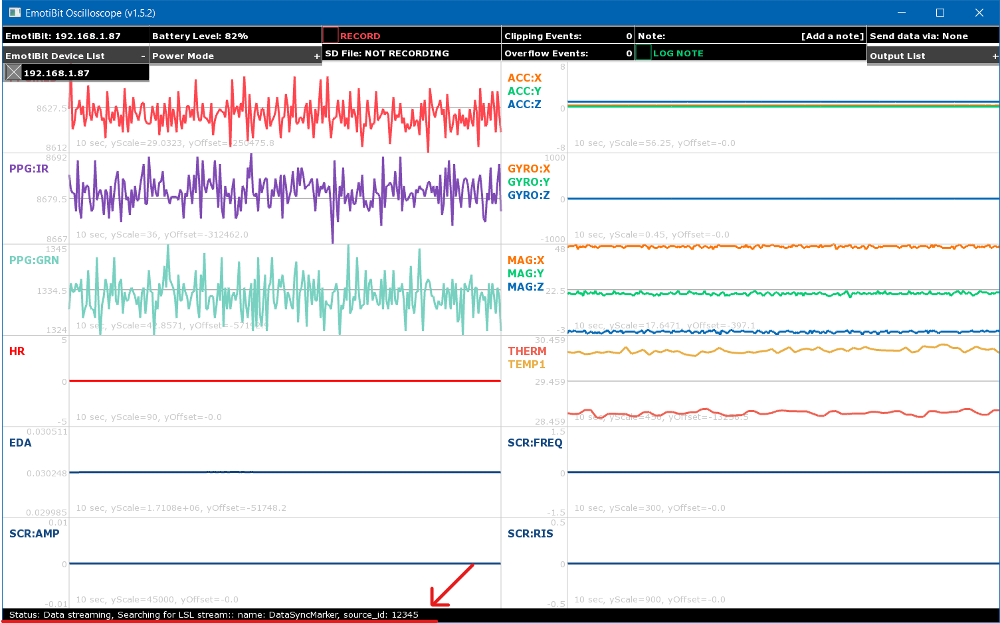
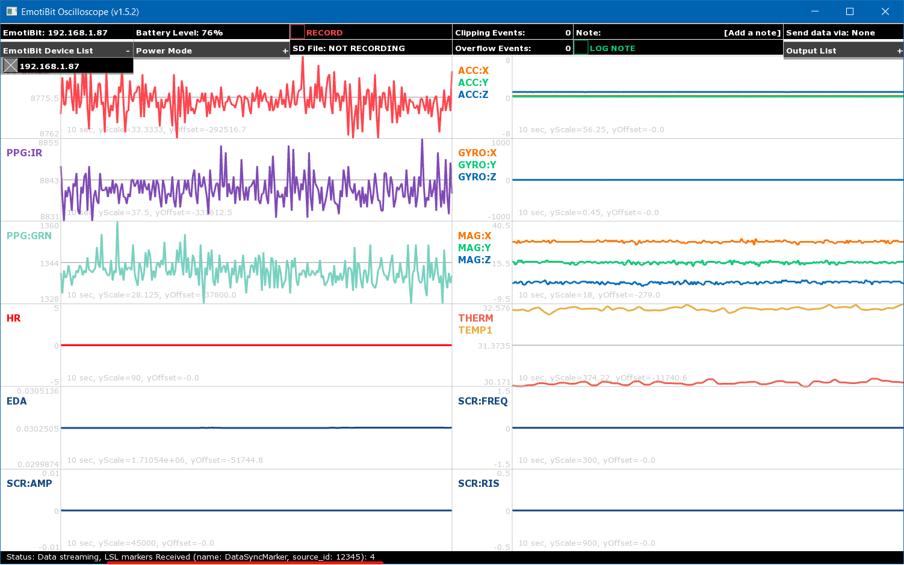

# EmotiBit Oscilloscope
EmotiBit Oscilloscope offers the ability to stream data in real-time from EmotiBit to your computer along with an array of other features.

Start by opening the EmotiBit Oscillosocpe on your computer. If you need more help with opening the Emotibit Oscilloscope, 
you may refer to the instructions on the [Getting Started](./Getting_Started.md/#Running-EmotiBit-software) page.

## EmotiBit Oscilloscope features
- The Oscilloscope offers the following features:
![][EmotiBit-Oscilloscope]

  - <details><summary>Connecting to EmotiBit</summary>

    - The Oscilloscope displays all available EmotiBits on the network in a list.  
    - You can click on any EmotiBit in the list to connect to it. 
    </details>

  - <details><summary>Streaming real-time Data</summary>

    - The moment you connect to an EmotiBit, the EmotiBit Ocsilloscope will display the data being transmitted by the EmotiBit.
    - Once a connection between the Oscilloscope and EmotiBit has been established, the EmotiBit Blue LED turns ON.
      - The EmotiBit Blue LED stays on as long as the EmotiBit is connected to an Oscilloscope. 
    </details>
  
  - <details><summary>Recording Data</summary>
    
    - Select an EmotiBit from the list of available EmotiBits.
    - You can initiate a record session by clicking on the record button. When a record session is initiated, the EmotiBit will start recording the data on the onboard SD-Card as well as stream it on the Oscilloscope.
      - The EmotiBit Red LED starts blinking once a recording session has been initiated.
    - You are free to move in/out of the network, close the Oscilloscope, or connect to a new Oscilloscope.
    - We recommend using the EmotiBit in-network as much as possible, connected to the Oscilloscope. This helps in generating more time-syncs which improves timestamp accuracy.
    </details>
  
  - <details><summary>Log note(labeling data)</summary>
    
    - Users can annotate data by adding labels/notes in real time. 
    - Type in the Note in the `Log Note` text box and click on the `Log Note` button to add notes to the data being recorded.
    </details> 
    
  - <details><summary>Power Modes</summary>
    
    The EmotiBit has 4 power modes. All modes can be accessed using the EmotiBit Oscilloscope.
    - **Normal Mode**: In normal mode, the EmotiBit works with complete functionality, being able to record and transmit data.
    - **Low Power Mode**: In Low power mode, the EmotiBit can record but cannot transmit data in real-time. It, however, continues to get the time-sync pulses.
    - **WiFi Off**: The onboard WiFi shield is shut down in this mode. This saves power and enables longer recording sessions. 
      - A `short press` of the [EmotiBit button](https://github.com/EmotiBit/EmotiBit_Docs/blob/master/Getting_Started.md#emotibit-leds-and-buttons) toggles `normal mode` and `WiFi off mode`.
      - If using the EmotiBit in `WiFi off` mode, we recommend toggling the EmotiBit to `normal mode` (short EmotiBit Button press) towards the end of the recording. Once in `normal mode` you can reconnect to the EmotiBit using the EmotiBit Oscilloscope and stream data for ~30 seconds to collect timesync pulses towards the end of the recording.
    - **Sleep**: In sleep mode, EmotiBit stops any tasks it is performing and goes to sleep.
      - A `long press` of the [EmotiBit button](https://github.com/EmotiBit/EmotiBit_Docs/blob/master/Getting_Started.md#emotibit-leds-and-buttons) can activate the sleep mode.
      - We recommend switching the EmotiBit into `Sleep mode` instead of un-plugging the EmotiBit battery when not in use for short periods.
      - If the EmotiBit is being left un-used for a long duration, it is best to flip the Hibernate Switch to `HIB`.
      - Refer [EmotiBit LEDs and buttons section](./Learn_more_about_emotibit.md#LEDs-and-Buttons) for more information on the Hibernate switch.
    </details>
  
  - <details><summary>DC/DO counter</summary>

    `Data Clipping` and `Data Overflow` are metrics that are used to determine data integrity.
    
    - `Data Clipping`: A clipping event occurs when the data recorded by any sensor goes out of the predefined bounds. 
    - `Data Overflow`: An overflow event occurs when the internal data buffers overflow, which results in loss of data samples.
    </details>

  - <details><summary>Battery Level Indicator</summary>
  
    - The Battery Level indicator displays the charge available in the battery as a percentage. 
    - We recommend not letting the battery fall below 10% as it might begin to interfere with the sensor data acquisition.
    </details>

## Using EmotiBit Oscilloscope to Record Data
Once you have succesfully set up your EmotiBit, you can start recording data using the EmotiBit Oscilloscope. If you have
not yet set up your EmotiBit, check our guide on the [Getting Started](./Getting_Started.md/#Running-EmotiBit-software) page.


### Active recording session indicator
You can check if a recording session is currently active by either checking the EmotiBit or the EmotiBit Oscilloscope.
- **Indication on the EmotiBit**
  - You will notice that the EmotiBit RED LED starts blinking if a recording session is active.
  - The EmotiBit RED LED will continue to blink till the active recording session has been stopped using the EmotiBit Oscillosocpe.
- **Indication on the EmotiBit Oscilloscope**
  - When you open the Oscilloscope, all available EmotiBits on the network will be listed under the `device list`. Select the EmotiBit you are interested in from the device list.
  - If a recording session is currently active, the name of the file being recorded appears below the `Record Button`. This name indicates the time when the recording was started.
    - *Pro-tip: You can check the length of active recording by subtracting the current time from the time displayed in the `Recording section` on the Oscillosocpe.*

[Click here to learn how to use the DataParser](#Parse-raw-data-using-EmotiBit-DataParser) to convert the raw data into parsed data files.
<br> If you want to learn about all the features offered by the EmotiBit Oscilloscope, check out the section [below](#EmotiBit-Oscilloscope-features).


### Output List
- The output list shows the options available to transmit the data out of the EmotiBit Oscilloscope.
- Each output protocol uses settings specified in the unique file name, defined in the sections below.
- Depending on your operating system, the settings file can be found in the locations listed below
      - Windows: `C:\Program Files\EmotiBit\EmotiBit Oscilloscope\data\`
      - macOS: `EmotiBitOscilloscope/Contents/resources/`
      - Linux: `EmotiBit Oscilloscope/bin/data/`     - 
- <details><summary>OSC</summary>

  - **EmotiBit Oscilloscope v1.2.0 and up** support the ability to transmit incoming data from an EmotiBit to a user-defined output channel using the OSC protocol.
  - To enable OSC, just click on the `Output List` dropdown in the EmotiBit Oscilloscope and enable `OSC`.
  - The EmotiBit Oscilloscope reads in and transmits out the data according to the specifications provided in the `oscOutputSettings.xml` file. 
  - You can find the settings file in the path mentioned above.
  - You can modify the contents of this file to control the behavior of the OSC output stream.
  - A snippet of the default contents are shared below
    ```
    <patchboard>
      <settings>
        <input>
          <type>EmotiBit</type>
        </input>
        <output>
          <type>OSC</type>
          <ipAddress>localhost</ipAddress>
          <port>12345</port>
        </output>
      </settings>
      <patchcords>
        <patch>
          <input>PR</input>
          <output>/EmotiBit/0/PPG:RED</output>
        </patch>		
            <patch>
          <input>PI</input>
          <output>/EmotiBit/0/PPG:IR</output>
        </patch>	
        <patch>
          <input>PG</input>
          <output>/EmotiBit/0/PPG:GRN</output>
        </patch>
      </patchcords>
    </patchboard>	
    ```
  - As you can see, the `input` is set to an EmotiBit, which is streaming data to the oscilloscope.
  - The Oscilloscope takes this data and relays it over the IP-Address and Port specified. 
  - A `patch` connects an input stream to an output stream. In the snippet above, the input `PR` (PPG Red channel) stream is patched to the output stream called `/EmotiBit/0/PPG:IR`
    - The `<input>` tag should contain the Typetag of the data you want to relay. The available typetags can be found in the [section below](#EmotiBit-data-types).
    - The `<output>` tag should contain the name of the OSC stream you want to relay the data as.
  - For example, to add SCR (Skin conductance response) metrics to OSC, you would add the following lines to the relevant section of the `oscOutputSettings.xml` file.
    ```
    <patch>
    <input>SA</input>
    <output>/EmotiBit/0/SCR:AMP</output>
      </patch>
      <patch>
    <input>SR</input>
    <output>/EmotiBit/0/SCR:RIS</output>
      </patch>
      <patch>
    <input>SF</input>
    <output>/EmotiBit/0/SCR:FREQ</output>
    </patch>
    ```   
  - When using the OSC protocol, at the receiver, you must use the same IP-Address, Port number, and label name you used as the output label here. To get started, check out this example of [OSC Oscilloscope as a receiver](https://github.com/produceconsumerobot/ofxOscilloscope/tree/master/oscOscilloscopeExample). If you have enabled OSC data transmission on the Emotibit Oscilloscope, you can run the example in the above link to plot the data being relayed by the EmotiBit oscilloscope.
  </details>
    
- <details><summary>UDP</summary>
  
  - **EmotiBit Oscilloscope v1.7.1 and up** support the ability to transmit incoming data from an EmotiBit to a user-defined output channel using the UDP protocol.
  - To enable UDP, just click on the `Output List` dropdown in the EmotiBit Oscilloscope and enable `UDP`.
  - The EmotiBit Oscilloscope reads in and transmits out the data according to the specifications provided in the `udpOutputSettings.xml` file.
  - You can find the settings file in the path mentioned above. You can modify the contents of this file to control the behavior of the UDP output stream.
  - A snippet of the default contents are shared below
  ```
  <patchboard>
    <settings>
      <input>
        <type>EmotiBit</type>
      </input>
      <output>
        <type>UDP</type>
        <ipAddress>localhost</ipAddress>
        <port>12346</port>
      </output>
    </settings>
    <patchcords>
    </patchcords>
  </patchboard>		
  ```
  </details>

- <details><summary>LSL</summary>

  - **EmotiBit Oscilloscope v1.11.1 and up** support the ability to transmit incoming data from an EmotiBit to a user-defined LSL stream.
  - To enable UDP, just click on the `Output List` dropdown in the EmotiBit Oscilloscope and enable `LSL`.
  - The LSL stream details are provided in the `lslOutputSettings.json` file. You can find this settings file in the operating-system-specific location mentioned above. Modifying the contents on this file updates the LSL stream details being transmitted by the EmotiBit.
  - The **patchcords** section in the documentation ties the input EmotiBit stream to the name of the output LSL stream. A complete list of EmotiBit data typetags can be found [here](#EmotiBit-data-types). 
  </details>

## EmotiBit Oscilloscope settings

### Settings files location

Based on the operating system, users can find the settings files in the following locations:
- For Windows users(Users will also need to give the file "write privileges". Check out this [FAQ](https://www.reddit.com/r/EmotiBit/comments/urp7dq/how_do_i_edit_files_installed_by_emotibit/) to learn how):
  - `C:\Program Files\EmotiBit\EmotiBit Oscilloscope\data\`
- For mac users
  - `EmotiBitSoftware-macOS/EmotiBitOscilloscope.app/Contents/Resources/`
  - Note: Users need to right-click the `EmotiBitOscilloscope` application (*inside the software bundle just downloaded*) and click on `Show Package Contents`. You can then find the files in `Contents > Resources`
- For linux users
  - `EmotiBitSoftware-linux/ofxEmotiBit/EmotiBitOscilloscope/bin/data/`

### EmotiBit Oscilloscope network settings
The software release `v1.4.11` adds the ability for users to tweak their network settings using the `emotibitCommSettings.json` file.
Refer the [section above](#Settings-files-location) to locate this file on your system.

- <details><summary><b>emotibitCommSettings.json</b></summary>

  - `sendAdvertisingInterval_msec` allows users to specify how frequently (time in mS) they want the Oscilloscope to ping the network to find EmotiBit. The default setting should work in most cases and we recommend
changing this setting only if it is required by your network admin.
  - `checkAdvertisingInterval_msec` allows users to specify how frequently (time in mS) they want the Oscilloscope to search for EmotiBit responses on the network. 
Again, we recommend changing this setting only if it is required by your network admin.
  - Users can now choose between `broadcast` vs `unicast` advertising. You can also specify ip ranges to ping for unicast! This will be beneficial for users that: 
    - are working with routers that block broadcast(ex: iPhone hotspot). Check out the note below for using the latest Oscilloscope(v1.4.11) with iPhone hotspot.
    - perform poorly with unicast. The oscilloscope now uses broadcast by default, so it should just work... and work better!
  - Specifically in `unicast mode` there are 2 more options available. Most users will never have to change these settings, but if you are working
in a constrained network environment, these settings may help to conform to network admin requirements.
    - `nUnicastIpsPerLoop` specified the number of IPs you want to ping at time.
    - `unicastMinLoopDelay_msec` specifies the min time to wait before trying to ping IPs on the network again.
  - Ability to exclude or include networks while looking for EmotiBits.
    - `excludeList`: If you don't want EmotiBit Oscilloscope to look for EmotiBit in a particular network, add it to the excludeList
    - `includeList`: If you want EmotiBit Oscilloscope to look for EmotiBits ins specific networks, add it to the includeList

  **Special note for iPhone hotspot users**
	
    iPhone does not allow broadcasting on its hotspot. Since the new Oscilloscope(v1.4.11+) uses broadcast(for advertising) by default, users will have to make the following change in the emotibitCommSettings.json to use EmotiBit on iPhone hotspot.
	1. Locate the file (as suggested above) based on your operating system.
	2. change "broadcast" -> "enabled" to false
	3. change "unicast" -> "enabled" to true
	4. Save the file.
	5. Run the Oscilloscope app!

    The modified file should look like the snippet shown below.
	```
    {
      "wifi": {
        "advertising": {
          "sendAdvertisingInterval_msec": 1000,
          "checkAdvertisingInterval_msec": 100,
          "transmission": {
            "broadcast": {
              "enabled": true
            },
            "unicast": {
              "enabled": true,
              "ipMax": 254,
              "ipMin": 2,
              "nUnicastIpsPerLoop": 1,
              "unicastMinLoopDelay_msec": 3
            }
          }
        },
        "network": {
          "excludeList": [ "" ],
          "includeList": [ "*.*.*.*" ]
        }
      },
      "lsl": {
        "marker": {
          "name": "",
          "sourceId": ""
        }
      }
    }

	```
  </details>

### Using LSL with EmotiBit Oscilloscope
#### LSL output
You can use the EmotiBit Oscilloscope to relay incoming EmotiBit data to output LSL streams. Check out the [output list section](#Output-List) aboce for more details.

#### Timesync with LSL using marker stream
EmotiBit oscillosocpe can ingest an LSL marker stream and use that stream to timestamp
EmotiBit data being recorded to LSL time. A marker stream is specified by a `name` and `sourceId`. By default the EmotiBit Oscilloscope searches for a LSL marker stream with the name `DataSyncMarker` and sourceId `12345`. You can create this stream by referring this [example](https://github.com/EmotiBit/ofxLSL/#example-for-generating-marker-stream).

If you want the Oscilloscope to search for a different marker stream, please refer the steps below.

- <details><summary>Specifying LSL marker stream for EmotiBit Oscilloscope</summary>

  You need to specify the marker stream information in the `emotibitCommSettings.json` file. 
Refer the [section above](#Settings-files-location) to locate this file on your system.
 
  For Example, an LSL marker stream with **name** `DataSyncMarker` and **source_id** `12345` can be specified in the `emotibitCommSettings.json` as shown below
  ```
    {
      "wifi": {
        "advertising": {
          "transmission": {
            "broadcast": {
              "enabled": true
            },
            "unicast": {
              "enabled": false,
              "ipMax": 254,
              "ipMin": 2
            }
          }
        },
        "network": {
          "excludeList": [ "" ],
          "includeList": [ "*.*.*.*" ]
        }
      },
      "lsl": {
        "marker": {
          "name": "DataSyncMarker",
          "sourceId": "12345"
        }
      }
    }
  ```
  With the stream information specified, when you open the EmotiBit Oscilloscope, you can find the same information on the status bar (at the bottom of the Oscilloscope). The EmotiBit Oscilloscope will continue to search for the stream till it is detected. 
  	

  Once detected, the EmotiBit starts receiving markers from the stream and displays a `markers received` count on the status bar. You need at least 2 markers during the recording to generate LSL timestamps.
  

  Check out this [section](#Parsing-EmotiBit-timestamps-to-LSL-time) to enable the DataParser to add LSL timestamps in the parsed data.

  **Note: Please make sure that your marker stream has both a **name** and a **source_id**. Connecting to a stream that only has the **name** specified
  can cause the Oscilloscope to crash, if the marker stream disconnects un-expectedly. This however, does not affect any data being recorded on the EmotiBit!**
  </details>

### EmotiBit Oscilloscope display settings
Users can use the `ofxOscilloscopeSettings.xml` file to change other Oscillocsope settings.
Refer the [section above](#Settings-files-location) to locate this file on your system.

- <details><summary>Using ofxOscilloscopeSettings.xml file</summary>

  Each datastream is a `plot` on a `scope panel`. The example below shows the settings available for each scope.
  ```
  <scope>
      <samplingFrequency>25.000000000</samplingFrequency> ## represents the sampling rate of the signal
      <timeWindow>10.000000000</timeWindow>               ## duration of time represented in the scope
      <yMin>0.000000000</yMin>                            ## min. signal threshold for display
      <yMax>0.000000000</yMax>                            ## max. signal threshold for display
      <minYSpan>0.000000000</minYSpan>                    ## min. allowed (yMax-yMin)
      <plot>
          <plotId>0</plotId>                              ## Plot ID. !! DO not change this. It should always follow the information specified in inputSettings.xml
          <plotName>PPG:RED</plotName>                    ## Plot name displayed on the screen
          <plotColor>                                     ## Plot color in RGB channels
              <r>255</r>               
              <g>69</g>
              <b>78</b>
          </plotColor>
      </plot>
  </scope>
  ```
  Close any running Oscilloscope window. Change any setting in this file. Reopen EmotiBit Oscilloscope to see the changes take effect.
  
  As an example, if you are using the 100Hz PPG example, then the PPG plot settings look something like:
  ```
  <scope>
        <samplingFrequency>100.000000000</samplingFrequency>
        <timeWindow>10.000000000</timeWindow>
        <yMin>0.000000000</yMin>
        <yMax>0.000000000</yMax>
        <minYSpan>0.000000000</minYSpan>
        <plot>
            <plotId>0</plotId>
            <plotName>PPG:RED</plotName>
            <plotColor>
                <r>255</r>
                <g>69</g>
                <b>78</b>
            </plotColor>
        </plot>
    </scope>
	<scope>
        <samplingFrequency>100.000000000</samplingFrequency>
        <timeWindow>10.000000000</timeWindow>
        <yMin>0.000000000</yMin>
        <yMax>0.000000000</yMax>
        <minYSpan>0.000000000</minYSpan>
        <plot>
            <plotId>1</plotId>
            <plotName>PPG:IR</plotName>
            <plotColor>
                <r>128</r>
                <g>75</g>
                <b>181</b>
            </plotColor>
        </plot>
    </scope>
	<scope>
        <samplingFrequency>100.000000000</samplingFrequency>
        <timeWindow>10.000000000</timeWindow>
        <yMin>0.000000000</yMin>
        <yMax>0.000000000</yMax>
        <minYSpan>0.000000000</minYSpan>
        <plot>
            <plotId>2</plotId>
            <plotName>PPG:GRN</plotName>
            <plotColor>
                <r>120</r>
                <g>209</g>
                <b>192</b>
            </plotColor>
        </plot>
    </scope>
  ```
  </details>

[EmotiBit-Oscilloscope]: ./assets/Visualizer_green_800px.gif "EmotiBit-Oscilloscope"
