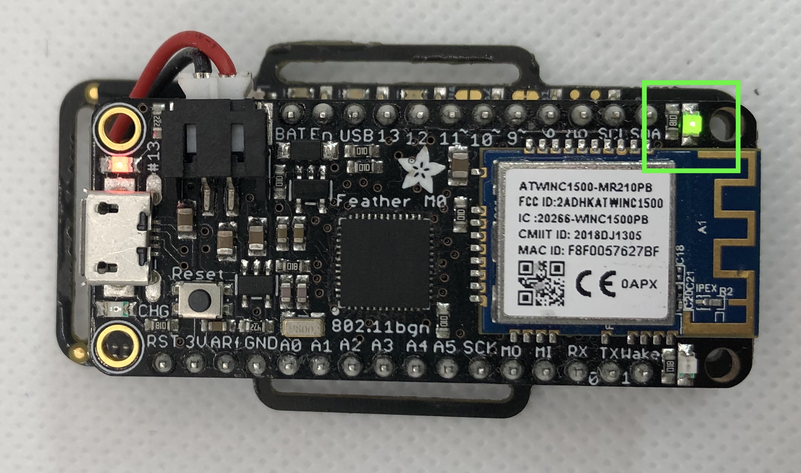

# Getting Started with EmotiBit
[comment]: <> ([alt text][SideView])

# Table of Contents
- [If you just received your EmotiBit](#If-you-just-received-your-EmotiBit)
  - [Unboxing](#Unboxing)
  - [Connecting To WiFi](#connecting-to-wifi)
  - [Get the Software](#Get-the-Software)
  - [Powering Up](#Powering-up)
- [EmotiBit: LEDs and Buttons](#EmotiBit-LEDs-and-Buttons)
- [Streaming Data in Real Time and Recording](#Streaming-Data-in-Real-Time-and-Recording)
- [Next Steps](#Next-Steps)
- [Troubleshooting](#Troubleshooting)

# Stack, Sense and Stream

- Follow the steps below for more information on how to connect to the WiFi and downloading EmotiBit software.

## EmotiBit Forum

The [EmotiBit forum](http://forum.emotibit.com) is a great place to get answers to all things EmotiBit! 
You can use the forum for
- Find answers to questions you may have about using EmotiBit.
- Offering support to fellow community members by providing insight into your experience.
- Take a glance at the [EmotiBit FAQ](https://www.reddit.com/r/EmotiBit/comments/s6hv54/emotibit_frequently_asked_questions_faq/). *Great minds think alike! If you have a question, the FAQ page probably has an answer.*

## Unboxing
Depending on your order, you will have received one of the following EmotiBit packages.

### EmotiBit 

- **1x EmotiBit** with finger loop velstretch
  - Depending on your purchase, you may either have an EmotiBit MD or an EmotiBit EMO
- **1x EmotiBit cover**(acts as barrier between skin)
- **2x Ag-AgCl Electrodes** attached to the EmotiBit
- **2x EmotiBit stickers**

-------------------------------

### Essentials Kit

The Essentials kit contains everything you will need to get started with EmotiBit! In the box you will find
- **Adafruit feather** M0 WiFi, programmed and ready to use
- **Micro SD-Card** with SD-Card adapter
- **3.7V 400mAh battery**
- **USB cable**
- **velstretch straps** of 3 different sizes
  - 1x headstrap
  - 1x shoulder strap
  - 1x wrist strap
- **Plastic spudger**
  - This should be used to easily toggle the hibernate switch, accessible from the bottom of the EmotiBit.

-------------------------
### Electrode Kit
The electrode kit has been designed for users who use multiple EmotiBits for research and intend to frequently swap out the electrodes. the electrode kit includes
- 10x Ag-AgCl snap electrodes
- 4x solder cup electrodes
  - The solder cup electrodes can be used to solder wires to. The user can then use the solder cup electrodes to breakout the EDA sub-system input.

---------------------------
### All-in-one-bundle
If you purchased the All-in-one-bundle, you will receive the [EmotiBit](#EmotiBit), [Essentials Kit](#Essentials-Kit) and [Electrode Kit](#Electrode-Kit).

------------------
## Assembling your EmotiBit
### Adding the WiFi credentials

- Plug in the USB card reader loaded with the SD-Card into the computer.
- Download the config file from https://www.emotibit.com/files/config.
- Open the config file in any text editor(ex: Notepad on windows or text edit on macOS).
- Add the WiFi credentials by changing `myWifiNetwork` to the name of your WiFi network and change `myPassword`to the password for your WiFi network. 
- Save the file onto your microSD card. Eject the SD-Card from your computer. 

**Pro tip**: If you use multiple WiFi networks and want your EmotiBit to automatically connect to whichever one is in range, simply add both networks to the WifiCredentials array in the config file like this: {"WifiCredentials": [{"ssid": "myWifiNetwork1", "password" : "myPassword1"},{"ssid": "myWifiNetwork2", "password" : "myPassword2"}]}.

**Note: EmotiBit only supports the 2.4GHz band for WiFi. Also, currently there is no support for enterprise networks.**

### Stack your EmotiBit!

- On the EmotiBit
  - Insert the SD-Card into the EmotiBit.
  - Make sure the sliding switch(*Hibernate switch*) on the lower side is not on HIB. *(Avaiable on only V4)*
- Plug in the Battery into the Feather.
- Stack the Feather with the EmotiBit(*12 pin connector goes into the 12 pin socket and the 16 pin connector goes into the 16 pin socket*)

![][EmotiBit-stackup]

## Installing EmotiBit Software

[Download the EmotiBit Oscilloscope](https://github.com/EmotiBit/ofxEmotiBit/releases/latest).
- 

<b>Installation Instructions For Windows Users</b>

 
    - _**Note:** EmotiBit software is supported only for Windows 10._
    - After you have downloaded `EmotiBitSoftware-Windows.zip`, go ahead and extract it.
    - You will find a `.msi` installer inside the extracted folder. Run the installer by double-clicking.
      - If the Windows Defender SmartScreen pops up, click on `More Info`.
      - Then click on `Run Anyway`.
      - 
    - Follow through the setup. Click on `Close` once the setup is complete and the EmotiBit Software has been installed.
    - You will notice that shortcuts to `EmotiBit Oscilloscope` and `EmotiBit DataParser` have been created in the start menu and on the desktop.
    - **Note: The EmotiBit Software installation process is sometimes blocked by any anti-virus tool you might have installed on your system. If you face any issues with installation, make sure to check that the appropriate settings are enabled on your anti-virus software to allow a third-party installs.**
  

- 

<b>Installation Instructions For Mac Users</b>

    
  - Move the downloaded zip file to a folder location you desire. Double click on the .zip file to extract it.
  - You will find the Application(`EmotiBit Oscilloscope` and `EmotiBit DataParser`) in the extracted folder.
      ![][oscilloscope-drirectory]
  
  - 

Opening Software in mojave

        
      - Right click on the EmotiBitOscilloscope app. Choose **Open**. 
      - If this is the first time you are using this application, a dialog box might appear asking you to `Allow` this application. Click on `Allow`. 
      - You will see the EmotiBit Oscilloscope Application start.
    

  - 

Opening Software in Catalina

  
      - Right click on the EmotiBitOscilloscope app. Choose **Open**. 
      - A dialog box will appear with options `Move to Trash` or `Cancel`. Click `Cancel`. You will have to allow the application to run in the `Security and Privacy` center. To do so:
              ![][macOs-Catalina-Initial_Oscilloscope_Error]
      - Click on the `Apple Logo` > `Syatem Preferences` > `Security and Privacy`.
              ![][macOS-Catalina-sys_pref]
      - You will find a request for `EmotiBit Oscilloscope` at the bottom of this window. Click on `Open Anyways`. 
              ![][macOS-Catalina-System_pref_Security&options]
      - Click on `Allow` on the dialog box that appears.This will open the `EmotiBit Oscilloscope` application.
              ![][macOS-Catalina-Allow_emotibit]
    

  > **Note that the Software is currently supported only for macOS-**Mojave**[version 10.14] and macOS-**Catalina**[version 10.15].**
  - 

Check your Operating System version

    
    - You can find your macOS version by clicking on the `Apple Logo`(on the top left of your screen) > `About This Mac`.
    
    
    

  
    

## Installing EmotiBit Firmware
- ToDo: add the steps for using firmware installer

## EmotiBit Bootup

|**LED Indicator**|**Stuck here ?**|
|--------------|---------|
||Link to FAQ|
||Check if SD-Card is correctly inserted|
||Check if config file is present on the SD-Card|
||Verify WiFi credentials in config File|
||Look for EmotiBit on EmotiBit Oscilloscope|

## Using EmotiBit Oscilloscope
[Learn more about streaming and recording data using the EmotiBit Oscilloscope](./Working_with_emotibit_data.md/#Real-Time-Streaming)

## EmotiBit: LEDs and Buttons

Learn [More about the LEDs and buttons on EmotiBit](./Learn_more_about_emotibit.md/#LEDs-and-Buttons)

## Next Steps
By this point, you are a EmotiBit ninja!! However, we at CFL believe in empowering the user. Below are listed topics, which we feel will help you understand and ultimately **master working with EmotiBit**
- EmotiBit Oscilloscope
  - [Learn more about streaming and recording data using the EmotiBit Oscilloscope](./Working_with_emotibit_data.md/#Real-Time-Streaming)
- Working with your data
  - [Converting raw data](./Working_with_emotibit_data.md/#Converting-Raw-Data)
  - [Visualizing  Data](./Working_with_emotibit_data.md/#Visualize-Recorded-Data)
- [Keep EmotiBit up to date](./Keep_emotibit_up_to_date.md)
- [Contributing to the EmotiBit Community](./Contributing_to_emotibit_community)
- [Learn more about EmotiBit](./Learn_more_about_emotibit.md)

## Troubleshooting
- Checkout the [EmotiBit FAQ](https://www.reddit.com/r/EmotiBit/comments/s6hv54/emotibit_frequently_asked_questions_faq/).
- FAQs did not help out? Post on the [EmotiBit Forum](http://forum.emotibit.com)

[ButtonsAndSwitches]: ./assets/EmotiBit-buttonsAndSwitches.jpg "EmotiBit Buttons and Switches"
[LED]: ./assets/M0_WiFi_LED_Indicators_01.png "Feather LED's"
[macOS-version]: ./assets/macOS-Catalina-OS_version.png "macOS version" 
[oscilloscope-drirectory]: ./assets/macOS-oscilloscope_file_heirarchy.png ""
[macOs-Catalina-Initial_Oscilloscope_Error]: ./assets/macOs-Catalina-Initial_Oscilloscope_Error.png ""
[macOS-Catalina-sys_pref]: ./assets/macOS-Catalina-sys_pref.png "" 
[macOS-Catalina-System_pref_Security&options]: ./assets/macOS-Catalina-System_pref_Security&options.png "" 
[macOS-Catalina-Allow_emotibit]: ./assets/macOS-Catalina-Allow_emotibit.png "" 
[EmotiBit-stackup]: ./assets/EmotiBit_stack_boards.gif ""
[EmotiBit-box-contents]: ./assets/EmotiBit-box-contents.jpg ""
[Electrode Kit]: ./assets/Electrode-Kit.jpg ""
