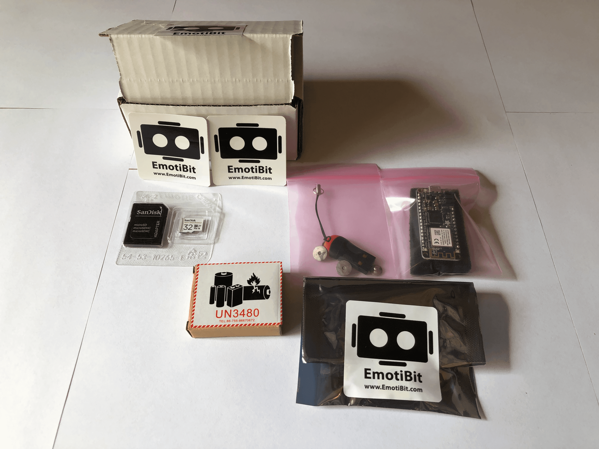
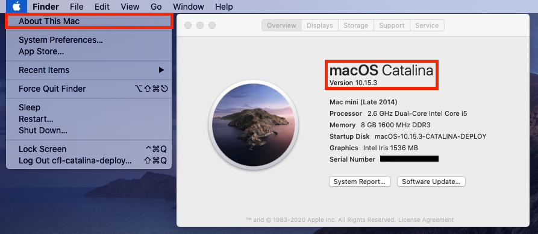

# Getting Started with EmotiBit
[comment]: <> ([alt text][SideView])

## Table of Contents
- [If you just received your EmotiBit](#If-you-just-received-your-EmotiBit)
  - [Unboxing](#Unboxing)
  - [Connecting To WiFi](#connecting-to-wifi)
  - [Get the Software](#Get-the-Software)
  - [Powering Up](#Powering-up)
- [EmotiBit: LEDs and Buttons](#EmotiBit-LEDs-and-Buttons)
- [Streaming Data in Real Time and Recording](#Streaming-Data-in-Real-Time-and-Recording)
- [Next Steps](#Next-Steps)
- [Troubleshooting](#Troubleshooting)

## If you just received your EmotiBit
### Unboxing
Welcome to the World of EmotiBit. If you just received your EmotiBit, in the box you will find:
- EmotiBit with straps
- Adafruit feather M0 WiFi, programmed and ready to use
- Micro SD-Card with SD-Card adapter
- Micro SD-Card USB reader
- 3.7V battery
- 2 snaps with Ag-AgCl coated studs + 2 extra snaps(can be used to attach external electrodes)

### Connecting to WiFi

<b>Adding WiFi credentials to SD-Card</b>

- To connect the EmotiBit to WiFi, you have to add the WiFi credentials`SSID: WIFi Name` and `Password: WiFi Password` to a file named `config.txt` on the SD-Card provided. **Note**: _FAT32 is important for the EmotiBit to function as designed_ 
- If you got your SD-card with your EmotiBit, it's already in the FAT32 format. 
- If using an SD-Card **other** than the one provided in the box, please **make sure it is formatted to be FAT32**. If it is not in **FAT32** format, follow the instructions below to Format the SD-Card
- 

Formatting to FAT32

  - Download [SD Memory Card Formatter](https://www.sdcard.org/downloads/formatter/)
  - You can use SD Memory Card Formatter to format the SD-Card into FAT32 format. 
  

- Create a **config.txt** file on the SD-Card.
- The contents of the file should be in format as shown below:
- ``{"WifiCredentials": [{"ssid": "Foo", "password" : "Bar"}]}`` (_Just copy and paste this line in the **config.txt** file on the SD-Card_)
- Replace `Foo` with the `WiFi name` and `Bar` with the `WiFi password`.

- 

<b>Access multiple WiFi networks</b>(EmotiBit FeatherWing v0.5.4+)

 
  - a JSON list can be used to store up to 12 sets of network credentials in config.txt:
    - ``{"WifiCredentials": [{"ssid": "Foo", "password" : "Bar"},{"ssid": "Fnord", "password" : "Baz"}]}`` (_Just copy and paste this line in the **config.txt** file on the SD-Card_)
    - Replace `Foo` with the `WiFi 1 name` and `Bar` with the `WiFi 1 password`. Replace `Fnord` with the `WiFi 2 name` and `Baz` with the `WiFi 2 password`
  - In the setup of EmotiBit_Example, all the WiFi networks are tried sequentially, a process that times out at ~1min. If a quick connection is desired after programming or reset:
    - Shorten the list
    - Organize the list in order of priority of the connection
  

> After your SD-Card is setup and ready for use, insert it into the EmotiBit SD-Card slot.

### Get the Software
[Get the EmotiBit Oscilloscope](https://github.com/EmotiBit/ofxEmotiBit/releases/latest).

<b>Installation Instructions For Windows Users:</b>

 
  - **Note:** EmotiBit software is supported only for Windows 10.
  - After you have downloaded `EmotiBitSoftware-Windows.zip`, go ahead and extract it.
  - You will find a `setup.exe` executable inside the extracted folder. Run the setup by double-clicking.
  - Follow through the setup. Click on `Close` once the setup is complete and the EmotiBit Software has been installed.
  - You will notice that shortcuts to `EmotiBit Oscilloscope` and `EmotiBit DataParser` have been created in the start menu and on the desktop.

 

<b>Installation Instructions For Mac Users:</b>

    
  - Move the downloaded zip file to a folder location you desire. Double click on the .zip file to extract it.
  - You will find the Application(`EmotiBit Oscilloscope` and `EmotiBit DataParser`) in the extracted folder.
      ![][oscilloscope-drirectory]
  
  - 

Opening Software in mojave

        
      - Right click on the EmotiBitOscilloscope app. Choose **Open**. 
      - If this is the first time you are using this application, a dialog box might appear asking you to `Allow` this application. Click on `Allow`. 
      - You will see the EmotiBit Oscilloscope Application start.
    

  - 

Opening Software in Catalina

  
      - Right click on the EmotiBitOscilloscope app. Choose **Open**. 
      - A dialog box will appear with options `Move to Trash` or `Cancel`. Click `Cancel`. You will have to allow the application to run in the `Security and Privacy` center. To do so:
              ![][macOs-Catalina-Initial_Oscilloscope_Error]
      - Click on the `Apple Logo` > `Syatem Preferences` > `Security and Privacy`.
              ![][macOS-Catalina-sys_pref]
      - You will find a request for `EmotiBit Oscilloscope` at the bottom of this window. Click on `Open Anyways`. 
              ![][macOS-Catalina-System_pref_Security&options]
      - Click on `Allow` on the dialog box that appears.This will open the `EmotiBit Oscilloscope` application.
              ![][macOS-Catalina-Allow_emotibit]
    

> **Note that the Software is currently supported only for macOS-**Mojave**[version 10.14] and macOS-**Catalina**[version 10.15].**
> You can find your macOS version by clicking on the `Apple Logo`(on the top left of your screen) > `About This Mac`.
> 

    

### Powering Up
- Stack the Feather with the EmotiBit(12 pin connector goes into the 12 pin socket and the 16 pin connector goes into the 16 pin socket).
- Plug in the 3.7V battery provided with the EmotiBit. We recommend that you plug in the Micro-USB cable too, as this will begin recharging the battery, which will be indicated by the YELLOW light on the Adafruit Feather.[ToDo:Add image of stacked up EmotiBit]
- If the EmotiBit does not automatically start when you plug in the battery, press the reset button(black push-button below the USB connector) on the feather.
- Wait for the EmotiBit to run through the setup.
  - The EmotiBit will light up RED, YELLOW and then BLUE light in sequence as it goes through the bootup.
  - You should see the red and green LED's on the PPG sensor at the bottom light up.
  - The Wifi Shield goes up next, indicated with a green light at the bottom on the feather
- **You should see the Data start to stream on the Oscilloscope!!**
- Don't see anything on the Oscilloscope? Check out our guide for [Troubleshooting](#Troubleshooting)

## EmotiBit: LEDs and Buttons
The on-board LEDs are a great way to understand the state of your EmotiBit. Below is an image we recommend you use for reference to understand more about the EmotiBit functionality.

![alt text][LED]

- Learn [More about the LEDs and buttons on EmotiBit](./Contributing_to_emotibit_community/Learn_more_about_emotibit.md/#LEDs-and-Buttons)

## Streaming Data in Real-Time and Recording
Now that you have your EmotiBit up and running, we recommend you learn more about the EmotiBit Oscilloscope to make the most of EmotiBit.
- [Learn more about streaming and recording data using the EmotiBit Oscilloscope](./Working_with_emotibit_data.md/#Real-Time-Streaming)

## Next Steps
By this point, you are a EmotiBit ninja!! However, we at CFL believe in empowering the user. Below are listed topics, which we feel will help you understand and ultimately **master working with EmotiBit**
- **Working with your data**
  - [Converting raw data](./Working_with_emotibit_data.md/#Converting-Raw-Data)
  - [Visualizing  Data](./Working_with_emotibit_data.md/#Visualize-Recorded-Data)
- [Keep EmotiBit up to date](./Keep_emotibit_up_to_date.md)
- [Contributing to the EmotiBit Community](./Contributing_to_emotibit_community)
- [Learn more about EmotiBit](./Contributing_to_emotibit_community/Learn_more_about_emotibit.md)

## Troubleshooting
- 

  
LEDs and the serial monitor can be useful tools for debugging

   
  
  - if the green _WiFi Connected_ LED is on, the feather is connected to WiFi
  - if the yellow _Network Traffic_ LED flashes at all, it suggests that the EmotiBit is exchanging packets with ofxEmotiBit
  

- 

  
Things to check for:

   
  
  - Make sure the SD-Card contains the **config.txt** file.
  - Verify if the **WiFi-Name** and **WiFi-Password** are correctly entered in the config file.
  

[LED]: ./assets/M0_WiFi_LED_Indicators_01.png "Feather LED's"
[macOS-version]: ./assets/macOS-Catalina-OS_version.png "macOS version" 
[oscilloscope-drirectory]: ./assets/macOS-oscilloscope_file_heirarchy.png ""
[macOs-Catalina-Initial_Oscilloscope_Error]: ./assets/macOs-Catalina-Initial_Oscilloscope_Error.png ""
[macOS-Catalina-sys_pref]: ./assets/macOS-Catalina-sys_pref.png "" 
[macOS-Catalina-System_pref_Security&options]: ./assets/macOS-Catalina-System_pref_Security&options.png "" 
[macOS-Catalina-Allow_emotibit]: ./assets/macOS-Catalina-Allow_emotibit.png "" 
