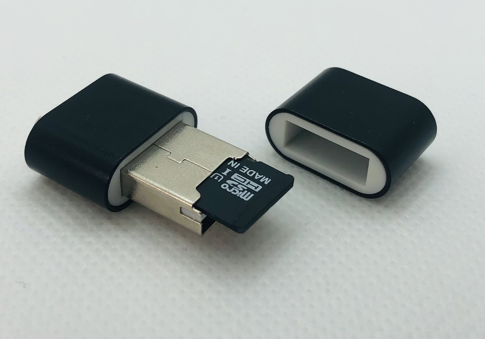
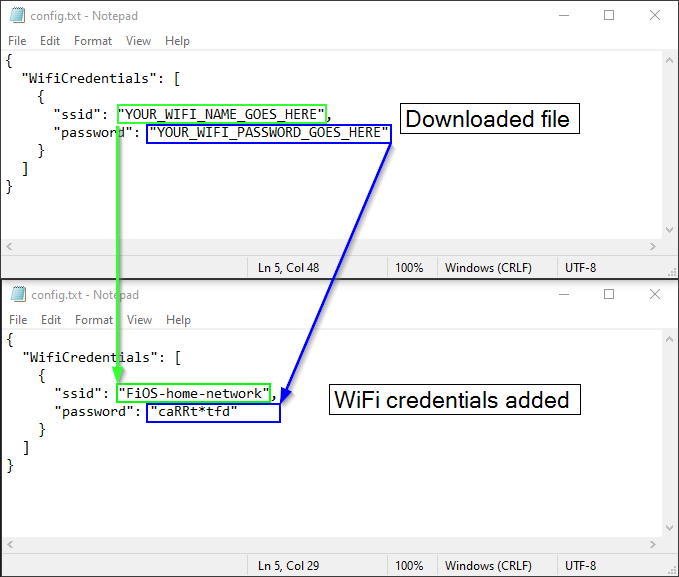
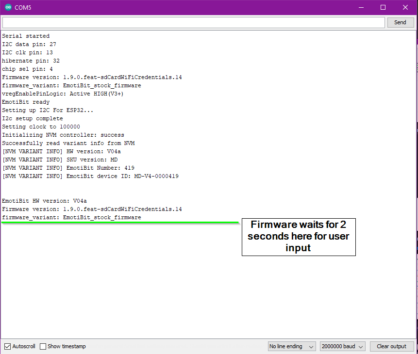
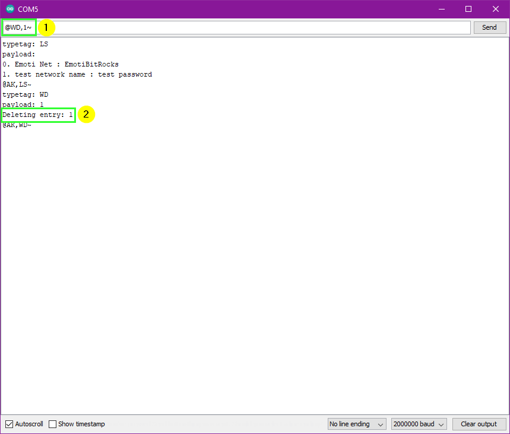
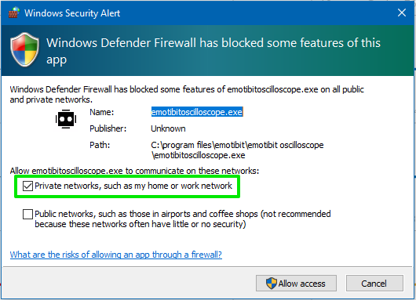
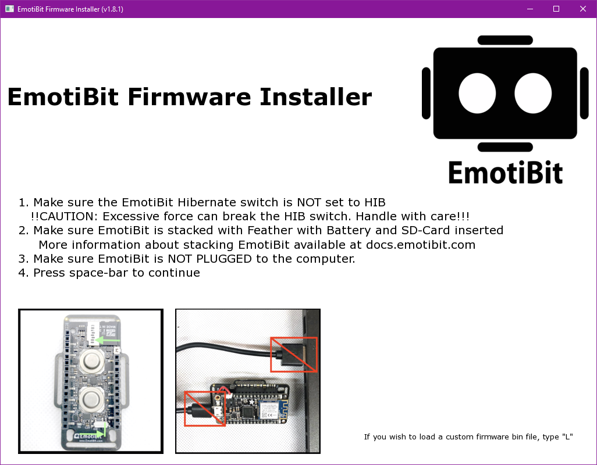
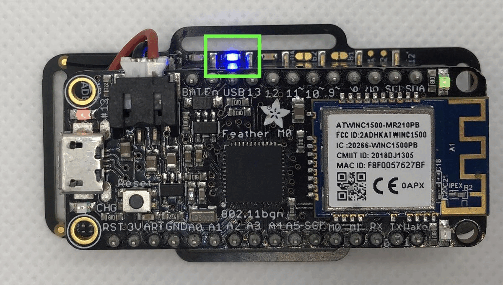

# Getting Started with EmotiBit
[comment]: <> ([alt text][SideView])


# Table of Contents
- [ELECTRICAL SHOCK WARNING](#ELECTRICAL-SHOCK-WARNING)
- [Stack, Sense and Stream](#Stack-Sense-and-Stream)
  - [EmotiBit Forum](#EmotiBit-Forum)
  - [Unboxing](#Unboxing)
    - [EmotiBit](#EmotiBit)
    - [Essentials Kit](#Essentials-Kit)
    - [Electrode Kit](#Electrode-Kit)
    - [All-in-one-bundle](#All-in-one-bundle)
  - [Assembling your EmotiBit](#Assembling-your-EmotiBit)
    - [Adding WiFi credentials](#Adding-WiFi-credentials)
    - [Stack your EmotiBit!](#Stack-your-EmotiBit)
  - [Installing EmotiBit Software](#Installing-EmotiBit-Software)
    - [Prerequisites](#Prerequisites)
    - [Run EmotiBit](#Run-EmotiBit-Firmware-Installer) 
  - [Running EmotiBit Software](#Running-EmotiBit-software)
    - [On Windows](#On-Windows)
    - [On macOS](#On-macOS)
    - [On Linux](#On-Linux)
- [Installing EmotiBit Firmware](#Installing-EmotiBit-Firmware)
  - [Using the EmotiBit Firmware Installer](#Using-the-EmotiBit-Firmware-Installer)
    - [Prerequisites](#Prerequisites)
    - [Run EmotiBit Firmware Installer](#Run-EmotiBit-Firmware-Installer)
  - [For Linux and Advanced Users](#For-Linux-and-Advanced-Users)
- [EmotiBit Bootup](#EmotiBit-Bootup)
- [Using EmotiBit Oscilloscope](#Using-EmotiBit-Oscilloscope)
- [EmotiBit: LEDs and Buttons](#EmotiBit-LEDs-and-Buttons)
- [Next Steps](#Next-Steps)
- [Troubleshooting](#Troubleshooting)


# ELECTRICAL SHOCK WARNING
EmotiBit should NEVER be worn while electrically connected to any device that's attached to A/C wall power. Connecting EmotiBit USB or any other pin to another device can be a shock risk hazzard and should ONLY be done when EmotiBit is NOT in physical contact with the body.


# Stack, Sense and Stream


- Follow the steps below for more information on downloading EmotiBit software and connecting to WiFi.

## EmotiBit Forum


The [EmotiBit forum](http://forum.emotibit.com) is a great place to get answers to all things EmotiBit!<br>
- Find answers to questions you may have about using EmotiBit.
- Share your experience working with EmotiBit or the latest signal processing tools.
- Take a glance at the [EmotiBit FAQ](https://www.reddit.com/r/EmotiBit/collection/27921349-c38f-4df4-b708-99346979039f). *Great minds think alike! If you have a question, the FAQ page probably has an answer.*
- Share your latest publication with the community or start a discussion about the future of biometric sensing!

## Unboxing
The following sections explain the contents of each item available for purchase at the [shop.EmotiBit.com](http://shop.emotibit.com/):

### EmotiBit 

- **1x EmotiBit** with finger loop Emoti-stretch strap
  - Depending on your purchase, you may either have an EmotiBit MD or an EmotiBit EMO
- **1x Emoti-genic barrier** (provides an additional hygienic layer and sweat protection)
- **2x EDA electrodes (Ag/AgCl)** attached to the EmotiBit
- **2x EmotiBit stickers**


-------------------------------

### Essentials Kit

The Essentials kit contains everything you will need to get started with EmotiBit! In the box you will find:
- **Adafruit Feather M0 WiFi** or **Adafruit Feather ESP32 Huzzah**
- **400mAh Lithium ion battery**
- **High-speed microSD card**
- **MicroSD card reader**
- **Micro USB cable**
- **3x Emoti-stretch straps** of different lengths to wear EmotiBit nearly anywhere on the body, ranging from a child’s wrist to an adult head
- **Plastic spudger** -- used to easily toggle the hibernate switch and EmotiBit button


-------------------------
### Electrode Kit
The electrode kit has been designed for users who use multiple EmotiBits for research and intend to frequently swap out the electrodes. the electrode kit includes
- **10x EDA electrodes (Ag/AgCl)**
- **4x solder-cup snaps** (to add your own EDA leads)
- **5x Emoti-genic barriers** (provides an additional hygienic layer and sweat protection)


---------------------------
### All-in-one-bundle
If you purchased the All-in-one-bundle, you will receive the [EmotiBit](#EmotiBit), [Essentials Kit](#Essentials-Kit) **and** [Electrode Kit](#Electrode-Kit).

------------------
## Assembling your EmotiBit
### Adding WiFi credentials


- Plug in the USB card reader loaded with the SD-Card into the computer.
- Download the config file from https://www.emotibit.com/files/config.
- Open the config file in any text editor (e.g. Notepad on Windows or text edit on macOS).
- Add your WiFi credentials by replacing `YOUR_WIFI_NAME_GOES_HERE` to the name of your WiFi network and change `YOUR_WIFI_PASSWORD_GOES_HERE`to the password for your WiFi network. 
  - 
- Save the file onto your microSD card. Eject the SD-Card from your computer. 
- **Note: Currently EmotiBit only supports the 2.4GHz band for WiFi and does not support enterprise networks (that require a login/password after connecting).** This is due to HW/FW limitations of the presently supported Adafruit Feather M0 WiFi.

- <details><summary>Multiple WiFi credentials</summary>

  - If you use multiple WiFi networks and want your EmotiBit to automatically connect to whichever one is in range, simply add both networks to the WifiCredentials array in the config file like this:<br> 
  ```
  {
    "WifiCredentials": [
      {
        "ssid": "wifi_1",
        "password": "password1"
      },
      {
        "ssid": "wifi_2",
        "password": "password2"
      },
      {
        "ssid": "wifi_3",
        "password": "password3"
      },
      {
        "ssid": "wifi_4",
        "password": "password4"
      },
    ]
  }
  ```
  </details>

- <details><summary>Adding credentials using Serial Monitor</summary>

  - The EmotiBit firmware also provides a provision to enter WiFi credentials through serial interface. To use this provision, you will need to download and install Arduino IDE. You will also need to upload the EmotiBit firmware to the device. [Stack your EmotiBit](#stack-your-emotibit) and check out the section to learn how to use the [EmotiBit Firmware Installer](#installing-emotibit-firmware). Once you have installed the firmware and ArduinoIDE, proceed to the next steps.
  - Open Arduino IDE. Under `Tools > Port` notice the ports avaiable, if any.
  - Make sure you have a stacked EmtotiBit and connect the Feather to the computer using the provided USB cable.
  - Once connected, check `Tools > Port` again in Arduino IDE. A new port will have appeared. Select that port.
  - Click on `Tools > Serial Monitor` to open a Serial Monitor on that port. A Serial Monitor should open, but may not output anything if EmotiBit is past setup. **Make sure `No line Ending` and `2000000 baud` is selected as the settings at the bottom.**
    - 
  - Close the Serial Monitor. Reset the EmotiBit (by pressing the reset button) and open the Seial monitor immediately after.
  - You will see setup messages being displayed. In setup, the EmotiBit waits for a few seconds to accept an input. 
    - 
  - Type capital `C` in the `input field`. Wait for the Serial monitor to print the message shown below and press `Send` / hit enter to send the character.
    - 
  - If you timed is right, you will see the following response in the serial monitor. You are now in `WiFi credential edit mode`. 
    - 
  - If the EmotiBit continues setup, then you need to reset the EmotiBit, close and reopen the Serial Monitor and try and get the timing right so that the firmware registers the serial input.
  - Once in the `WiFi credential edit mode`, you can `Add`, `Delete` or `View` credentials in the config.txt file.
  - **Adding a Credential**
    - To add a credential, you will need to use the keyword `WA`.
    - In the serial monitor input type `@WA,{"ssid":"SSSS","password" : "PPPP"}~`
    - Replace `SSSS` with the **network name** and `PPPP` with the **network password**.
    - Once the Name and password uare update, hit `Send`.
    - You shuold see the following response on the Serial Monitor.
      - 
  - **View existing credentials**
    - To view existing credentials, you will need to use the keyword `LS`.
    - In the serial monitor input type `@LS,~`. Hit `Send`.
    - The existing credentials, along with their passwrods will be printed as a list.
      - 
  - **Delete a credential**
    - To delete an existing credentials, you will need to use the keyword `WD`.
    - Use the `LS` keword as mentioned above to get the list of existing credentials.
    - Note the number of the credential you want to delete.
    - In the serial monitor input type `@WD,<network_number>~`. Replace network number with a number on the list output in the previous step. For example, `@WD,1~`. Hit `Send`.
    - The credential will be deleted and you will see the following output.
      - 

  - **Reset**
    - Once you have completed the edits to the credentials, type `@RS,~` in the Serial Monitor input. Hit `Send`.
    - The EmotiBit will restart and you will see Setup messages being printed on the Serial Monitor again.
      - 
  </details>


### Stack your EmotiBit!

- On the EmotiBit
  - Insert the SD-Card into the EmotiBit.
  - Make sure the sliding switch (*Hibernate switch*) is set to the active (not HIB) position as shown *(Available on only EmotiBit version V4)*.
    - ```diff
      - CAUTION: Excessive force can break the HIB switch. Handle with care! -
      ```
    - 


- Plug the battery into the Feather (**ensure the connector is firmly pushed all the way into the Feather connector**)
- Stack the Feather with EmotiBit (*12 pin connector goes into the 12 pin socket and the 16 pin connector goes into the 16 pin socket*)

![][EmotiBit-stackup]

## Installing EmotiBit Software

[Download the EmotiBit Software](https://github.com/EmotiBit/ofxEmotiBit/releases/latest).
- <details><summary><b>Installation Instructions For Windows Users</b></summary>
 
    - _**Note:** EmotiBit software is supported only for Windows 10+._
    - After you download `EmotiBitSoftware-Windows.zip`, go ahead and extract it.
    - You will find an `.msi` installer inside the extracted folder. Run the installer by double-clicking.
      - If the Windows Defender SmartScreen pops up, click on `More Info`.
      - Then click on `Run Anyway`.
      - 
    - Follow through the setup. Click on `Close` once the setup is complete and the EmotiBit Software has been installed.
    - You will notice that shortcuts to `EmotiBit Oscilloscope`, `EmotiBit DataParser` and `EmotiBit FirmwareInstaller` have been created in the start menu and on the desktop.
    - **Note: The EmotiBit Software installation process is sometimes blocked by any anti-virus tool you might have installed on your system. If you face any issues with installation, make sure to check that the appropriate settings are enabled on your anti-virus software to allow a third-party installs. You will likely also need to allow firewall permissions to allow streaming data on your WiFi networks.**
  </details>

- <details><summary><b>Installation Instructions For Mac Users</b></summary>
    
  - Download `EmotiBitSoftware-macOS.zip` from the release page.
  - Move the downloaded zip file to a folder location you desire. Double click on the .zip file to extract it.
  - You will find the Applications in the extracted folder.
  
  > **Note1: The EmotiBit software is tested on all operating systems except macOS Ventura. (However, user reports suggest it works on Ventura, even though not officially tested.)**
  
  - <details><summary>Check your Operating System version</summary>
    
    - You can find your macOS version by clicking on the `Apple Logo`(on the top left of your screen) > `About This Mac`.
    
    
    </details>
  </details> 

- <details><summary><b>Installation Instructions For Linux Users</b></summary>
    
  - Follow the instructions on the release page.
  </details>    

## Running EmotiBit software
Based on your operating system, follow the steps below:
### On Windows
You can click on the start menu and search for the name of the application you want to run, e.g.`EmotiBitFirmwareInstaller`. The application should pop up in the search. Double-click on the application to run it!
<br>
- <details><summary>Windows Security Alert pop-up</summary>
  
  - If a `Windows Security Alert` pop-up appears, **allow private network access**. 
If you have an Antivirus program installed, make sure the appropriate settings are enabled to grant EmotiBit software
network access.
  - 
  </details>


### On macOS
You can find the EmotiBit applications in the folder you just extracted (*as mentioned in the steps in the previous section*)
- <details><summary>Opening Software in mojave</summary>
        
    - Right click on the application you want to run. Choose **Open**. 
    - If this is the first time you are using this application, a dialog box might appear asking you to `Allow` this application. Click on `Allow`. 
    - You will see the EmotiBit Application start.
  </details>
- <details><summary>Opening Software in Catalina</summary>
  
    - Right click on the application you want to run. Choose **Open**. 
    - A dialog box will appear with options `Move to Trash` or `Cancel`. Click `Cancel`. You will have to allow the application to run in the `Security and Privacy` center. To do so:<br>
            ![][macOs-Catalina-Initial_Oscilloscope_Error]
    - Click on the `Apple Logo` > `Syatem Preferences` > `Security and Privacy`.
            ![][macOS-Catalina-sys_pref]
    - You will find a request from the applicaiton at the bottom of this window. Click on `Open Anyways`. 
            ![][macOS-Catalina-System_pref_Security&options]
    - Click on `Allow` on the dialog box that appears.This will open the application.
            ![][macOS-Catalina-Allow_emotibit]
  </details>

### On Linux
Build the application from source. You can find instructions in the `ReadMe` provided with the zip file downloaded in the previous step..


# Installing EmotiBit Firmware
To start using EmotiBit, you will first need to install the latest EmotiBit firmware on the Feather.
- If you did not order an Essentials-Kit, Basic-Kit (*Kickstarter*) or Research-Kit (*Kickstarter*), you will need to 
get one to start using EmotiBit. You can grab [Feather M0 WiFi](https://www.adafruit.com/product/3044) or the [Feather ESP32 Huzzah!](https://www.adafruit.com/product/3405) from the Adafruit online store.

## Using the EmotiBit Firmware Installer

### Prerequisites

- **Drivers**: Install the drivers provided with the downloaded EmotiBitSoftware bundle.

  - <details><summary> On Windows 10 </summary>

    - If you have not done so already, extract the `EmotiBitSoftware-Windows.zip`.
    - Navigate to `EmotiBitSoftware-Windows` > `CP210x_Windows_Drivers`.
    - Double click to run `CP210xVCPInstaller_x64.exe`
    - Follow the on-screen instructions to complete driver installation.
    </details>

  - <details><summary> On Windows 11 </summary>

    - If you have not done so already, extract the `EmotiBitSoftware-Windows.zip`.
    - Navigate to `EmotiBitSoftware-Windows` > `CP210x_Universal_Windows_Driver`.
    - Right click on `silabser.inf` > `Show more options` > `Install`.
    - Depending on your firewall/antivirus settings you will likely need to grant permissions for the installation.
    - Once completed, the required the drivers should be installed on your Windows 11 machine.
    </details>

  - <details><summary>On macOS</summary>

    - If you have not done so already, extract the `EmotiBitSoftware-macOS.zip`.
    - Navigate to `EmotiBitSoftware-macOS` > `CP210X VCP Mac OSX driver`.
    - Double click on the `SiLabsUSBDriverDisk.dmg`. The contents will open in a new finder window.
    - Double click on `Install CP210x VCP driver` to run the installer.
    - Follow the on-screen instructions to complete the driver installation.
    </details>

### Run EmotiBit Firmware Installer
- You will need the `EmotiBit FirmwareInstaller`, which comes with the EmotiBit software bundle.
  - If you have not done so already, follow [these steps to grab the latest EmotiBit software](#Installing-EmotiBit-Software). 
- Open the `EmotiBit FirmwareInstaller`. 
  - Follow the instructions mentioned in the [section above](#Running-EmotiBit-software) to start using `EmotiBit FirmwareInstaller`
- After you start the application, follow the on-screen instructions to complete installing the firmware.
- Screengrab from `EmotiBitFirmwareInstaller`
  - 
- <details><summary> Installing custom firmware</summary>

  - The `EmotiBit FirmwareInstaller` installs the stock firmware provided in the software bundle.
    - Each software release bundles specific firmware version that can be found in the [software release notes](https://github.com/emotibit/ofxemotibit/releases/latest). 
  - If you wish to install a custom firmware or an older firmware release, you can do so using the "Load" provision in the Firmware Installer.
  - To do so, 
    - Press `L` on the first screen on the Firmware Installer (You may also notice that the Firmware Installer has a footnote with the same prompt)
    - Choose the file (`.bin`) you want to install on EmotiBit
    - After selecting the file, you will return to the original Firmware Installer screen
    - Continue with normal installation process (instructions on the screen)
  - For example, you may grab an earlier release from the [EmotiBit firmware release page](https://github.com/EmotiBit/EmotiBit_FeatherWing/releases), and install that firmware using the `Load` function in the EmotiBit Installer.
  - Alternatively, you can write your own custom firmware and create a binary. You can then use the Firmware Installer to install that binary.
  - **WARNING**: Make sure that the firmware you are trying to install has been written for the correct board version. 
Installing incompatible firmware may lead to un-expected behavior, or worse, may brick your device.
  </details>

## For Linux and Advanced Users
- <details><summary> Installing Emotibit Firmware on Feather M0 WiFi</summary>
  
  - **Note**: on macOS, you will need to give the `EmotiBit FirmwareInatller` application permissions to run the contained executables. To do so, right click on the `EmotiBit FirmwareInstaller` app and click on Open. This will open the application but you may close it to proceed below.
  - The FirmwareInstaller essentaily performs 3 actions:
    1. Uploads the firmware updater sketch to prep the Feather for WINC updater
    2. Updates the WINC WiFi module FW to version 19.6.1
    3. Uploads the latest EmotiBit FW onto the Feather, after the WINC has been updated
  - We use the [`bossac`](http://manpages.ubuntu.com/manpages/bionic/man1/bossac.1.html) command line tool to upload binary files to the feather.
  - There are 2 requirements to run bossac
    - COM port on which the Feather is detected
    - The bin file (*provided in the software release*). If your flavor of Linux doesn't work with the provided bin file, you'll have to download/compile `bossac` yourself, but ***WARNING: THAR BE DRAGONS***
      - Check out these [instructions on installing bossac](https://learn.adafruit.com/adafruit-feather-m0-express-designed-for-circuit-python-circuitpython/uf2-bootloader-details#running-bossac-on-the-command-line-2929769-30). ***PLEASE NOTE*** that with bossac version 1.9 or later, you must give an --offset parameter on the command line to specify where to start writing the firmware in flash memory. ***FAILING TO DO SO WILL BRICK YOUR FEATHER!***
  - To perform the operations manually, the follow the below listed steps:
    - Navigate to the `data` folder located inside the EmotiBit software directory.
      - On Linux the path to the data folder should look like `EmotiBitSoftware-linux/ofxEmotiBit/EmotiBitFirmwareInstaller/bin/data`
      - On MacOS the path should look like `EmotiBitSoftware-macOS/EmotiBitFirmwareInstaller.app/Contents/Resources`
      - On Windows the path will be `C:\Program Files\EmotiBit\EmotiBit FirmwareInstaller\data`
    - Open a `cmd prompt` window for Windows or `terminal` for Linux/Mac at this location
    - Connect the Feather to the computer using a data-capable USB cable
      - **The Feather should NOT be stacked with EmotiBit** (to enable the programmer mode LED)
    - Double-press the reset button to set the Feather in programmer mode.
      - You should see the RED LED on the Feather pulsating!
        - [ToDo: add gif]
    - **WARNING: DO NOT UNPLUG OR RESET FEATHER WHILE UPLOAD/UPDATE IN PROGRESS. YOU COULD BRICK YOUR FEATHER!**
    - Upload the firmware updater sketch by running the following command (*use .\bossac.exe for windows*, *use ./bossac for macOS*)
      - `./bossac_linux -i -d --port=YOUR_FEATHER_COM_PORT -U true -i -e -w -v ./WINC/FirmwareUpdater.ino.feather_m0.bin -R`
        - [For linux] If you get a `permission denied` error, run the command `chmod u+x ./bossac_linux`, to make the file executable.
    - Update the WINC by running (*use .\FirmwareUploader.exe for windows*, *use ./FirmwareUploader for macOS*)
      - `./WINC/FirmwareUploader_linux -port YOUR_FEATHER_COM_PORT -firmware ./WINC/m2m_aio_3a0.bin`
        - [For linux] If you get a `permission denied` error, run the command `chmod u+x ./WINC/FirmwareUploader_linux` , to make the file executable.
    - ONLY AFTER the FirmwareUploader command completes, double-press the reset button to set the Feather in programmer mode again
    - Upload the EmotiBit FW using (*use .\bossac.exe for windows*, *use ./bossac for macOS*)
      - `./bossac_linux -i -d --port=YOUR_FEATHER_COM_PORT -U true -i -e -w -v EmotiBit_stock_firmware.ino.feather_m0.bin -R`
  </details> 

- <details><summary> Installing Emotibit Firmware on Feather ESP32 Huzzah</summary>
  
  - **Note**: on macOS, you will need to give the `EmotiBit FirmwareInatller` application permissions to run the contained executables. To do so,
  right click on the `EmotiBit FirmwareInstaller` app and click on Open. This will open the application but you may close it to proceed below.
  - The FirmwareInstaller essentaily uploads the latest EmotiBit FW onto the Feather
  - We use the [`esptool`](https://github.com/espressif/esptool/releases/tag/v3.3) command line tool to upload binary files to the feather.
  - There are 2 requirements to run esptool
    - COM port on which the Feather is detected
    - The esptool bin file (*provided in the software release*).
  - To perform the operations manually, the follow the below listed steps:
    - Navigate to the `data` folder located inside the EmotiBit software directory.
      - On Linux the path to the data folder should look like `EmotiBitSoftware-linux/ofxEmotiBit/EmotiBitFirmwareInstaller/bin/data`
      - On MacOS the path should look like `EmotiBitSoftware-macOS/EmotiBitFirmwareInstaller.app/Contents/Resources`
      - On Windows the path will be `C:\Program Files\EmotiBit\EmotiBit FirmwareInstaller\data`
    - Open a `cmd prompt` window for Windows or `terminal` for Linux/Mac at this location
    - Connect the Feather to the computer using a data-capable USB cable.
      - The Feather should show up as a COM port on the system.
        - On `Windows`: The device appears with a same similiar to `COM X` (where `X` is a number)
        - On `mac/linux`: You may find the COM port by running the terminal command `ls -la /dev/tty*`
        - Pro-tip for linux: the Feather may likely show up as `/dev/ttyUSB0`
    - **WARNING: DO NOT UNPLUG OR RESET FEATHER WHILE UPLOAD/UPDATE IN PROGRESS. YOU COULD BRICK YOUR FEATHER!**
    - replace **YOUR_FEATHER_PORT** with the COM port you detected in the previous step in the following command and run it to upload the firmware.
      - `./exec/linux/esptool --chip esp32 --port YOUR_FEATHER_PORT --baud 921600 --before default_reset --after hard_reset write_flash -z --flash_mode dio --flash_freq 80m --flash_size 4MB 0x1000 ./esp32/EmotiBit_stock_firmware.ino.bootloader.bin 0x8000 ./esp32/EmotiBit_stock_firmware.partitions.bin 0xe000 ./esp32/boot_app0.bin 0x10000 ./EmotiBit_stock_firmware.ino.feather_esp32.bin`
        - [For linux] If you get a `permission denied` error, run the command `chmod u+x ./exec/esptool`, to make the file executable.
        - [For Windows] replace `./exec/linux/esptool` with `.\exec\win\esptool.exe`. You will also need to change all file paths to `.\esp32\name-of-file`
        - [For macOS] replace `./exec/linux/esptool` with `./exec/mac/esptool`.
  </details> 
# EmotiBit Bootup
When EmotiBit is booting up, the LEDs are used to indicate the steps in the process. If EmotiBit gets stuck prior to fully connecting to your WiFi, you can use the below table to assess what went wrong and how to fix it.

|LED State|**LED Indicator**|**What to do?**|
|--|--------------|---------|
|Feather RED LED ON||Write a post describing your steps on http://forum.emotibit.com/ |
|Feather RED LED turns ON for a few seconds and then stays OFF||Check if SD-Card is correctly inserted|
|EmotiBit RED LED ON||Check if config file is present on the SD-Card|
|EmotiBit BLUE LED solid ON||Verify correct WiFi credentials in config file (see [Adding WiFi credentials](#Adding-WiFi-credentials))|
|EmotiBit BLUE LED BLINKING||Huzzah! EmotiBit is connected to your WiFi! Open EmotiBit Oscilloscope to start streaming biometric data!|

# Using EmotiBit Oscilloscope
[Learn more about streaming and recording data using the EmotiBit Oscilloscope](./Working_with_emotibit_data.md/#EmotiBit-Oscilloscope)

# EmotiBit: LEDs and Buttons

Learn [More about the LEDs and buttons on EmotiBit](./Learn_more_about_emotibit.md#LEDs-and-Buttons)


# Next Steps
By this point, you're ready to be an EmotiBit rockstar!! However, we at CFL believe in empowering the user. Below are listed topics, which we feel will help you understand and ultimately **master working with EmotiBit**.
- EmotiBit Oscilloscope
  - [Learn more about streaming and recording data using the EmotiBit Oscilloscope](./Working_with_emotibit_data.md/#EmotiBit-Oscilloscope)
- Working with your data
  - [Parsing raw data](./Working_with_emotibit_data.md/#Parse-raw-data-using-EmotiBit-DataParser)
  - [Visualizing  Data](./Working_with_emotibit_data.md/#Visualize-parsed-data)
- [Keep EmotiBit up to date](./Keep_emotibit_up_to_date.md)
- [Contributing to the EmotiBit Community](./Contributing_to_emotibit_community)
- [Learn more about EmotiBit](./Learn_more_about_emotibit.md)

# Troubleshooting
- Checkout the [EmotiBit FAQ](https://www.reddit.com/r/EmotiBit/collection/27921349-c38f-4df4-b708-99346979039f).
- FAQs did not help out? Post on the [EmotiBit Forum](http://forum.emotibit.com)
  - Having trouble connecting to network? check out this [FAQ](https://www.reddit.com/r/EmotiBit/comments/tsiu7j/how_do_i_add_my_wifi_credentials_to_connect_to_a/)


[ButtonsAndSwitches]: ./assets/EmotiBit-buttonsAndSwitches.jpg "EmotiBit Buttons and Switches"
[LED]: ./assets/M0_WiFi_LED_Indicators_01.png "Feather LED's"
[macOS-version]: ./assets/macOS-Catalina-OS_version.png "macOS version" 
[oscilloscope-drirectory]: ./assets/macOS-oscilloscope_file_heirarchy.png ""
[macOs-Catalina-Initial_Oscilloscope_Error]: ./assets/macOs-Catalina-Initial_Oscilloscope_Error.png ""
[macOS-Catalina-sys_pref]: ./assets/macOS-Catalina-sys_pref.png "" 
[macOS-Catalina-System_pref_Security&options]: ./assets/macOS-Catalina-System_pref_Security&options.png "" 
[macOS-Catalina-Allow_emotibit]: ./assets/macOS-Catalina-Allow_emotibit.png "" 
[EmotiBit-stackup]: ./assets/EmotiBit_stack_boards.gif ""
[EmotiBit-box-contents]: ./assets/EmotiBit-box-contents.jpg ""
[Electrode Kit]: ./assets/Electrode-Kit.jpg ""
