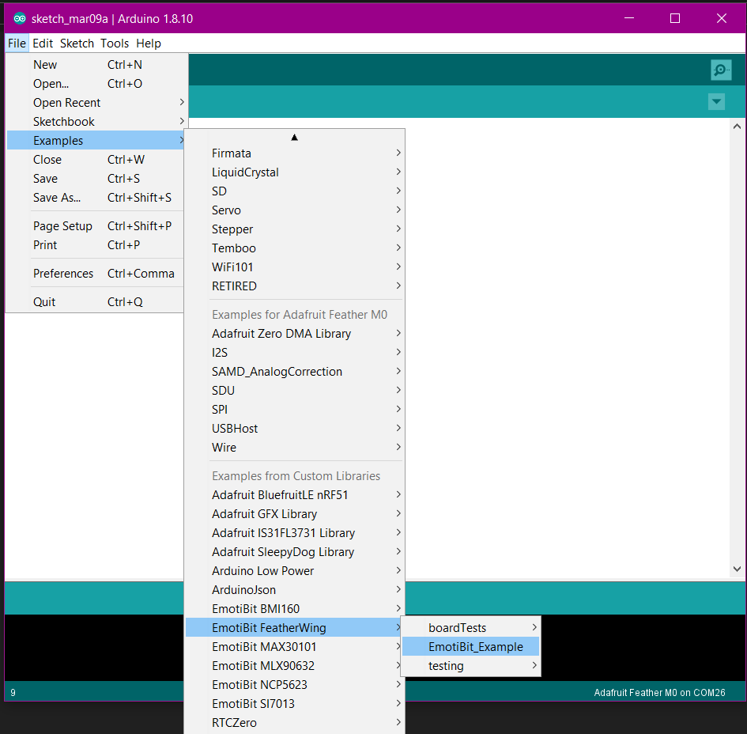
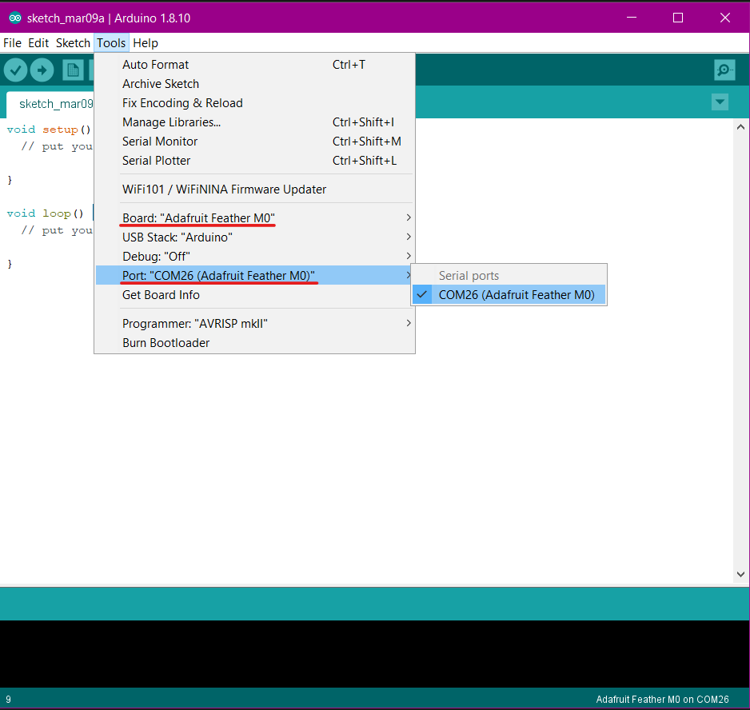
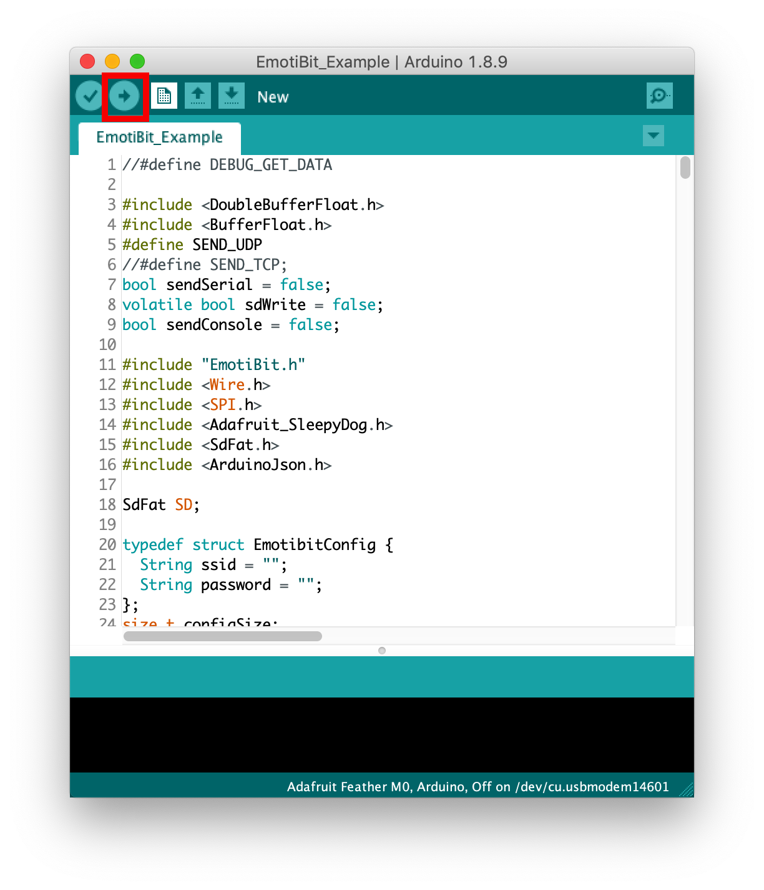
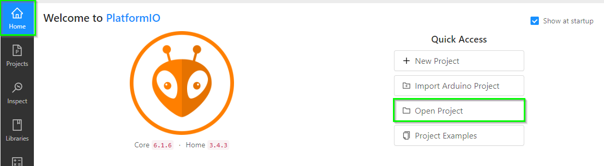

# Keeping EmotiBit up-to date

## Overview
If you just received your EmotiBit, please checkout our [EmotiBit Getting Started](./Getting_Started.md) startup-guide.

Trying to update EmotiBit Firmware? You are at the right place! **Lets get started!!!**

## Table of Contents
- [(Recommended option) Update firmware using EmotiBit FirmwareInstaller](#Recommended-option-Update-firmware-using-EmotiBit-FirmwareInstaller)
- [Building from source](#Building-from-source)
  - [Option A: Update firmware using Arduino IDE](#Option-A-Update-firmware-using-Arduino-IDE)
    - [1. Setup](#1-setup)
      - [1.1 Download and install the Arduino IDE](#11-Download-and-install-the-Arduino-IDE)
      - [1.2 Add Adafruit Feather boards to Arduino IDE](12-Add-Adafruit-Feather-boards-to-Arduino-IDE)
      - [1.3 Install firmware libraries](13-Install-firmware-libraries)
      - [1.4 Close and re-open Arduino IDE](14-Close-and-re-open-Arduino-IDE)
    - [2. Programming the Feather](#2-programming-the-feather)
    - [3. Ready to go!](#3-Ready-to-go)
    - [4. About the WiFi shield](#4-About-the-WiFi-shield)
  - [Option B: Building firmware using PlatformIO](#Option-B-Building-firmware-using-PlatformIO)
    - [1. Requirements](#1-Requirements)
    - [2. Steps to build from source](#2-Steps-to-build-from-source)
      - [2.1 Download required dependencies](#21-Download-required-dependencies)
      - [2.2 Install the correct board versions](#22-Install-the-correct-board-versions)
      - [2.3 Building the project](#23-Building-the-project)
    - [3 Importing an Arduino sketch into platformIO](#3-Importing-an-Arduino-sketch-into-platformIO)

## (Recommended option) Update firmware using EmotiBit FirmwareInstaller
Using the `EmotiBit FirmwareInstaller` is the easiest way to update EmotiBit firmware.
Just follow the steps listed in the [Installing EmotiBit Firmware](./Getting_Started.md/#Installing-EmotiBit-Firmware) section on the **Getting Started** page.
<br>
If you want to build EmotiBit firmware from source, check out the section below.
# Building from source
## Option A: Update firmware using Arduino IDE
Setting up and using the Arduino IDE is recommended if you want to build EmotiBit firmware from source. 
Follow the steps below to get started!
### 1. Setup
#### 1.1. Download and install the Arduino IDE
  - https://www.arduino.cc/en/main/software#download
#### 1.2. Add Adafruit Feather boards to Arduino IDE

- For Feather ESP32 huzzah boards
  - <details><summary><b>Add URL for ESP boards</b></summary>
    
    - `File > Preferences > [Settings Tab]`
    - Copy-Paste the following link into `Additional Board Manager URLs:`. Note: Use `,` to separate a list of URLs
      - https://raw.githubusercontent.com/espressif/arduino-esp32/gh-pages/package_esp32_index.json
    - [See Espressif's page for detailed instructions ](https://docs.espressif.com/projects/arduino-esp32/en/latest/installing.html)
    </details>
  
  - <details><summary><b>Add support for ESP boards</b></summary>
    <br>
    
    - `Tools > Board: [...] > Boards Manager...`
    - Search for `ESP32`
      - Install `esp32` *by Espressif Systems* **version 2.0.7**
    </details>

- For Feather M0 WiFi boards
  - <details>
    <summary><b>Add URL to Adafruit Boards</b></summary>
    <br>
    
    - `File > Preferences > [Settings Tab]`
    - Copy-Paste the following link into `Additional Board Manager URLs:` 
      - https://adafruit.github.io/arduino-board-index/package_adafruit_index.json
    - [*[See Adafruit's page if you'd like instructions with images]*](https://learn.adafruit.com/adafruit-feather-m0-wifi-atwinc1500/setup)
    </details>
    
  - <details>
    <summary><b>Add support for specific SAMD boards</b></summary>
    <br>
    
    - `Tools > Board: [...] > Boards Manager...`
    - Search for `SAMD`
      - Install `Arduino SAMD Boards (32-bits ARM Cortex-M0+)` *by Arduino*
      - Install `Adafruit SAMD Boards` *by Adafruit* _**(use version 1.5.1)**_
    - [*[See Adafruit's page if you'd like instructions with images]*](https://learn.adafruit.com/adafruit-feather-m0-wifi-atwinc1500/using-with-arduino-ide)
      - If you're on Windows 7  or 8, the above link also has driver installation instructions (note, however, that EmotiBit software is not officially supported on Windows versions prior to Windows 10)
    </details>
    
#### 1.3. Install firmware libraries
  - <details>
    <summary><b>Using Arduino IDE</b></summary>
    <br>
    
    - Open the Arduino IDE and go to `Tools > Manage Libraries...`
    - Search for and install the following Libraries.
    - EmotiBit FeatherWing (*It will automatically install the following EmotiBit dependencies*)
      - EmotiBit BMI160
      - EmotiBit MAX30101
      - EmotiBit MLX90632
      - EmotiBit NCP5632
      - EmotiBit SI7013
      - EmotiBit External EEPROM 
      - EmotiBit ADS1X15
      - EmotiBit XPlat Utils
      - EmotiBit EmojiLib
      - EmotiBit ArduinoFilters
      - EmotiBit SimpleFTPServer
      - EmotiBit KTD2026
      - WiFi101 *by Arduino*
      - SdFat *by Bill Greiman* _**(v2.2.0)**_
      - ArduinoJson _**(v6.21.2)**_
      - Arduino Low Power
      - RTCZero
      - Adafruit_IS31FL3731_Library
      - Adafruit_GFX_Library
      - Adafruit BusIO
    </details>
  - <details>
    <summary>Using git</summary>
    <br>

    ```diff
    -- Be sure to install the correct version when specified for any library below --
    ```
    - (**option 1**) Clone [EmotiBit_FeatherWing](https://github.com/EmotiBit/EmotiBit_FeatherWing) repository. Then run the `download_dependencies.sh` script found inside the EmotiBit_FeatherWing repository.
    - (**option 2**) The following script may be run from a bash shell within your `Arduino/libraries/` directory to install all dependencies from EmotiBit.
      - _**Note:**_ this requires you to have [github SSH key access set up](https://docs.github.com/en/authentication/connecting-to-github-with-ssh/generating-a-new-ssh-key-and-adding-it-to-the-ssh-agent).
      - Check out the `ArduinoJson` and `SdFat` libraries to the **required versions** specified in the "Using Arduino IDE" dropdown above.

      ```
      eval "$(ssh-agent -s)"
      ssh-add ~/.ssh/id_ed25519
      git clone git@github.com:EmotiBit/EmotiBit_EmojiLib.git
      git clone git@github.com:EmotiBit/EmotiBit_NCP5623.git
      git clone git@github.com:EmotiBit/EmotiBit_FeatherWing.git
      git clone git@github.com:EmotiBit/EmotiBit_XPlat_Utils.git
      git clone git@github.com:EmotiBit/EmotiBit_ArduinoFilters.git
      git clone git@github.com:EmotiBit/EmotiBit_SI7013.git
      git clone git@github.com:EmotiBit/EmotiBit_MLX90632.git
      git clone git@github.com:EmotiBit/EmotiBit_BMI160.git
      git clone git@github.com:EmotiBit/EmotiBit_ADS1X15.git
      git clone git@github.com:EmotiBit/EmotiBit_MAX30101.git
      git clone git@github.com:EmotiBit/EmotiBit_External_EEPROM.git
      git clone git@github.com:EmotiBit/EmotiBit_SimpleFTPServer.git
      git clone git@github.com:arduino-libraries/WiFi101.git
      git clone git@github.com:greiman/SdFat.git
      git clone git@github.com:bblanchon/ArduinoJson.git
      git clone git@github.com:arduino-libraries/ArduinoLowPower.git
      git clone git@github.com:arduino-libraries/RTCZero.git
      git clone git@github.com:adafruit/Adafruit_IS31FL3731.git
      git clone git@github.com:adafruit/Adafruit-GFX-Library.git
      git clone git@github.com:adafruit/Adafruit_BusIO.git
      git clone git@github.com:EmotiBit/EmotiBit_KTD2026.git
      ```
    </details>

#### 1.4. Close and re-open Arduino IDE
  - After installing boards or libraries you should close and re-open the Arduino Application to make sure the changes take effect.

### 2. Programming the Feather
- In the Arduino program (IDE), open `File > Examples > EmotiBit FeatherWing > EmotiBit Example`
  - 
  - Alternatively you can double click the `EmotiBit_Example.ino` file presenst at the location:`Documents/Arduino/libraries/EmotiBit_FeatherWing/EmotiBit_stock_firmware/EmotiBit_stock_firmware.ino` 
- Put the Feather in programming mode by double clicking the reset button. You should see the red LED pulsing.*(Please note that the LED pulsates only in EmotiBit V2 and not V3. You can find your EmotiBit version printed near the board edge on the front top right corner)*
- In the `Emotibit_Example` Arduino window that opens, Choose the board you will be programming
  - For Feather M0 WiFi: `Tools > Board > Adafruit SAMD (32-bits ARM Cortex-M0+ and Cortex-M4) Boards > Adafruit Feather M0`
  - For feather ESP32 Huzzah: `Tools > Board > ESP32 Arduino > Adafruit ESP32 Feather`
- Choose `Tools > Port > [the correct port for your board]`
  - 

- Click “Upload” button.
  - 

### 3. Ready to go!
- Once your feather is successfully uploaded, you are ready to go! [Start working with your data](./Working_with_emotibit_data.md/#Real-Time-Streaming)

### 4. About the WiFi shield
- Adafruit feather M0 works with the `ATWINC1500` for wireless communication. The `ATWINC` exists as a independent submodule to the feather
and might get updates which require a different set of instructions to be followed. 
  - If you are using the feather you received with the EmotiBit, everything is upto data. If you are using 
  a feather purchased independently, check out the documentation on the [Adafruit website](https://learn.adafruit.com/adafruit-winc1500-wifi-shield-for-arduino/updating-firmware).

## Option B: Building firmware using PlatformIO

```diff
-- This section of the documentation is a work in progress. Complete support for platformIO will be added in a future release.
```
Note: This section is for advanced users who have experience with programming for
embedded environemts. Using platformIO as a build tool is still being tested and this section will be imrpoved as
we create our structure to use platformIO. <br>

### 1. Requirements
To start using PlatformIO, you will need:
1. PlatformIO development environment
    - We have tested this build process with `PlatformIO`+`VScode`. 
    - If you do not have VS-Code already installed, go ahead and [download&install VS-Code](https://code.visualstudio.com/download). 
    - PlatformIO on VS-Code is installed as a plug-in. Please visit their [website](https://platformio.org/platformio-ide) for instructions on downloading platformIO for VS-Code.
2. A platformIO `.ini` project file
    - A `platformIO.ini` file has been included inside each stock firmware directory (Ex: `EmotiBit FeatherWing/EmotiBit_stock_firmware`).
3. All required libraries to build EmotiBit firmware. 
    - If you have previously used Arduino to build EmotiBit firmware, all the required libraries should already be installed in the `Documents/Arduino/libraries` folder. 
    - If you are building from source for the first time, follow the steps in the section below. 


### 2. Steps to build from source

#### 2.1 Download required dependencies
1. You should download all the required libraries using the steps [mentioned above](#install-firmware-libraries)
(using Arduino IDE).
2. All the libraries should be added to the `Documents/Arduino/libraries` folder.
3. Alternatively, you can clone all the repositories from github. Just make sure the directory structure shown below is maintained. If not using Arduino, the root folder will be different from `Arduino/libraries` (the  `lib_dir` project environment variable will have to be updated accordingly).

**Note**: Make sure that after the libraies have been downloaded, the following directory structure is maintained.
```
Arduino/libraries
|-- EmotiBit Feather Wing
|   |-- EmotiBit_stock_firmware
|       |-- EmotiBit_stock_firmware.ino
|       |-- platformio.ini
|   |-- EmotiBit_stock_firmware_100Hz_PPG
|       |-- platformio.ini
|-- EmotiBit MAX30101
|-- EmotiBit XPlat Utils
|-- EmotiBit BMI160
|-- [dependency_library1]
|-- [dependency_library2]
```

#### 2.2 Install the correct board versions
- <details><summary>Get the correct board version for Feather M0</summary>
  
  - Download the `framework v4.3.0` zip (source code zip) from the [link](https://github.com/platformio/platformio-pkg-framework-arduinosam/releases/tag/v4.3.190711).
    - Unzip the archive and place the unzipped folder in the `packages` folder in your platformIO core directory.
      - If you are using platformIO for the first time, then the `packages` folder may not exist. In that case, just create the `packages` folder in `.platformio`.
      - on Windows: The location should be equivalent to  `C:\Users\<user_name>\.platformio\packages`.
      - on Linux: `/home/.platformio/packages`
      - on Mac: `/Users/<user_name>/.platformio/packages`
  - Download `platform v3.8.1` zip (source code zip) from the [link](https://github.com/platformio/platform-atmelsam/releases/tag/v3.8.1).
    - Unzip the archive and place the unzipped folder in the `platforms` folder in your platformIO core directory. 
      - If you are using platformIO for the first time, then the `platforms` folder may not exist. In that case, just create the `platforms` folder in `.platformio`.
      - on Windows: The location should be equivalent to  `C:\Users\<user_name>\.platformio\platforms`.
      - on Linux: `/home/.platformio/platforms`  
      - on Mac: `/Users/<user_name>/.platformio/platforms`
  - <details><summary>Long explanation</summary>
  
    - The latest firmware on EmotiBit uses an older `Adafruit SAMD board package (v1.5.1)`
      - A history of all versions can be found [here](https://github.com/adafruit/ArduinoCore-samd/releases)
    - To get an environment set up in platformIO, we need to specify the `board`, `platform` and the `framework` in the `.ini` file.
    - For our code, that looks something like
    ```
    [env:adafruit_feather_m0]
    platform = atmelsam @3.8.1
    board = adafruit_feather_m0 
    framework = arduino
    ```
    - We need to explicitely specify the `atmelsam` version as `v3.8.1` because as per the release notes, that platformio version is parity 
for adafruit samd board package v1.5.1. You can check this in the release notes for [`v3.8.0`](https://github.com/platformio/platform-atmelsam/releases/tag/v3.8.0)
    - But, this version of the `platform` is only compatible with an earlier version of the `framework`([v4.3.0](https://github.com/platformio/platformio-pkg-framework-arduinosam)) which unfortunately has been marked as obsolete. As a consequence, when platformio is compiled with the enviroment set as above, the required framework fails to install automatically.
    - To solve this, you need to manually add this framework to the PIO core. 
      - Download the zip from the [link](https://github.com/platformio/platformio-pkg-framework-arduinosam/releases/tag/v4.3.190711).
      - Unzip the archive and place the unzipped folder in  your platformIO core folder. The location should be equivalent to  `C:\Users\<user_name>\.platformio\packages` path on windows.
      - After downloading and adding the extracted flder, the `packages` folder should look something like 
        - 
    - Once the framework is added, you should be able to build from source using platformIO!
    - **NOTE:** If your build fails, throwing an error stating `Error: Could not find the package with 'atmelsam @ 3.8.1' requirements ...`, it is most likely because that platform has been removed from auto-downloads for platformIO. To manually add that platform to your platformIO build,
      - Get the platform from the [v3.8.1 release page](https://github.com/platformio/platform-atmelsam/releases/tag/v3.8.1). (Download the source code zip)
      - Extract the zip and place the unzipped folder in your `platforms` directory in the platformIO core directory. The path should look something like : `Users\<user_name>\.platformio\platforms`
    </details>  
  </details>

- <details><summary>Get the correct board version for Feather ESP32</summary>

  - ESP board will be downloaded automatically when building the project for the first time.
    - The core version is specified in the `.ini` file.
  </details>

#### 2.3. For Linux users
- You will need to make a minor modification by commenting out a couple of `#include`s. we are working on resolving this issue in the best way.
- Check out [this issue](https://github.com/EmotiBit/EmotiBit_FeatherWing/issues/290) for more information.
#### 2.4. Building the project
- Brief instructions:
  - Open Visual Studio Code and navigate to the PlatformIO home page.
  - On the hokme page (`Quick Access` panel > `PIO Home` > `Open`), click on `Open Project`.
    - 
  - Navigate to the platformIO ini file.
    - `Documents/Arduino/libraries/EmotiBit_FeatherWing/EmotiBit_FeatherWing/EmotiBit_stock_firmware`.
    - Click on `Open EmotiBit_stock_firmware`.

``` diff
-- Note: Do not close or try to open the project immediately after opening it the first time. Opening the project takes some time.
Trying to re-open a project before the first attempt has finished creates build issues later (with "file not found" errors)
Unfortunately, PIO does not show a "progress screen" while initializing the project.
As a hack, you can try to switch between the PIO panes (on the left. `Project`, `Inspect`, `Libraries` etc.) to check is project initialization is complete.
If the initialization is complete, returning to `Projects` pane will show the new project you just opened.
```
- Once the project is loaded in PIO, you can open the files in your workspace.
- Click on the `build button` (`check mark` icon on the status bar at the bottom) to create the firmware binary.
  - Check out the [platformIO documentation](https://docs.platformio.org/en/latest/tutorials/espressif32/arduino_debugging_unit_testing.html#compiling-and-uploading-the-firmware) to learning more about build/upload/debug options. 
- The binaries are created at `project_folder/.pio/build/<board_name>/EmotiBit_stock_firmware.<board_name>.bin`.

## 3. Importing an Arduino sketch into platformIO
- Copy and paste the platformio.ini file from `EmotiBit_stock_firmware` folder into the project you are trying to import.
- The stock exmaple `.ini` file looks like 
```
[platformio]
extra_configs = 
    ../board_feather_m0.ini
    ../board_feather_esp32.ini
src_dir = ./
lib_dir = ../../


[custom]
variant_flags = -DSTOCK_FIRMWARE

[env]
lib_ldf_mode = deep+
```
- After copying the file, Open the project from `PIO Home` > `Open` > navigate to the project and click on Open.
- After the project has been opened in PlatformIO, make the following changes to the `platformio.ini` file.
- Changes to be made:
  - Mke sure the `lib_dir` flag is pointing to `Arduino/libraries` as a relative path from the `.ini.` file.
  - Also make sure to include the line `#include <Arduino.h>` in the `.ino` file. This is important for building in platformIO.
  - You will also need to modify the path to `board_feather_m0.ini` and `board_feather_esp32.ini` relative to `.ini`.
  - Finally, keep the variant flag as `-DSTOCK_FIRMWARE` for PPG 25hz and `-DEMOTIBIT_PPG_100HZ` for PPG 100Hz.
- After the change has been made, try building the project!


[comment]: <> (Add links to images below)

[arduino_chooseExample]: ./assets/arduino-choose_emotibit_example.png
[arduino_choosePort]: ./assets/arduino-uploading_FW.png
[arduino_upload_button]: ./assets/Arduino_upload_button.png
