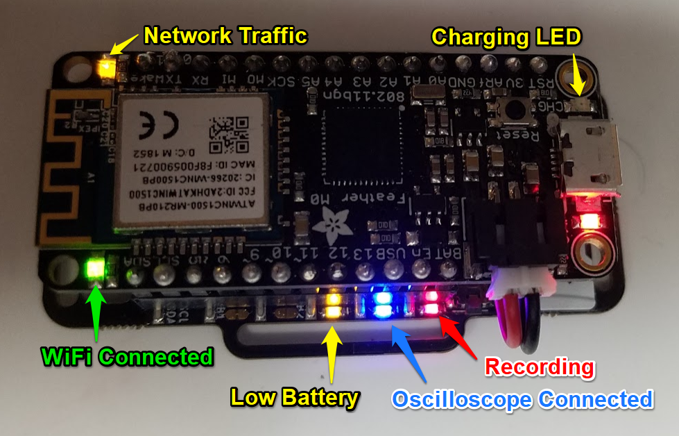
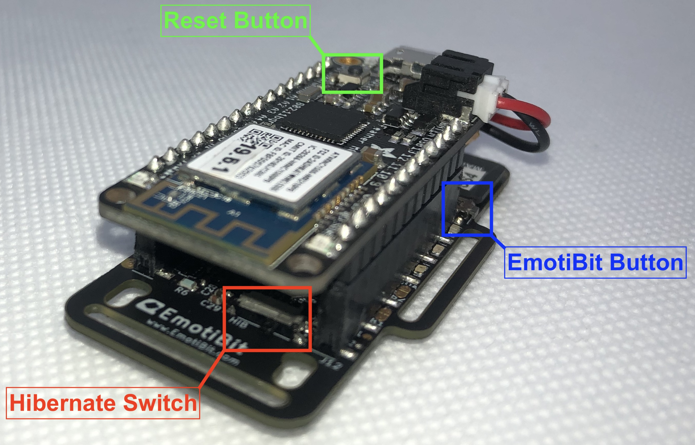

# Learn More About EmotiBit

## Table of contents
- [EmotiBit HW](#EmotiBit-HW)
  - [LEDs and Buttons](#LEDs-and-Buttons)
- [EmotiBIt FW](#EmotiBit-FW)
  - [EmotiBit firmware variants](#EmotiBit-firmware-variants)
- [EmotiBit SW](#EmotiBit-SW)
  - [How is Data Stored on the SD Card](#How-is-Data-Stored-on-the-SD-Card)
- [Repositories](#Repositories)

## EmotiBit HW
### LEDs and Buttons



- **LED's on the EmotiBit:** As shown in the Images above, The EmotiBit FeatherWing has 3 LEDs to indicate its present status.
  - RED: Blinks at ~1Hz when recording
  - BLUE: Steady-on when connected to the EmotiBit Oscilloscope
  - Yellow: Steady-on when the battery level is low

- **LED's on the Adafruit Feather M0 WiFi:** In addition to the EmotiBit LEDs, the Feather has 4 indicator LED's 
  - RED: Is the I2C SCL Line. Under regular Operation, it should be always ON
  - ORANGE: This is the Charging indicator, which glows if a battery is connected to the feather and is being charged by the USB connection
  - GREEN: This is the WiFi indicator. If the EmotiBit is Connected to Wifi, there should be a constant glow.
  - YELLOW: It blinks whenever the EmotiBit receives a message from the computer. This blinks periodically when an EmotiBit Oscilloscope executable is running on the network.

- **Buttons on the EmotiBit**
  - `EmotiBit Button`: _adjacent to the SD card_
    - Long Press (5 sec) to put EmotiBit into `Sleep mode`
    - Short Press- Switch between WiFi modes. In future will support mapping to different functionality.
  - `Reset button`:
    - resets the microncontroller board. All current operations are halted and EmotiBit restarts.
  - `Hibernate Switch`(**Only Available on V4 and above**):
    - The Hibernate Switch kills power to both the Feather and the EmotiBit. It is recommended to toggle the switch to `HIB` if leaving the EmotiBit unused for long durations.

- Check out EmotiBit [hardware files](./hardware_files/README.md) for more information

## EmotiBit FW

### EmotiBit firmware variants
The official stock firmware for EmotiBit (EmotiBit_stock_firmware) unlocks all features of EmotiBit and is a great starting point
for using EmotiBit! 

Since EmotiBit is opensource, you can also tweak the [firmware](https://github.com/EmotiBit/EmotiBit_FeatherWing) and make changes as per your specific needs.
As an exmaple, we have created a variant which runs the PPG sensor at 100Hz sampling rates (instead of the stock 25hz). You may choose to use this firmware
if you are interested in derivatives metrics like HRV (Heart rate Variability), which benefits from a faster sampling rate.
Also be sure to update the [EmotiBit Oscilloscope display settings](./Working_with_emotibit_data.md#EmotiBit-Oscilloscope-display-settings) with the higher PPG sampling rate to display the data correctly in the EmotiBit Oscillscope window. You can find the binary for this firmware in our [github repository](https://github.com/EmotiBit/EmotiBit_FeatherWing/releases/latest).

If you wish to tweak this firmware and compile it from source, follow the instructions to download and install platformIO (checkout the [Keeping EmotiBit up to date](./Keep_emotibit_up_to_date.md#Building-firmware-using-PlatformIO) document).

**Developer note: This variant is based on the same source code and uses build flags to setup different sampling rates. As a result,
it cannot be compiled on Arduino and needs a different embedded environment for development. We use PlatformIO for this purpose.**

[ToDo:] Create a table that lists the variant information.

## EmotiBit SW
### How is Data Stored on the SD Card 
- CSV: Experimental Data
  - All data is saved to the SD card into a .csv file when recording is initiated from the GUI
  - The file is named with the date-time that the recording started
    -   An example file name can be `2019-01-30_11-57-13-492.csv`
- JSON: Configuration Settings
  - Information about the configuration of the hardware and firmware are written to a .json file also on the SD card
  - The file is named with the date-time that the recording started
    - 2019-01-30_11-57-13-492_info.json

```
[
{"info":{"name":"Accelerometer","type":"Accelerometer","typeTags":["AX","AY","AZ"],"channel_count":3,"nominal_srate":60,"channel_format":"float","units":"G/second","source_id":"EmotiBit FeatherWing","hardware_version":0,"feather_version":"Adafruit Feather M0 WiFi","firmware_version":"0.4.3","created_at":"2019-07-17_14-38-30-914939","setup":{"range":8}}},
{"info":{"name":"Gyroscope","type":"Gyroscope","typeTags":["GX","GY","GZ"],"channel_count":3,"nominal_srate":60,"channel_format":"float","units":"degrees/second","source_id":"EmotiBit FeatherWing","hardware_version":0,"feather_version":"Adafruit Feather M0 WiFi","firmware_version":"0.4.3","created_at":"2019-07-17_14-38-30-914939","setup":{"range":1000}}},
{"info":{"name":"Magnetometer","type":"Magnetometer","typeTags":["MX","MY","MZ"],"channel_count":3,"nominal_srate":60,"channel_format":"float","units":"raw samples","source_id":"EmotiBit FeatherWing","hardware_version":0,"feather_version":"Adafruit Feather M0 WiFi","firmware_version":"0.4.3","created_at":"2019-07-17_14-38-30-914939","setup":{}}},
{"info":{"name":"ElectrodermalActivity","type":"ElectrodermalActivity","typeTags":["EA"],"channel_count":1,"nominal_srate":15,"channel_format":"float","units":"microsiemens","source_id":"EmotiBit FeatherWing","hardware_version":0,"feather_version":"Adafruit Feather M0 WiFi","firmware_version":"0.4.3","created_at":"2019-07-17_14-38-30-914939","setup":{"adc_bits":12,"voltage_divider_resistance":5000000,"EDR_amplification":20,"low_pass_filter_frequency":"15.91Hz","samples_averaged":4,"oversampling_rate":60}}},
{"info":{"name":"Humidity0","type":"Humidity","typeTags":["H0"],"channel_count":1,"nominal_srate":7,"channel_format":"float","units":"Percent","source_id":"EmotiBit FeatherWing","hardware_version":0,"feather_version":"Adafruit Feather M0 WiFi","firmware_version":"0.4.3","created_at":"2019-07-17_14-38-30-914939","setup":{"resolution":"RESOLUTION_H11_T11","samples_averaged":2,"oversampling_rate":15}}},
{"info":{"name":"Temperature0","type":"Temperature","typeTags":["T0"],"channel_count":1,"nominal_srate":7,"channel_format":"float","units":"degrees celcius","source_id":"EmotiBit FeatherWing","hardware_version":0,"feather_version":"Adafruit Feather M0 WiFi","firmware_version":"0.4.3","created_at":"2019-07-17_14-38-30-914939","setup":{"resolution":"RESOLUTION_H11_T11","samples_averaged":2,"oversampling_rate":15}}},
{"info":{"name":"Thermistor","type":"Thermistor","typeTags":["TH"],"channel_count":1,"nominal_srate":7,"channel_format":"float","units":"raw adc units","source_id":"EmotiBit FeatherWing","hardware_version":0,"feather_version":"Adafruit Feather M0 WiFi","firmware_version":"0.4.3","created_at":"2019-07-17_14-38-30-914939","setup":{"ADC_speed":"ADC_NORMAL","Vin_buffering":"VIN_UNBUFFERED","VREFP":"VREFP_VDDA","voltage_divider_resistance":10000,"thermistor_resistance":10000,"low_pass_filter_frequency":"0.1591Hz","amplification":10,"samples_averaged":2,"oversampling_rate":15}}},
{"info":{"name":"PPG","type":"PPG","typeTags":["PI","PR","PG"],"channel_count":3,"nominal_srate":25,"channel_format":"float","units":"raw units","source_id":"EmotiBit FeatherWing","hardware_version":0,"feather_version":"Adafruit Feather M0 WiFi","firmware_version":"0.4.3","created_at":"2019-07-17_14-38-30-914939","setup":{"LED_power_level":47,"samples_averaged":16,"LED_mode":3,"oversampling_rate":400,"pulse_width":215,"ADC_range":4096}}}
]
```


[GPS]: https://developer.android.com/reference/android/location/Location
[Pack]: assets/PacketExample.png "Example Packets"

## Repositories
- Parent Github
  - https://github.com/EmotiBit/
- Android App
  - https://github.com/EmotiBit/EmotiBit_Android_App/
- Firmware
  - https://github.com/EmotiBit/EmotiBit_FW_FeatherWing
  - Latest release: https://github.com/EmotiBit/EmotiBit_FW_FeatherWing/releases/latest
- OpenFrameworks GUI
  - https://github.com/EmotiBit/ofxEmotiBit
  - Latest release: https://github.com/EmotiBit/ofxEmotiBit/releases/latest


  [LED]: assets/M0_WiFi_LED_Indicators_01.png "Feather LED's"
