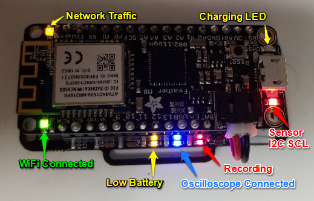

# Learn More About EmotiBit

## Table of contents
- [EmotiBit HW](#EmotiBit-HW)
  - [LEDs nad Buttons](#LEDs-and-Buttons)
- [EmotiBIt FW](#EmotiBit-FW)
  - [Raw data packet architecture](#Raw-data-packet-architecture)
  - [TypeTag Character Codes](#TypeTag-Character-Codes)
- [EmotiBit SW](#EmotiBit-SW)
  - [How is Data Stored on the SD Card](#How-is-Data-Stored-on-the-SD-Card)
- [Repositories](#Repositories)

## EmotiBit HW
### LEDs and Buttons



- **LED's on the EmotiBit:** As shown in the Images above, The EmotiBit FeatherWing has 3 LEDs to indicate its present status.
  - RED: Blinks at ~1Hz when recording
  - BLUE: Steady-on when connected to the EmotiBit Oscilloscope
  - Yellow: Steady-on when the battery level is low

- **LED's on the Adafruit Feather M0 WiFi:** In addition to the EmotiBit LEDs, the Feather has 4 indicator LED's 
  - RED: Is the I2C SCL Line. Under regular Operation, it should be always ON
  - ORANGE: This is the Charging indicator, which glows if a battery is connected to the feather and is being charged by the USB connection
  - GREEN: This is the WiFi indicator. If the EmotiBit is Connected to Wifi, there should be a constant glow.
  - YELLOW: It blinks whenever the EmotiBit receives a message from the computer. This blinks periodically when an EmotiBit Oscilloscope executable is running on the network.

- **Buttons on the EmotiBit**
  - `EmotiBit Button`: _adjacent to the SD card_
    - Long Press (5 sec) to put EmotiBit into `Sleep mode`
    - Short Press- Switch between WiFi modes. In future will support mapping to different functionality.
  - `Reset button`:
    - resets the microncontroller board. All current operations are halted and EmotiBit restarts.
  - `Hibernate Switch`(**Only Available on V4**):
    - The Hibernate Switch kills power to both the Feather and the EmotiBit. It is recommended to toggle the switch to `HIB` if leaving the EmotiBit unused for long durations.

## EmotiBit FW

### Raw data packet architecture

- `TIMESTAMP`-`PACKET#`-`#DATAPOINTS`-`TYPETAG`-`VERSION`-`RELIABILITY`-`PAYLOAD`
  - **Timestamp:** milliseconds since start of EmotiBit
  - **Packet Number:** packet count since start of EmotiBit
  - **Number of Datapoints:** Number of data points in the payload
  - **Typetag:** type of data being sent
  - **Version:** version of packet protocol
  - **Reliability:** data reliability score out of 100, currently always 100
  - **Payload:** data to send
- Example Packets:

![alt text][Pack]
### TypeTag Character Codes
The most up-to-date list of type tags can be found in https://github.com/EmotiBit/EmotiBit_XPlat_Utils/blob/master/src/EmotiBitPacket.cpp
<br>
For a quick look at the available typetags, you can check out the table below. We periodically update this table as the EmotiBit firmware grows.

- <details open><summary><b>Biometric TypeTags</b></summary>

  |Tag    | Description          |
  |:-----:|----------------------|
  |EA     |EDA- Electrodermal Activity  |
  |EL     |EDL- Electrodermal Level     |
  |ER     |EDR- Electrodermal Response  |
  |PI     |PPG Infrared          |
  |PR     |PPG Red               |
  |PG     |PPG Green             |
  |T0     |Temperature (Si7013)  |
  |TH     |Thermopile(ML90632)          |
  |H0     |Humidity (Si7013)     |
  |AX     |Accelerometer X       |
  |AY     |Accelerometer Y       |
  |AZ     |Accelerometer Z       |
  |GX     |Gyroscope X           |
  |GY     |Gyroscope Y           |
  |GZ     |Gyroscope Z           |
  |MX     |Magnetometer X        |
  |MY     |Magnetometer Y        |
  |MZ     |Magnetometer Z        |

  </details>

- <details><summary><b>General Typetags</b></summary>

  |Tag    | Description                       |
  |:-----:|:----------------------------------|
  |EI     |EmotiBit Info Json                 |
  |DC     |Data Clipping, TypeTag in Payload  |
  |DO     |Data Overflow, TypeTag in Payload  |
  |B%     |Battery Percentage Remaining       |
  |BV     |Battery Voltage                    |
  |D%     |SD card percent capacity filled    |
  |RD     |Request Data, TypeTag in Payload   |
  |PI     |Ping                               |
  |PO     |Pong                               |
  |RS     |Reset                              |

  </details>

- <details><summary><b>Computer to EmotiBit TypeTags</b></summary>

  |Tag    | Description                       |
  |:-----:|:----------------------------------|
  |GL     |[GPS latitude and Longitude][GPS]  |
  |GS     |[GPS Speed][GPS]                   |
  |GB     |[GPS Bearing][GPS]                 |
  |GA     |[GPS Altitude][GPS]                |
  |TL     |Local Computer Timestamp           |
  |TU     |UTC Timestamp                      |
  |TX     |Crosstime, used for timestamp comparison   |
  |LM     |LSL Marker/message                 |
  |RB     |Record begin (Include timestamp in Data)   |
  |RE     |Record End                         |
  |UN     |User Note                          |
  |MH     |Mode Hibernate                     |
  |HE     |Hello EmotiBit, used to establish communication  |

  </details>

## EmotiBit SW
### How is Data Stored on the SD Card 
- CSV: Experimental Data
  - All data is saved to the SD card into a .csv file when recording is initiated from the GUI
  - The file is named with the date-time that the recording started
    -   An example file name can be `2019-01-30_11-57-13-492.csv`
- JSON: Configuration Settings
  - Information about the configuration of the hardware and firmware are written to a .json file also on the SD card
  - The file is named with the date-time that the recording started
    - 2019-01-30_11-57-13-492_info.json
    
```
[
{"info":{"name":"Accelerometer","type":"Accelerometer","typeTags":["AX","AY","AZ"],"channel_count":3,"nominal_srate":60,"channel_format":"float","units":"G/second","source_id":"EmotiBit FeatherWing","hardware_version":0,"feather_version":"Adafruit Feather M0 WiFi","firmware_version":"0.4.3","created_at":"2019-07-17_14-38-30-914939","setup":{"range":8}}},
{"info":{"name":"Gyroscope","type":"Gyroscope","typeTags":["GX","GY","GZ"],"channel_count":3,"nominal_srate":60,"channel_format":"float","units":"degrees/second","source_id":"EmotiBit FeatherWing","hardware_version":0,"feather_version":"Adafruit Feather M0 WiFi","firmware_version":"0.4.3","created_at":"2019-07-17_14-38-30-914939","setup":{"range":1000}}},
{"info":{"name":"Magnetometer","type":"Magnetometer","typeTags":["MX","MY","MZ"],"channel_count":3,"nominal_srate":60,"channel_format":"float","units":"raw samples","source_id":"EmotiBit FeatherWing","hardware_version":0,"feather_version":"Adafruit Feather M0 WiFi","firmware_version":"0.4.3","created_at":"2019-07-17_14-38-30-914939","setup":{}}},
{"info":{"name":"ElectrodermalActivity","type":"ElectrodermalActivity","typeTags":["EA"],"channel_count":1,"nominal_srate":15,"channel_format":"float","units":"microsiemens","source_id":"EmotiBit FeatherWing","hardware_version":0,"feather_version":"Adafruit Feather M0 WiFi","firmware_version":"0.4.3","created_at":"2019-07-17_14-38-30-914939","setup":{"adc_bits":12,"voltage_divider_resistance":5000000,"EDR_amplification":20,"low_pass_filter_frequency":"15.91Hz","samples_averaged":4,"oversampling_rate":60}}},
{"info":{"name":"Humidity0","type":"Humidity","typeTags":["H0"],"channel_count":1,"nominal_srate":7,"channel_format":"float","units":"Percent","source_id":"EmotiBit FeatherWing","hardware_version":0,"feather_version":"Adafruit Feather M0 WiFi","firmware_version":"0.4.3","created_at":"2019-07-17_14-38-30-914939","setup":{"resolution":"RESOLUTION_H11_T11","samples_averaged":2,"oversampling_rate":15}}},
{"info":{"name":"Temperature0","type":"Temperature","typeTags":["T0"],"channel_count":1,"nominal_srate":7,"channel_format":"float","units":"degrees celcius","source_id":"EmotiBit FeatherWing","hardware_version":0,"feather_version":"Adafruit Feather M0 WiFi","firmware_version":"0.4.3","created_at":"2019-07-17_14-38-30-914939","setup":{"resolution":"RESOLUTION_H11_T11","samples_averaged":2,"oversampling_rate":15}}},
{"info":{"name":"Thermistor","type":"Thermistor","typeTags":["TH"],"channel_count":1,"nominal_srate":7,"channel_format":"float","units":"raw adc units","source_id":"EmotiBit FeatherWing","hardware_version":0,"feather_version":"Adafruit Feather M0 WiFi","firmware_version":"0.4.3","created_at":"2019-07-17_14-38-30-914939","setup":{"ADC_speed":"ADC_NORMAL","Vin_buffering":"VIN_UNBUFFERED","VREFP":"VREFP_VDDA","voltage_divider_resistance":10000,"thermistor_resistance":10000,"low_pass_filter_frequency":"0.1591Hz","amplification":10,"samples_averaged":2,"oversampling_rate":15}}},
{"info":{"name":"PPG","type":"PPG","typeTags":["PI","PR","PG"],"channel_count":3,"nominal_srate":25,"channel_format":"float","units":"raw units","source_id":"EmotiBit FeatherWing","hardware_version":0,"feather_version":"Adafruit Feather M0 WiFi","firmware_version":"0.4.3","created_at":"2019-07-17_14-38-30-914939","setup":{"LED_power_level":47,"samples_averaged":16,"LED_mode":3,"oversampling_rate":400,"pulse_width":215,"ADC_range":4096}}}
]
```


[GPS]: https://developer.android.com/reference/android/location/Location
[Pack]: assets/PacketExample.png "Example Packets"

### A Note on LSL

- EmotiBit is currently able to recieve a single multichannel LSL stream via communication with [ofxEmotiBit](https://github.com/EmotiBit/ofxEmotiBit/releases)
- ofxEmotiBit makes use of the openFrameworks addon [ofxLSL](https://github.com/badfishblues/ofxLSL) which has further documentation and examples in its own git repository
- The resolve stream argument is currently hardcoded in the main of ofxEmotiBit to **"name = 'CFL'"**, which means that the outlet stream that is being sent must have this name, or the GUI will not be able to find it
- While running ofxEmotiBit, the terminal window will display updates on when a connection to the stream occurred
```
[notice ] ofxLSL::update()
[notice ] ofxLSL::connect()
[notice ] Connecting to CFL at 0 hz 
```
- Each LSL marker has 3 timestamps associated with it:
  - **timestamp (TS):** _lsl_clock()_ time associated with the tag on the computer that sent the tag
  - **timestampLocal (TSC):** _timestamp + inlet->time_correction(1)_, an estimation of the _lsl_clock()_ time on the recieving computer equivalent to the TS
  - **localClock (LC):** _lsl_clock()_ after the _pull_sample()_
- LD is the payload of an LM and can be multiple channels
- LSL times are not unix times, but rather in seconds since your computer was turned on
- Crosstimes (TX) for LSL include a TL and an LC at the given instance
  - LC is an _lsl_clock()_ call at the time of the TX
  - Note that any conversion from the LSL time system to an external system could seriously hamper the accuracy and effectiveness of LSL
#### Accuracy

- **TS** is 100% accurate
- **TSC** periodicity is at worst accurate to 1.8ms
  - _average:_ 19 microseconds
  - defined as {TSC(n) - TSC(n-1)} - {TSsender(n) - TSsender(n-1)}
- **LC** periodicity is rather unreliable (>300ms)
  - Can be more accurate on same computer
  
#### LSL Packet Examples

```
127214,21942,1,TX,1,100,TL,2019-07-17_14-40-01-804897,LC,189690.2055982
249054,45373,1,LM,1,100,TSC,264448.0612918,TS,264448.0607235,LC,264448.0676169,LD,Hello
250555,45660,1,LM,1,100,TSC,264449.5732830,TS,264449.5727040,LC,264449.5778914,LD,World
```


## Repositories
- Parent Github
  - https://github.com/EmotiBit/
- Android App
  - https://github.com/EmotiBit/EmotiBit_Android_App/
- Firmware
  - https://github.com/EmotiBit/EmotiBit_FW_FeatherWing
  - Latest release: https://github.com/EmotiBit/EmotiBit_FW_FeatherWing/releases/latest
- OpenFrameworks GUI
  - https://github.com/EmotiBit/ofxEmotiBit
  - Latest release: https://github.com/EmotiBit/ofxEmotiBit/releases/latest
  
  
  [LED]: assets/M0_WiFi_LED_Indicators_01.png "Feather LED's"
