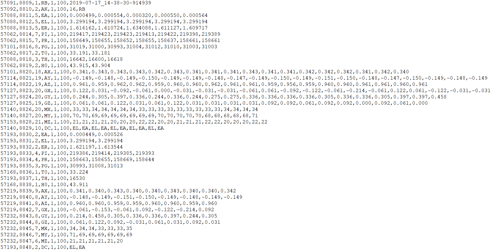

## EmotiBit FW

### Raw data packet architecture

- `TIMESTAMP`-`PACKET#`-`#DATAPOINTS`-`TYPETAG`-`VERSION`-`RELIABILITY`-`PAYLOAD`
  - **Timestamp:** milliseconds since start of EmotiBit
  - **Packet Number:** packet count since start of EmotiBit
  - **Number of Datapoints:** Number of data points in the payload
  - **TypeTag:** type of data being sent
  - **Version:** version of packet protocol
  - **Reliability:** data reliability score out of 100, currently always 100
  - **Payload:** data to send

- Example packets:

For more details about Emotibit data streams, go to [EmotiBit Data Types](../Working_with_emotibit_data.md#emotibit-data-types).

### Sampling rates
- The following table shows the sampling rates at which the sensors operate with the stock EmotiBit firmware.

| Function |Data Type| Sensor IC | Sampling Rate (samples per second)|
|----------|---------|-----------|--------------|
| Motion   |`AX` `AY` `AZ` `GX` `GY` `GZ` `MX` `MY` `MZ`|BMI160+BMI150|25|
|PPG |`PI` `PG` `PR`| MAX30101|25|
|Temperature |`T0` / `TH`|MAX30101 / MLX90632 |7.5|
|EDA|`EA` `EL` `ER`|-|15|

### EmotiBit firmware variants
The official stock firmware for EmotiBit (EmotiBit_stock_firmware) unlocks all features of EmotiBit and is a great starting point
for using EmotiBit! 

Since EmotiBit is opensouce, you can also tweak the [firmware](https://github.com/EmotiBit/EmotiBit_FeatherWing) and make changes as per your specific needs.
As an exmaple, we have created a variant which run the PPG sensor at 100Hz sampling rates (instead of the stock 25hz). You may choose to use this firmware
if you are interested in derivatives metrics like HRV (Heart rate Variability), which benefits from a faster sampling rate.

ToDo: add link to the bin folder.
You can find the binary for this firmware in our [github repository]().

If you wish to tweak this firmware and compile it from source, follow the instructions to download and install platformIO.

**Developer note: This variant is based on the same source code and uses build flags to setup different sampling rates. As a result,
it cannot be compiled on Arduino and needs a different embedded environment for development. We use PlatformIO for this purpose.**

[ToDo:] Create a table that lists the variant information. 