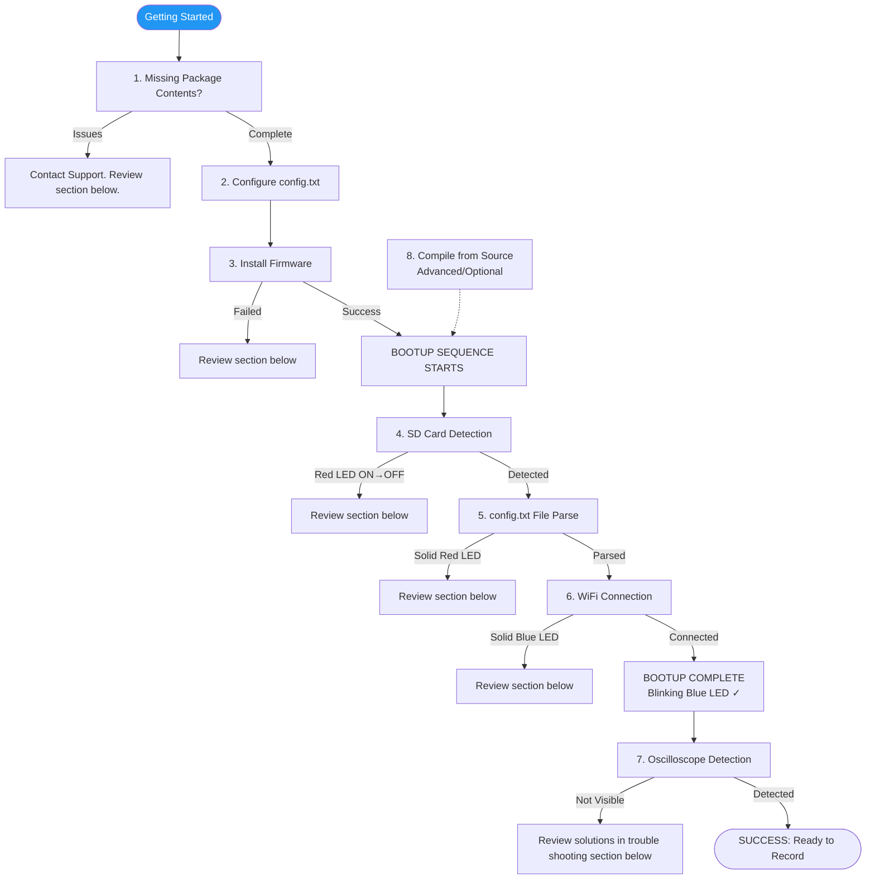

# EmotiBit Troubleshooting Guide
This guide provides solutions to common EmotiBit issues. The content is curated from community discussions and support inquiries.

## Troubleshooting Flow Overview
The diagram below illustrates the sequential troubleshooting process for EmotiBit. Each step must be successfully completed before proceeding to the next. Use this flow to quickly identify where in the setup process you may be experiencing issues.

### Detailed Flow Diagram

# Typical EmotiBit Getting Started Flow

- Note: The Getting Started steps are sequential. You cannot proceed to a step if the previous step has not been successfully completed. For example, if firmware installation (step 1) fails, the EmotiBit will not attempt to connect to a WiFi network.

## 1. Missing Package Contents
If you find something is missing from your order, please contact us via email with your order number. You can verify the complete contents of your package in the [Unboxing section](https://github.com/EmotiBit/EmotiBit_Docs/blob/master/Getting_Started.md#Unboxing) of the Getting Started guide.
   - Orders placed on the OpenBCI website: contact support@openbci.com
   - Orders placed on the EmotiBit website: contact support@emotibit.com
---
## 2. Config.txt Configuration Issues

**Definition:** This section addresses issues related to configuring the `config.txt` file for EmotiBit setup.

### FAQs

1. **[How do I add my WiFi credentials to connect to a network?](https://www.reddit.com/r/EmotiBit/comments/tsiu7j/how_do_i_add_my_wifi_credentials_to_connect_to_a/)**

2. **[Where can I find the WiFi config file to copy onto my SD card?](https://www.reddit.com/r/EmotiBit/comments/tt3cnv/where_can_i_find_the_wifi_config_file_to_copy/)**

---

## 3. Firmware Installation Issues

**Definition:** This section addresses problems encountered when attempting to install firmware on EmotiBit devices.

### Indication of this Issue
- Error messages stating "Feather not detected" or "Firmware installation failed".
  - If firmware installation has failed, you may see a blinking red LED on the Feather board (**NOT THE RED EMOTIBIT RECORDING LED**). The Feather is shipped with a default program that causes this LED behavior, which persists if new firmware is not successfully programmed onto the Feather.
- ToDo: Add assets representing this error.

### Solution Steps
1. **Check USB Cable**: Ensure you are using a data-capable USB cable. Charge-only cables will cause detection failures.
2. **Verify HIB Switch Position**: Confirm that the HIB switch on the Feather board is set to "On" (not in HIB mode).
3. **Install Correct Drivers**:
    - Ensure the SiLabs USB drivers are installed. See our [documentation](https://github.com/EmotiBit/EmotiBit_Docs/blob/master/Getting_Started.md#prerequisites).
4. **Retry Firmware Installation**: Follow the installation instructions again after confirming all checks above. Repeat the process a couple of times if necessary.
5. **Community Engagement**: If problems persist, document and share detailed errors with the community on our support [forum](https://forum.emotibit.com). Collaborative troubleshooting can help identify solutions.

### Additional Notes
- For Mac users, be aware of security prompts that may block the firmware installer. See this [relevant post](https://www.reddit.com/r/EmotiBit/comments/1iy7i2q/macos_firmware_installer_not_working/) on the forum.

### FAQs
1. **[Why is the Firmware Installer failing to install EmotiBit firmware?](https://www.reddit.com/r/EmotiBit/comments/1d3enx3/why_is_the_firmware_installer_failing_to_install/)**

---

## 4. Bootup Failure: SD Card Not Detected

**Definition:** This section addresses issues where the EmotiBit is unable to detect the SD Card.

### Indication of this Issue
   - The red LED turns ON and then OFF during startup, indicating SD card failure. **A blinking RED LED does not fall under this category**. See documentation for EmotiBit LEDs.
   - ToDo: Add a link to the EmotiBit LED reference.

### How to Confirm this Issue
   - "Setup failed: SD-Card not detected" message logged on the Arduino IDE Serial Monitor. See this [FAQ](https://www.reddit.com/r/EmotiBit/comments/vmtz6w/how_i_use_the_arduino_serial_monitor_with_emotibit/) for more information on using the Arduino Serial Monitor.

### Solution Steps
- **Verify Hardware Connections:** Ensure that the pins of the Feather board and EmotiBit are properly aligned and seated (no floating pins). Clean contact points if necessary to improve connection quality.
- **Battery Checks:** Confirm that the battery is connected and properly charged. **The SD Card will not be detected if the battery is not plugged in.**
- **Replace or Test SD Cards:** Try different SD cards from various brands or sizes (32GB recommended).
- **Verify SD Card Format:** Ensure that the SD card is formatted as FAT32. *If you received the SD Card as part of the EmotiBit All-in-one bundle or the Essentials Kit, it is already in the correct format.*
- **Check Firmware Version (Only for users who programmed the Feather using Arduino or PlatformIO):** Ensure the Adafruit SAMD Boards are at version 1.5.1 and confirm the [SD-Fat library version](https://github.com/EmotiBit/EmotiBit_Docs/blob/master/Keep_emotibit_up_to_date.md#install-firmware-libraries).

### FAQs
1. [My EmotiBit is not detecting the SD-Card. What are my next steps?](https://www.reddit.com/r/EmotiBit/comments/1jgn44l/my_emotibit_is_not_detecting_the_sdcard_what_are/)
---

## 5. Bootup Failure: Config File Parse Error

**Definition:** This section addresses issues where the EmotiBit fails to parse the config file contents on the SD Card.

### Indication of this Issue
- Presence of a **solid red LED** on EmotiBit (indicating either the config file is missing or cannot be parsed). **A blinking RED LED does not fall under this issue.**

### How to Confirm this Issue
- Serial Monitor logs showing the following error: **"Failed to parse Config file contents."** See this [FAQ](https://www.reddit.com/r/EmotiBit/comments/vmtz6w/how_i_use_the_arduino_serial_monitor_with_emotibit/) for more information on using the Arduino Serial Monitor.

### Solution Steps
- **Check Configuration File:**
  - Confirm that the config file is present on the SD Card.
- **SD Card Compatibility:**
  - Use a **32GB SD card** formatted to FAT32. Larger cards are not supported. *If you ordered an All-in-one bundle or the Essentials Kit, your SD Card meets these specifications.*
- **Troubleshoot config.txt File:**
   - Ensure JSON formatting is correct. Avoid trailing commas and validate the JSON structure to prevent errors. You can use an [online JSON format checker](https://jsonlint.com/) to validate that your config file is in the correct format.

---

## 6. Bootup Failure: WiFi Connection Issues

**Definition:** This section addresses issues where the EmotiBit fails to connect to a WiFi network.

### Indication of this Issue
- A **solid blue LED** indicates the EmotiBit is attempting to connect to the designated WiFi network but is unsuccessful.

### How to Confirm this Issue
- The Serial Monitor will show repeated unsuccessful connection attempts to the WiFi network(s) listed in the config file. See this [FAQ](https://www.reddit.com/r/EmotiBit/comments/vmtz6w/how_i_use_the_arduino_serial_monitor_with_emotibit/) for more information on using the Arduino Serial Monitor.

### Solution Steps
- **Verify WiFi Credentials:** Check that the SSID and password in the `config.txt` file on the SD Card are correct.
- **Network Checks:** Ensure that you are on a 2.4GHz WiFI network.
- **Testing Environment:** Test with a known good network (e.g., mobile hotspot) to isolate the problem.
- **Check for Network Restrictions:** Check for any network restrictions or requirements that may prevent connection attempts, such as MAC filtering or captive portals.
- **Enterprise Network Limitations:** If you are using an Enterprise network, try connecting to a home network to verify EmotiBit functionality. If it works on a home network, the issue may be with the Enterprise network configuration.

### FAQs

1. **[Why isn't my EmotiBit connecting to my phone's WiFi hotspot?](https://www.reddit.com/r/EmotiBit/comments/t4hchv/why_isnt_my_emotibit_connecting_to_my_phones_wifi/)**
2. **[Help! I'm having trouble connecting to EmotiBit!](https://www.reddit.com/r/EmotiBit/comments/11hbme1/help_im_having_trouble_connecting_to_emotibit/)**
3. **[What are the available network options to use with EmotiBit?](https://www.reddit.com/r/EmotiBit/comments/11hjv49/what_are_the_available_network_options_to_use/)**

---

## 7. EmotiBit Oscilloscope Not Detecting EmotiBit

**Definition:**
This issue occurs **ONLY IF** all of the following conditions are met:
1. You have successfully installed the EmotiBit firmware.
2. The EmotiBit has successfully completed bootup.
3. The EmotiBit is connected to the network, as indicated by a blinking blue LED.

**If you do not see a blinking blue LED, please refer to the issues above.**

Once the EmotiBit has completed setup and connected to WiFi (confirmed by a blinking blue LED), the EmotiBit Oscilloscope should be able to detect it. If the Oscilloscope fails to detect the EmotiBit even when it is connected to WiFi, this issue applies.

### Indication of this Issue
- The EmotiBit has a blinking blue LED, but it is not visible in the EmotiBit Oscilloscope.

### How to Confirm this Issue
- Use the Arduino Serial Monitor and press "i" to print device information. The device information contains the IP address of the EmotiBit, confirming it is on the network. See this [FAQ](https://www.reddit.com/r/EmotiBit/comments/vmtz6w/how_i_use_the_arduino_serial_monitor_with_emotibit/) for more information on using the Arduino Serial Monitor.

### Solution Steps

1. **Confirm Network Compatibility**:
   - Ensure that both the EmotiBit and Oscilloscope are on the **same WiFi network** (2.4GHz band).
   - Consider using a simple hotspot for testing purposes to rule out complex network issues.

2. **Check Firewall and Security Settings**:
   - Verify that firewall and antivirus software permissions allow communication with the EmotiBit. Disable them temporarily if necessary for testing.
   - Adjust router settings to ensure that no settings are inadvertently blocking traffic from the EmotiBit.

3. **Conduct Serial Monitor Diagnostics**:
   - Use the Arduino Serial Monitor to view live logs during connection attempts to gather data on errors or disconnection reasons.

4. **Adjust Broadcast Settings**:
   - Switch between unicast and broadcast settings in the `emotibitCommSettings.json` file based on the network configuration that yields better connectivity.

### FAQs
1. **[Help! I'm having trouble connecting to EmotiBit!](https://www.reddit.com/r/EmotiBit/comments/11hbme1/help_im_having_trouble_connecting_to_emotibit/)**

2. **[EmotiBit Oscilloscope is not detecting EmotiBits connected to the WiFi network!](https://www.reddit.com/r/EmotiBit/comments/v75gsq/emotibit_oscilloscope_is_not_detecting_emotibits/)**

### Additional Diagnostic Steps
- Use the EmotiBit IP Address to ping the EmotiBit (ToDo: Add more details)
- Use the Arduino Serial Monitor to check logs. An `HE` (Hello EmotiBit) message is printed on the Serial. (ToDo: Add more details)

---

## 8. Compiling Firmware from Source

**Definition:** This section addresses problems encountered when compiling EmotiBit firmware from source code.

### Common Symptoms
- Missing files or libraries resulting in compilation errors (e.g., `fatal error: String.h: No such file or directory`).
- SD Card detection failures preventing successful firmware installations or uploads.
- Attempting to upload the compiled binary for the wrong MCU.

### Things to Check
1. **Missing Libraries**
   - Check for specific versions of libraries mentioned in the documentation, updating where necessary. See our [documentation](https://github.com/EmotiBit/EmotiBit_Docs/blob/master/Keep_emotibit_up_to_date.md#update-firmware-using-arduino-ide) for details.

### FAQs
1. **[Is it possible to modify the sampling rate of data streams on EmotiBit?](https://www.reddit.com/r/EmotiBit/comments/1crpxah/is_it_possible_to_modify_the_sampling_rate_of/)**

2. **[Why can I not see the Feather port on Arduino IDE to use the Serial Monitor?](https://www.reddit.com/r/EmotiBit/comments/1d3edjz/why_can_i_not_see_the_feather_port_on_arduino_ide/)**

3. **[How to increase PPG sampling rate to 100 Hz on EmotiBit (looking for .ino firmware for Arduino IDE)](https://www.reddit.com/r/EmotiBit/comments/1m17trk/how_to_increase_ppg_sampling_rate_to_100_hz_on/)**
