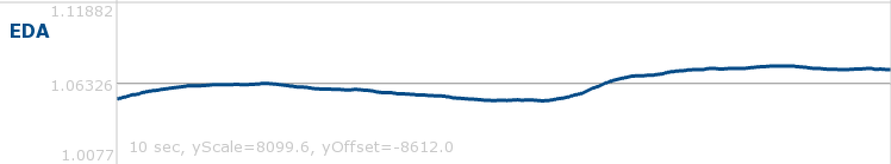
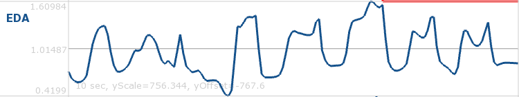
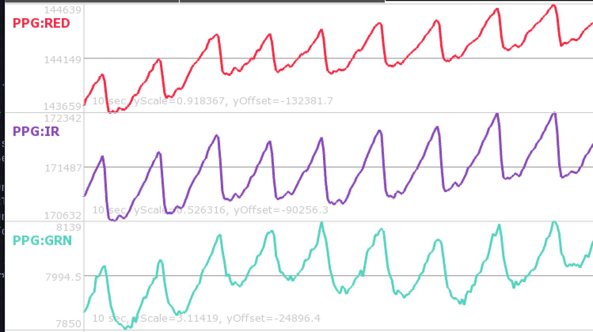
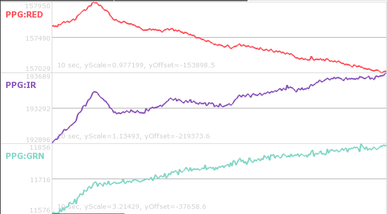
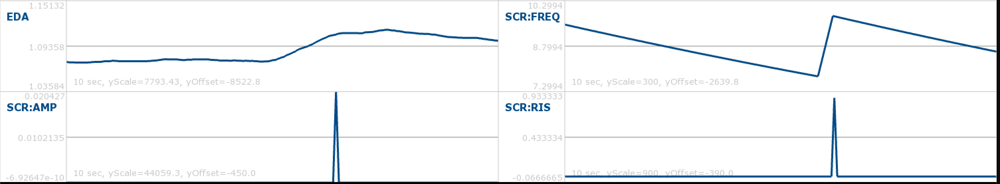
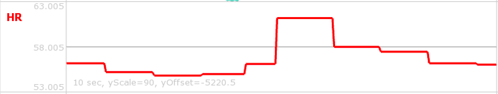

# Table of Contents
* [How to Use EmotiBit](#how-to-use-emotibit)
    * [Placement on the Body](#placement-on-the-body)
    * [How to Verify a Good Placement](#how-to-verify-a-good-placement)
* [The Data Ecosystem](#the-data-ecosystem)
    * [Sensors and Signals](#sensors-and-signals)
    * [Data type sampling rates](#data-type-sampling-rates)
    * [Expected Data Format](#expected-data-format)
        * [Local SD Card data format](#local-sd-card-data-format)
        * [Parsed Data File Format](#parsed-data-file-format)
* [Accessing EmotiBit Data](#accessing-emotibit-data)
    * [EmotiBit Oscilloscope: The Basics](#emotibit-oscilloscope-the-basics)
    * [1. Record data on the SD-Card](#1-record-data-on-the-sd-card)
    * [2. Stream data to another location (Using Output List)](#2-stream-data-to-another-location-using-output-list)

> [!IMPORTANT]
> If you are reading this page, it means you have already successfully streamed data from your EmotiBit hardware to the EmotiBit Oscilloscope. 
If you have not yet successfully streamed data or if you need help with the initial setup, please head back to the [**Getting Started**](./Getting_Started.md) page before proceeding with this document.

# How to Use EmotiBit

Getting reliable biometric data depends heavily on how the EmotiBit is positioned and secured on the body.

### Placement on the Body

For the best data collection results, make sure the EmotiBit is properly secured to the body:
- **Securing the Device**: Use the provided strap to attach the device. It should be snug enough to prevent it from shifting while you move, but comfortable enough that it doesn't restrict blood flow.
- **Placement Options**: For a deeper look at different placement spots and how they affect your data, check out this reference blog post: [Sensing Biometrics from Anywhere on the Body](https://www.emotibit.com/sensing-bio-metrics-from-anywhere-on-the-body/).
> [!TIP]
> The EmotiBit has slots for straps on all 4 sides. This enables you to strap the EmotiBit in both orientations.

### Using the Oscilloscope for Feedback
Treat the EmotiBit Oscilloscope as your real-time feedback loop. As you adjust the sensor placement, use the live signal stream to guide your adjustments.
To help you gauge your signal quality, the following sections illustrate what good, clean data looks like for each sensor.

# The Data Ecosystem

Understanding the relationship between the physical sensors, the signals they generate, and how they are structured is key to successfully analyzing EmotiBit data.

## Sensors and Signals

Each data type represents a unique signal captured by EmotiBit and is represented by a unique `TypeTag`. The most up-to-date list of TypeTags can always be found in the [EmotiBit Packet Repository](https://github.com/EmotiBit/EmotiBit_XPlat_Utils/blob/master/src/EmotiBitPacket.cpp).

Below is a quick reference guide for the available data types. This table is updated periodically as the EmotiBit firmware grows. 

<table>
  <thead>
    <tr>
      <th align="center">TypeTag</th>
      <th align="left">Signal & Description</th>
      <th align="left" width="35%">How a Good Signal Looks</th>
      <th align="left" width="35%">How a Bad Signal Looks</th>
    </tr>
  </thead>
  <tbody>
    <tr>
      <td align="center"><strong>EA</strong></td>
      <td align="left"><strong>EDA</strong> - Electrodermal Activity</td>
      <td align="left"></td>
      <td align="left"></td>
    </tr>
    <tr>
      <td align="center"><strong>PI</strong><br><strong>PR</strong><br><strong>PG</strong></td>
      <td align="left"><strong>PPG Infrared</strong><br><strong>PPG Red</strong><br><strong>PPG Green</strong></td>
      <td align="left"></td>
      <td align="left"></td>
    </tr>
    <tr>
      <td align="center"><strong>T1</strong></td>
      <td align="left"><strong>Temperature</strong></td>
      <td align="left"></td>
      <td align="left"></td>
    </tr>
    <tr>
      <td align="center"><strong>TH</strong></td>
      <td align="left"><strong>Temperature via Medical-grade Thermopile</strong> <em>(EmotiBit MD only)</em></td>
      <td align="left"></td>
      <td align="left"></td>
    </tr>
    <tr>
      <td align="center"><strong>AX, AY, AZ</strong></td>
      <td align="left"><strong>Accelerometer</strong> (X, Y, Z axes)</td>
      <td align="left"></td>
      <td align="left"></td>
    </tr>
    <tr>
      <td align="center"><strong>GX, GY, GZ</strong></td>
      <td align="left"><strong>Gyroscope</strong> (X, Y, Z axes)</td>
      <td align="left"></td>
      <td align="left"></td>
    </tr>
    <tr>
      <td align="center"><strong>MX, MY, MZ</strong></td>
      <td align="left"><strong>Magnetometer</strong> (X, Y, Z axes)</td>
      <td align="left"></td>
      <td align="left"></td>
    </tr>
    <tr>
      <td align="center"><strong>SA</strong><br><strong>SR</strong><br><strong>SF</strong></td>
      <td align="left"><strong>SCR Amplitude</strong> (Skin Conductance Response)<br><strong>SCR Rise Time</strong><br><strong>SCR Frequency</strong></td>
      <td align="left"></td>
      <td align="left"></td>
    </tr>
    <tr>
      <td align="center"><strong>HR</strong><br><strong>BI</strong></td>
      <td align="left"><strong>Heart Rate</strong><br><strong>Heart Inter-beat Interval</strong></td>
      <td align="left"></td>
      <td align="left"></td>
    </tr>
  </tbody>
</table>

> [!TIP]
>  Additional details about the data stream (*such as units, sampling rate, data format, and averaging*) can be found in the `_info.json` file created automatically with each recording session.

## Data type sampling rates
The following table shows the sampling rates at which the sensors operate with the stock EmotiBit firmware. You can also find a link to each sensor datasheet.

| Function |Data Type| Sensor IC | Sampling Rate (samples per second)|
|----------|---------|-----------|--------------|
| Motion   |`AX` `AY` `AZ` `GX` `GY` `GZ` `MX` `MY` `MZ`|[BMI160](https://www.bosch-sensortec.com/products/motion-sensors/imus/bmi160/)+[BMI150](https://www.bosch-sensortec.com/products/motion-sensors/magnetometers/bmm150/)|25|
|PPG |`PI` `PG` `PR`| [MAX30101](https://www.analog.com/en/products/max30101.html)|25 (Use EmotiBit FirmwareInstaller)<br>100Hz ([Special firmware](https://github.com/EmotiBit/EmotiBit_FeatherWing/releases))|
|Temperature |`T0` / `TH`|[MAX30101](https://www.analog.com/en/products/max30101.html) / [MLX90632](https://www.melexis.com/en/product/MLX90632/Miniature-SMD-Infrared-Thermometer-IC) |7.5|
|EDA|`EA` `EL` `ER`|[ADS1114](https://www.ti.com/product/ADS1114)|15|

## Expected Data Format

### Local SD Card data format
> [!IMPORTANT]
> You need to start a recording session using the EmotiBit Oscilloscope to record data and store it locally on the SD Card.

EmotiBit data is written to the SD card in the following structured format:
`EMOTIBIT_TIMESTAMP`,`PACKET#`,`NUM_DATAPOINTS`,`TYPETAG`,`VERSION`,`RELIABILITY`,`PAYLOAD`
- `EMOTIBIT_TIMESTAMP`: milliseconds since EmotiBit bootup
- `PACKET#`: sequentially increasing packet count
- `NUM_DATAPOINTS`: Number of data points in the payload
- `TYPETAG`: [type of data](#sensors-and-signals) being sent
- `VERSION`: packet protocol version
- `RELIABILITY`: data reliability score out of 100 (for future use)
- `PAYLOAD`: data points

<details open><summary><b>Sample raw data file</b></summary>
    
  ```
  531386,17296,1,RB,1,100,2024-09-18_22-59-45-827135
  531388,17297,4,EM,1,100,RS,RB,2024-09-18_22-59-45-827135.csv,PS,MN
  531473,17298,3,PI,1,100,112870,112866,112867
  531473,17299,3,PR,1,100,26870,26855,26857
  531473,17300,3,PG,1,100,3720,3704,3717
  531459,17301,2,EA,1,100,0.030269,0.030269
  531459,17302,2,EL,1,100,26425.000000,26425.000000
  531452,17303,1,T1,1,100,33.037
  531467,17304,1,TH,1,100,29.770
  531473,17305,3,AX,1,100,-0.436,-0.434,-0.433
  531473,17306,3,AY,1,100,-0.015,-0.015,-0.015
  531473,17307,3,AZ,1,100,0.967,0.968,0.970
  ```
</details>

### Parsed Data File Format
> [!IMPORTANT]
> You need to run the EmotiBit Data Parser to convert raw data recordings into parsed files. See the DataParser section to learn more about how to use the EmotiBit Data Parser.
```
LocalTimestamp,EmotiBitTimestamp,PacketNumber,DataLength,TypeTag,ProtocolVersion,DataReliability,PI
1781122022.609306,565464.000,24431,3,PI,1,100,169093
1781122022.609306,565464.000,24431,3,PI,1,100,169120
1781122022.609306,565464.000,24431,3,PI,1,100,169140
1781122022.649304,565504.000,24448,3,PI,1,100,169136
```
* `LocalTimestamp`: Epoch time in seconds
* `EmotiBitTimestamp`: EmotiBit time in milli-seconds (emotibit time resets everytime emotibit is rebooted)
* `PacketNumber`: Packet number the data point was extracted from (sequentially increases)
* `DataLength`: Number of data points in the packet
* `TypeTag`: TypeTag of the data (see table above)
* `ProtocolVersion`: Reserved for future extensibility
* `DataReliability`: Reserved for future extensibility
* `Data`: Single data-point

# Accessing EmotiBit Data
EmotiBit offers two distinct methodologies to capture your data.
Both methods utilize the **EmotiBit Oscilloscope** application as a core tool. 
1. Record data on the SD-Card
2. Stream data to another program (Using Output List)

You can learn more about each method in the [EmotiBit Oscilloscope reference manual](./EmotiBitOscilloscope_reference_manual.md).
# Next steps
- To learn more about the EmotiBit software, check out the following reference manuals
  - [EmotiBit Oscilloscope](./EmotiBitOscilloscope_reference_manual.md)
  - [EmotiBit DataParser](./EmotiBitDataParser_reference_manual.md)

[EmotiBit-Oscilloscope]: ./assets/Visualizer_green_800px.gif "EmotiBit-Oscilloscope"
[EmotiBit-File-Types]: ./assets/EmotiBit_File_Types.png "EmotiBit-File-Types"
[EmotiBit-DataParser]: ./assets/DataParser.png "EmotiBit-Dataparser"
[EmotiBit-PythonDataViewer]: ./assets/PythonDataViewer.jpg "EmotiBit-PythonDataViewer"
[Good-data-PPG]: ./assets/Good-data-ppg.png "Good-data-PPG"
[Good-data-EDA]: ./assets/Good-data-eda.png "Good-data-EDA"
[Good-data-HR]: ./assets/Good-data-hr.png "Good-data-HR"
[Good-data-eda-derivatives]: ./assets/Good-data-eda-derivatives.png "Good-data-eda-derivatives"
