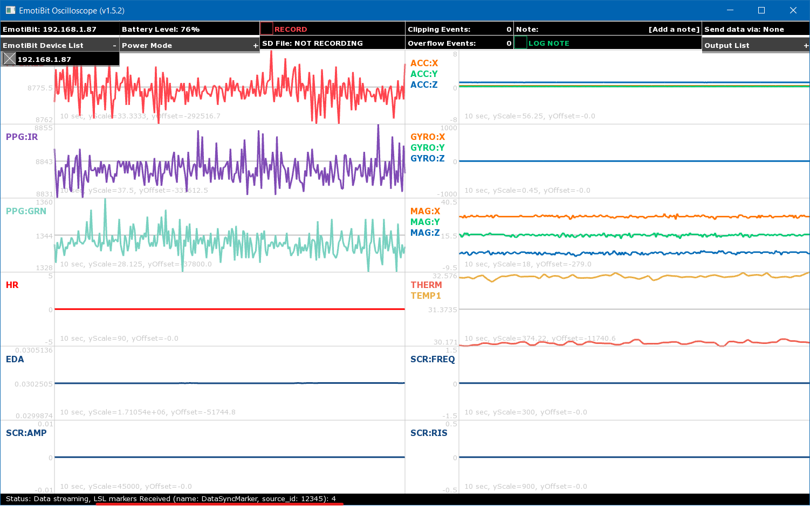

# Working with EmotiBit Data

# Table of Contents
- [Overview](#Overview)
- [EmotiBit Oscilloscope](#EmotiBit-Oscilloscope)
  - [Using EmotiBit Oscilloscope to Record Data](#Using-EmotiBit-Oscilloscope-to-Record-Data)
  - [EmotiBit Oscilloscope features](#EmotiBit-Oscilloscope-features)
  - [Using LSL with EmotiBit Oscilloscope](#Using-LSL-with-EmotiBit-Oscilloscope)
- [EmotiBit DataParser](#EmotiBit-DataParser)
  - [Parse raw data using EmotiBit DataParser](#Parse-raw-data-using-EmotiBit-DataParser)
    - [Transfer file from SD-Card to computer](#Transfer-file-from-SD-Card-to-computer)
    - [Parse raw data file](#Parse-raw-data-file)
    - [Parsing EmotiBit timestamps to LSL time](#Parsing-EmotiBit-timestamps-to-LSL-time)
  - [EmotiBit file types](#EmotiBit-file-types)
  - [EmotiBit data types](#EmotiBit-data-types) 
    - [Data type sampling rates](#Data-type-sampling-rates)
- [Visualize parsed data](#Visualize-parsed-data)
  - [Visualization tools](#Visualization-tools)

# Overview

On this page, we will talk about using EmotiBit to record data. We will also talk about various functions available in the 
EmotiBit software suite.


The EmotiBit workflow can be described as follows:
- Set up the EmotiBit as described in the Getting Started page.
- Use the EmotiBit Oscilloscope to record data.
  - The raw data is recorded as a single file on the SD-Card.
- Copy raw data files from SD-Card to computer.
- Use the EmotiBit DataParser to parse this raw data.
  - The DataParser generates one parsed data file for each data type.
- After the recorded data has been parsed, visualize the data.

# EmotiBit Oscilloscope
EmotiBit Oscilloscope offers the ability to stream data in real-time from EmotiBit to your computer along with an array of other features.

Start by opening the EmotiBit Oscillosocpe on your computer. If you need more help with opening the Emotibit Oscilloscope, 
you may refer to the instructions on the [Getting Started](./Getting_Started.md/#Running-EmotiBit-software) page.

## Using EmotiBit Oscilloscope to Record Data
Once you have succesfully set up your EmotiBit, you can start recording data using the EmotiBit Oscilloscope. If you have
not yet set up your EmotiBit, check our guide on the [Getting Started](./Getting_Started.md/#Running-EmotiBit-software) page.

To start a record session, follow these steps:
- Select the EmotiBit from the `EmotiBit Device List`.
  - If you have multiple EmotiBits on the network, select the EmotiBit you want to record data from.
- Once an EmotiBit is selected, the Oscilloscope starts streaming data.
- Click on the `Record Button` on the top console on the Oscillscope.
- Once a recording session has been started, the `Record Button` section becomes red.
- You will notice that the EmotiBit RED LED starts blinking.
- The name of the file being recorded appears below the `Record Button` on the Oscilloscope.
- You can end the recording session by pressing the `Record Button` again.
  - Once ended, the EmotiBit RED LED stops blinking.
- You now have a raw data files on the SD-Card!

[Click here to learn how to use the DataParser](#Parse-raw-data-using-EmotiBit-DataParser) to convert the raw data into parsed data files.
<br> If you want to learn about all the features offered by the EmotiBit Oscilloscope, check out the section [below](#EmotiBit-Oscilloscope-features).

## EmotiBit Oscilloscope features
- The Oscilloscope offers the following features:
![][EmotiBit-Oscilloscope]

[ToDo:Update the Gif above to represent the new oscilloscope]
  - <details><summary>Connecting to EmotiBit</summary>

    - The Oscilloscope displays all available EmotiBits on the network in a list.  
    - You can click on any EmotiBit in the list to connect to it. 
    </details>

  - <details><summary>Streaming real-time Data</summary>

    - The moment you connect to an EmotiBit, the EmotiBit Ocsilloscope will display the data being transmitted by the EmotiBit.
    - Once a connection between the Oscilloscope and EmotiBit has been established, the EmotiBit Blue LED turns ON.
      - The EmotiBit Blue LED stays on as long as the EmotiBit is connected to an Oscilloscope. 
    </details>
  
  - <details><summary>Recording Data</summary>
    
    - Select an EmotiBit from the list of available EmotiBits.
    - You can initiate a record session by clicking on the record button. When a record session is initiated, the EmotiBit will start recording the data on the onboard SD-Card as well as stream it on the Oscilloscope.
      - The EmotiBit Red LED starts blinking once a recording session has been initiated.
    - You are free to move in/out of the network, close the Oscilloscope, or connect to a new Oscilloscope.
    - We recommend using the EmotiBit in-network as much as possible, connected to the Oscilloscope. This helps in generating more time-syncs which improves timestamp accuracy.
    </details>
  
  - <details><summary>Log note(labeling data)</summary>
    
    - Users can annotate data by adding labels/notes in real time. 
    - Type in the Note in the `Log Note` text box and click on the `Log Note` button to add notes to the data being recorded.
    </details> 
    
  - <details><summary>Power Modes</summary>
    
    The EmotiBit has 4 power modes. All modes can be accessed using the EmotiBit Oscilloscope.
    - **Normal Mode**: In normal mode, the EmotiBit works with complete functionality, being able to record and transmit data.
    - **Low Power Mode**: In Low power mode, the EmotiBit can record but cannot transmit data in real-time. It, however, continues to get the time-sync pulses.
    - **WiFi Off**: The onboard WiFi shield is shut down in this mode. This saves power and enables longer recording sessions.
      - However, since the WiFi shield is Off, the EmotiBit cannot get time-sync pulses, which can lead to less accurate time stamping. 
      - A `long press` of the EmotiBit button toggles `normal mode` and `WiFi off mode`.
      - If using the EmotiBit in `WiFi off` mode, we recommend leaving the EmotiBit running for a few minutes towards the end of the record session in `normal mode`.
    - **Sleep**: In sleep mode, EmotiBit stops any tasks it is performing and goes to sleep.
      - We recommend switching the EmotiBit into `Sleep mode` instead of un-plugging the EmotiBit battery when not in use for short periods.
      - If the EmotiBit is being left un-used for a long duration, it is best to flip the Hibernate Switch to `HIB`.
      - Refer [EmotiBit LEDs and buttons section](./Learn_more_about_emotibit.md#LEDs-and-Buttons) for more information on the Hibernate switch.
    </details>
  
  - <details><summary>DC/DO counter</summary>

    `Data Clipping` and `Data Overflow` are metrics that are used to determine data integrity.
    
    - `Data Clipping`: A clipping event occurs when the data recorded by any sensor goes out of the predefined bounds. 
    - `Data Overflow`: An overflow event occurs when the internal data buffers overflow, which results in loss of data samples.
    </details>

  - <details><summary>Battery Level Indicator</summary>
  
    - The Battery Level indicator displays the charge available in the battery as a percentage. 
    - We recommend not letting the battery fall below 10% as it might begin to interfere with the sensor data acquisition.
    </details>

  - <details><summary>Output List</summary>

    The output list shows the options available to transmit the data out of the EmotiBit Oscilloscope.
    - <details><summary>OSC</summary>

      - **EmotiBit Oscilloscope v1.2.0 and up** support the ability to transmit incoming data from an EmotiBit to a user-defined output channel using the OSC protocol.
      - To enable OSC, just click on the `Output List` dropdown in the EmotiBit Oscilloscope and enable `OSC`.
      - The EmotiBit Oscilloscope reads in and transmits out the data according to the specifications provided in the `oscOutputSettings.xml` file. The file path depends on your operating system.
        - Windows: `C:\Program Files\EmotiBit\EmotiBit Oscilloscope\data\oscOutputSettings.xml`
        - macOS: `EmotiBitOscilloscope/Contents/resources/oscOutputSettings.xml`
        - Linux: `EmotiBit Oscilloscope/bin/data/oscOutputSettings.xml`
      - You can modify the contents of this file to control the behavior of the OSC output stream.
      - A snippet of the default contents are shared below
      ```
      <patchboard>
	      <settings>
		      <input>
			      <type>EmotiBit</type>
		      </input>
		      <output>
			      <type>OSC</type>
			      <ipAddress>localhost</ipAddress>
			      <port>12345</port>
		      </output>
	      </settings>
	      <patchcords>
		      <patch>
			      <input>PR</input>
			      <output>/EmotiBit/0/PPG:RED</output>
		      </patch>		
              <patch>
			      <input>PI</input>
			      <output>/EmotiBit/0/PPG:IR</output>
		      </patch>	
		      <patch>
			      <input>PG</input>
			      <output>/EmotiBit/0/PPG:GRN</output>
		      </patch>
	      </patchcords>
      </patchboard>	
      ```
      - As you can see, the `input` is set to an EmotiBit, which is streaming data to the oscilloscope.
      - The Oscilloscope takes this data and relays it over the IP-Address and Port specified. 
      - A `patch` connects an input stream to an output stream. 
        - As an example, the input `PR` (PPG Red channel) stream is patched to the output stream called `/EmotiBit/0/PPG:IR`. 
      - When using the OSC protocol, at the receiver, you must use the same IP-Address, Port number, and label name you used as the output label here. To get started, check out this example of [OSC Oscilloscope as a receiver](https://github.com/produceconsumerobot/ofxOscilloscope/tree/master/oscOscilloscopeExample). If you have enabled OSC data transmission on the Emotibit Oscilloscope, you can run the example in the above link to plot the data being relayed by the EmotiBit oscilloscope.
    </details>
  </details>

### Using LSL with EmotiBit Oscilloscope
You can use the EmotiBit oscillosocpe to ingest an LSL marker stream and use that stream to timestamp
EmotiBit data to LSL time. To start receiving LSL stream, you need to specify the LSL stream name and
source_id. To do so, follow the steps below:

- <details><summary>Specifying LSL marker stream for EmotiBit Oscilloscope</summary>

  You need to specify the marker stream information in the `emotibitCommSettings.json` file. You can find this file:
    - On Windows: `C:\Program Files\EmotiBit\EmotiBit Oscilloscope\data`
    - On macOS: `EmotiBitSoftware-macOS/EmotiBitOscilloscope.app/Contents/Resources`
    - On Linux: `EmotiBitSoftware-linux/ofxEmotiBit/EmotiBitOscilloscope/bin/data`
 
   If you don't already have an LSL marker stream, you may use the example in [`EmotiBit/ofxLSL`](https://github.com/EmotiBit/ofxLSL#example-for-generating-marker-stream).
  For Example, an LSL marker stream with **name** `DataSyncMarker` and **source_id** `12345` can be specified in the `emotibitCommSettings.json` as shown below
  ```
    {
      "wifi": {
        "advertising": {
          "transmission": {
            "broadcast": {
              "enabled": true
            },
            "unicast": {
              "enabled": false,
              "ipMax": 254,
              "ipMin": 2
            }
          }
        },
        "network": {
          "excludeList": [ "" ],
          "includeList": [ "*.*.*.*" ]
        }
      },
      "lsl": {
        "marker": {
          "name": "DataSyncMarker",
          "sourceId": "12345"
        }
      }
    }
  ```
  With the stream information specified, when you open the EmotiBit Oscilloscope, you can find the same information on the status bar (at the bottom of the Oscilloscope). The EmotiBit Oscilloscope will continue to search for the stream till it is detected. 
  	

  Once detected, the EmotiBit starts receiving markers from the stream and displays a `markers received` count on the status bar. You need atleast 2 markers to generate LSL timestamps.
  
  
  **Note: Please make sure that your marker stream has both a **name** and a **source_id**. Connecting to a stream that only has the **name** specified
  can cause the Oscilloscope to crash, if the marker stream disconnects un-expectedly. This however, does not affect any data being recorded on the EmotiBit!**
  </details>

# EmotiBit DataParser
The DataParser is used to convert the raw recorded data into parsed data files.<br>
Start by opening the EmotiBit DataParser on your computer. If you need more help with opening the Emotibit DataParser, 
you may refer to the instructions on the [Getting Started](./Getting_Started.md/#Running-EmotiBit-software) page.

## Parse raw data using EmotiBit DataParser

### Transfer file from SD-Card to computer
The data recorded using EmotiBit is stored on the SD-Card. To parse the raw data, 
copy both the **raw data file** and the **info file**(`_info.json`) from the SD-Card to the computer(You may use the provided SD-Card reader to do so!).

### Parse raw data file
 
The steps below describe how you can use the DataParser to parse the raw data file to generate individual parsed data files.
- Click on the `Load file` button to open a file browser. Navigate to the raw data(**csv**) file which you want to parse and select that file.
- The parser will show the progress as it parses the data. The DataParser quits automatically on completion.
- The parsed data files are created in the same directory as the original **raw data file**.

![][EmotiBit-DataParser]

For more deatils on the file types check out the section [below]().

### Parsing EmotiBit timestamps to LSL time

- <details><summary>Parsing EmotiBit data using LSL timestamps</summary>
  
  To do so, you will need to use the `parsedDataFormat.json` file. You can find the file:
  - On Windows: `C:\Program Files\EmotiBit\EmotiBit DataParser\data`
  - On macOS: `EmotiBitSoftware-macOS/EmotiBitDataParser.app/Contents/Resources`
  - On Linux: `EmotiBitSoftware-linux/ofxEmotiBit/EmotiBitDataParser/bin/data`

  
  To include the appropriate LSL time in the parsed output, just set the **addToOutput** filed to `true` in the `parsedDataFormat.json` file.
  - Setting **LslLocalTimestamp** to `true` adds timestamps acording to the time on the local LSL clock of the system.
  - Setting **LslMarkerSourceTimestamp** to `true` adds timestamps according to the time set on the 
marker source generator system.
  For example, if you want to add the timestamps as per your local LSL clock (the clock on the system running the EmotiBit Oscilloscope), the file should look like as shown below.
  ```
  {
    "timestampColumns": [
      {
        "identifier": "TL",
        "columnHeader": "LocalTimestamp",
        "addToOutput": true
      },
      {
        "identifier": "LC",
        "columnHeader": "LslLocalTimestamp",
        "addToOutput": true
      },
      {
        "identifier": "LM",
        "columnHeader": "LslMarkerSourceTimestamp",
        "addToOutput": false
      }
    ]
  }
  ```
  When **addToOutput** is set to `true`, an additional column is added to the parsed output, with the column header set as the `columnHeader` specified in the file above.
  </details>

## EmotiBit file types
There are 3 types of files associated with EmotiBit
- Raw data file(**csv**)
  - Every recording sessions generates 1 raw data file.
  - This file is named with the start time of the recording session. Ex: `2019-01-30_11-57-13-492.csv`
- Information file(**json**)
  - Along with the raw data file, each recording session generates 1 `info` file.
  - It contains information like sampling rates and other important settings for each sensor/stream.
  - It shares the name of the raw file. For example, the `info` file for the above raw file will be named `2019-01-30_11-57-13-492_info.json`
- Parsed data files(**csv**)
  - the raw file is converted to parsed files by running the DataParser.
  - Each parsed file contains data for a specific data type.
  - The name for each parsed file is created by joining the `TypeTag` of the data type to the raw file name.
    - Ex: After running the data parser on `2019-01-30_11-57-13-492.csv`, the parsed data file containing the data for `PPG IR channel` 
    will be called `2019-01-30_11-57-13-492_PI.csv`
    - For more details on data types, see [EmotiBit Data Types](#emotibit-data-types) (below).

![][EmotiBit-File-Types]


## EmotiBit data types
Each data type represents a unique signal captured by EmotiBit and is represented by a unique `TypeTag`. The most up-to-date list of TypeTags can be found in https://github.com/EmotiBit/EmotiBit_XPlat_Utils/blob/master/src/EmotiBitPacket.cpp

For a quick look at the available data types, you can check out the table below. We periodically update this table as the EmotiBit firmware grows.

- <details open><summary><b>Biometric TypeTags</b></summary>

  |TypeTag    | Description          |
  |:-----:|----------------------|
  |EA     |EDA- Electrodermal Activity  |
  |EL     |EDL- Electrodermal Level     |
  |ER     |EDR- Electrodermal Response (EmotiBit V4+ combines ER into EA signal)  |
  |PI     |PPG Infrared          |
  |PR     |PPG Red               |
  |PG     |PPG Green             |
  |T0     |Temperature          |
  |TH     |Temperature via Medical-grade Thermopile (only on EmotiBit MD)   |
  |AX     |Accelerometer X       |
  |AY     |Accelerometer Y       |
  |AZ     |Accelerometer Z       |
  |GX     |Gyroscope X           |
  |GY     |Gyroscope Y           |
  |GZ     |Gyroscope Z           |
  |MX     |Magnetometer X        |
  |MY     |Magnetometer Y        |
  |MZ     |Magnetometer Z        |
  |SA     |Skin Conductance Response (SCR) Amplitude        |
  |SR     |Skin Conductance Response (SCR) Rise Time |
  |SF     |Skin Conductance Response (SCR) Frequency |
  |HR     |Heart Rate        |
  |BI     |Heart Inter-beat Interval        |
  |H0     |Humidity (only on EmotiBit Alpha/Beta V1, V2, V3)     |

  </details>

- <details><summary><b>General Typetags</b></summary>

  |TypeTag    | Description                       |
  |:-----:|:----------------------------------|
  |EI     |EmotiBit Info Json                 |
  |DC     |Data Clipping, TypeTag in Payload  |
  |DO     |Data Overflow, TypeTag in Payload  |
  |B%     |Battery Percentage Remaining       |
  |BV     |Battery Voltage                    |
  |D%     |SD card percent capacity filled    |
  |RD     |Request Data, TypeTag in Payload   |
  |PI     |Ping                               |
  |PO     |Pong                               |
  |RS     |Reset                              |

  </details>

- <details><summary><b>Computer to EmotiBit TypeTags</b></summary>

  |TypeTag    | Description                       |
  |:-----:|:----------------------------------|
  |GL     |[GPS latitude and Longitude][GPS]  |
  |GS     |[GPS Speed][GPS]                   |
  |GB     |[GPS Bearing][GPS]                 |
  |GA     |[GPS Altitude][GPS]                |
  |TL     |Local Computer Timestamp           |
  |TU     |UTC Timestamp                      |
  |TX     |Crosstime, used for timestamp comparison   |
  |LM     |LSL Marker/message                 |
  |RB     |Record begin (Include timestamp in Data)   |
  |RE     |Record End                         |
  |UN     |User Note                          |
  |MH     |Mode Hibernate                     |
  |HE     |Hello EmotiBit, used to establish communication  |

  </details>

### Data type sampling rates
The following table shows the sampling rates at which the sensors operate with the stock EmotiBit firmware.

| Function |Data Type| Sensor IC | Sampling Rate (samples per second)|
|----------|---------|-----------|--------------|
| Motion   |`AX` `AY` `AZ` `GX` `GY` `GZ` `MX` `MY` `MZ`|BMI160+BMI150|25|
|PPG |`PI` `PG` `PR`| MAX30101|25|
|Temperature |`T0` / `TH`|MAX30101 / MLX90632 |7.5|
|EDA|`EA` `EL` `ER`|ADS1113|15|

# Visualize parsed data
Visualization tools can often help answer some immediate questions and hence, can be very useful when working with time-series data. Below we have outlined a number of tools that we think can be very successful.
## Visualization tools
- Text Editors
  - Notepad++(on Windows)
  - Text Edit(on mac)
- Spreadsheet softwares
  - Microsoft Excel
  - Google Sheets 
- [EmotiBit python data viewer](https://github.com/EmotiBit/EmotiBit_Biometric_Lib/tree/master/py/examples/dataviewer_example)
  - A tool created for visualizing all data channels in one window. 
  - ![][EmotiBit-PythonDataViewer]

[EmotiBit-Oscilloscope]: ./assets/Visualizer_green_800px.gif "EmotiBit-Oscilloscope"
[EmotiBit-File-Types]: ./assets/EmotiBit_File_Types.png "EmotiBit-File-Types"
[EmotiBit-DataParser]: ./assets/DataParser.png "EmotiBit-Dataparser"
[EmotiBit-PythonDataViewer]: ./assets/PythonDataViewer.jpg "EmotiBit-PythonDataViewer"
