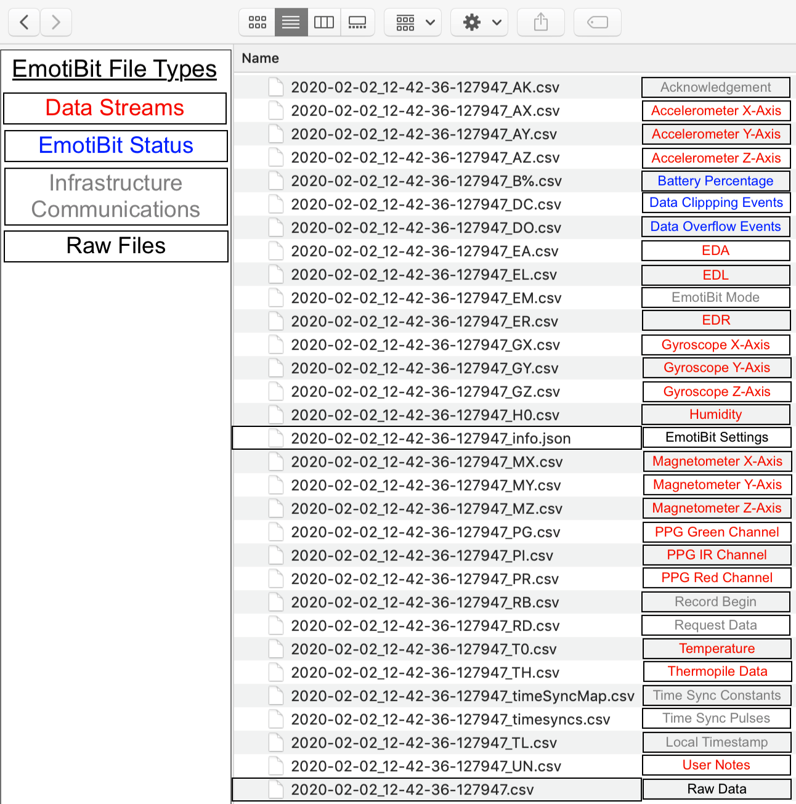

# Working with EmotiBit Data
We at Connected Future Labs created EmotiBit keeping **data** at the core of development. We realize that Data is the most important aspect of working with EmotiBit and therefore, we have developed
some essential tools which we think will help our users interact better with the EmotiBit.
On this page we will talk about:
- [**EmotiBit Oscilloscope**](#Real-Time-Streaming): An intuitive and powerful tool to **live stream data** from any EmotiBit active on the Network. You would also use this tool to initiate
recording, add User-Notes and an array of other useful features
- [**EmotiBit DataParser**](#Next-Steps-Converting-Raw-Data): It is hard to parse and make intuitive sense of the raw data collected by the EmotiBit. We have therefore created a parser, which goes through the raw data and creates data files that are easy to read and interpret by humans or other visualization software.
- [**Data Visualization**](#Next-Steps-Visualize-Recorded-Data): Being able to visualize data helps in making intuitive sense of the data collected. We suggest some tools which we have found to be very useful in analyzing data and also introduce a tool we have created in python to visualize all data streams on one screen.

## Real-Time Streaming
The ability to stream data in real-time from the EmotiBit to a computer is incredible. The EmotiBit Oscilloscope offers this capability along with an array of other functionalities.

### Grab the EmotiBit oscilloscope
- If you have not already, grab the [latest release of EmotiBit Oscilloscope](https://github.com/EmotiBit/ofxEmotiBit/releases/latest)
You can follow the installation instruction on the [getting started](./Getting_Started.md/#Installing-EmotiBit-Software) page.

### EmotiBit Oscilloscope user guide
- The Oscilloscope offers the following functionalities:
![][EmotiBit-Oscilloscope]

[ToDo:Update the Gif above to represent the new oscilloscope]
  - <details><summary>Track All EmotiBits on the N/W</summary>

    - All active EmotiBits on the same network as the host computer show up on the Oscilloscope.  
    - The EmotiBit you are connected to appears with an `X` in front of the IP address of that EmotiBit.  
    - All other EmotiBits, if present are grouped as a list. You can have several Oscilloscopes open on the same computer with an EmotiBit connected to each Oscilloscope. **However**, one Oscilloscope can be connected only to one EmotiBit at a time. If an EmotiBit is already connected to an Oscilloscope, it appears **greyed out** to all other oscilloscopes on the network.
    </details>

  - <details><summary>Stream real-time Data</summary>

    - The Moment you connect to an EmotiBit, the EmotiBIt Ocsilloscope will begin to display the data being transmitted by the EmotiBit. You can switch between available EmotiBits in the list and the data streams will update automatically.
    </details>
  
  - <details><summary>Recording Data</summary>
    
    - This is one of the most important features offered by the EmotiBit Oscilloscope. 
    - By clicking on the Record button, you can initiate a record session on the Selected EmotiBit. When a record session is initiated, the EmotiBit will start recording the data on the onboard SD-Card as well as stream it on the Oscilloscope.
    - The Important thing to note is that a recording session can be initiated only from an EmotiBit Oscilloscope window.
    - The EmotiBit uses this connection with an Oscilloscope to generate time syncing information essential for data integrity. We, therefore, recommend using the EmotiBit in-network as much as possible, connected to the Oscilloscope.
    - Once the Recording has been Initiated, you will notice the `red recording` indicator led flashing on the EmotiBit. You are also free to move in/out of the network, close the Oscilloscope, or connect to a new Oscilloscope.

    </details>
  
  - <details><summary>Adding User Notes(labeling data)</summary>
    
    - The ability to add User Notes was recognized as **essential for the user experience** by our development team. 
    The EmotiBit Oscilloscope can be used to label/tag the data being recorded by the EmotiBit in real-time.
    Note that the User Note feature is available only when a recording session has been initiated by the user.
    </details> 
    
  - <details><summary>Power Modes</summary>
    
    The EmotiBit has 4 power modes it can work in. All modes can be accessed using the EmotiBit Oscilloscope.
    - **Normal Mode**: In normal mode, the EmotiBit works with complete functionality, being able to record and transmit data.
    - **Low Power Mode**: In Low power mode, the EmotiBit can record but cannot transmit data in real-time. It, however, continues to get the time-sync pulses.
    - **WiFi Off**: This mode causes the EmotiBit to shut down the onboard WiFi shield. This saves power and enables long recording sessions. However, since the WiFi shield is Off, the EmotiBit cannot get time-sync pulses, which can lead to less accurate time stamping. A `long press` of the EmotiBit button toggles `normal mode` and `WiFi off mode`. If using the EmotiBit in `WiFi off` mode, we recommend leaving the EmotiBit running for a couple of minutes towards the end of the record session in `normal mode`. This can potentially help with time-syncing issues.
    - **Sleep**: In sleep mode, EmotiBit stops any tasks it is performing and goes to sleep. We recommend switching the EmotiBit into `Sleep mode` instead of un-plugging the EmotiBit battery when not in use for short periods. If the EmotiBit is being left un-used for a long duration, it is best to flip the Hibernate Switch located at the bottom to `HIB`. 
    </details>
  
  - <details><summary>DC/DO counter</summary>

    Data Clipping and Data Overflow are metrics that are used to determine data integrity. Each metric is explained here:
    
    - Data Clipping: A clipping event occurs when the data recorded by any sensor goes out of the predefined bounds. The user should interpret the occurrence of a clipping event as a point in time where the captured data does not represent the actual physical phenomenon.
    - Data Overflow: An overflow event occurs when the internal data buffers are filled and no new data being generated can be recorded. This leads to    "blanks" in the data time series. An overflow event should be taken more seriously, as the EmotiBit has been designed to avoid such scenarios.
    </details>

  - <details><summary>Battery Level Indicator</summary>
  
    - The Battery Level indicator displays the charge available in the battery as a percentage. We recommend not letting the battery fall below 10% as it might begin to interfere with the sensor data acquisition.
    </details>

  - <details><summary>Output List</summary></details>


    The output list shows the options available to transmit the data out of the EmotiBit Oscilloscope.
    - <details><summary>OSC</summary>

      - **EmotiBit Oscilloscope v1.2.0 and up** support the ability to transmit incoming data from an EmotiBit to a user-defined output channel using the OSC protocol.
      - To enable OSC, just click on the `Output List` dropdown in the EmotiBit Oscilloscope and enable `OSC`.
      - The EmotiBit Oscilloscope reads in and transmits out the data according to the specifications provided in the `oscOutputSettings.xml` file.
        - This file is located in the EmotiBit Oscilloscope folder in the C: - `C:\Program Files\EmotiBit\EmotiBit Oscilloscope\data`.
      - You can modify the contents of this file to control the behavior of the OSC output stream.
      - A snippet of the default contents are shared below
      ```
      <patchboard>
	      <settings>
		      <input>
			      <type>EmotiBit</type>
		      </input>
		      <output>
			      <type>OSC</type>
			      <ipAddress>localhost</ipAddress>
			      <port>12345</port>
		      </output>
	      </settings>
	      <patchcords>
		      <patch>
			      <input>PR</input>
			      <output>/EmotiBit/0/PPG:RED</output>
		      </patch>		
              <patch>
			      <input>PI</input>
			      <output>/EmotiBit/0/PPG:IR</output>
		      </patch>	
		      <patch>
			      <input>PG</input>
			      <output>/EmotiBit/0/PPG:GRN</output>
		      </patch>
	      </patchcords>
      </patchboard>	
      ```
        - As you can see, the `input` is set to an EmotiBit, which is streaming data to the oscilloscope.
        - The Oscilloscope takes this data and relays it over the IP-Address and Port specified. 
        - A `patch` connects an input stream to an output stream. 
          - As an example, the input `PR` (PPG Red channel) stream is patched to the output stream called `/EmotiBit/0/PPG:IR`. 
        - When using the OSC protocol, at the receiver, you must use the same IP-Address, Port number, and label name you used as the output label here. To get started, check out this example of [OSC Oscilloscope as a receiver](https://github.com/produceconsumerobot/ofxOscilloscope/tree/master/oscOscilloscopeExample). If you have enabled OSC data transmission on the Emotibit Oscilloscope, you can run the example in the above link to plot the data being relayed by the EmotiBit oscilloscope.
      </details>
  </details>

## Next Steps: Converting Raw Data
Data integrity and precise time stamping have been given paramount importance while designing the EmotiBit. Hence, the raw data collected by the EmotiBit, although very accurate, is less intuitively understood by human eyes. The `EmotiBit data parser` is a tool that converts this **raw** data into individual files that represent each channel of data acquired.
 
### What you should have at this point
- [Get the data parser](https://github.com/EmotiBit/ofxEmotiBit/releases/latest)
- Data recorded using the EmotiBit. 
  - EmotiBit records data in a single csv file on the onboard SD-Card. To use the parser, you will need to transfer the data file(csv) onto the computer. 
  - You can do so by removing the SD-Card from the EmotiBit and transfer the `.csv` and `.json` files onto the system using the SD-Card USB reader provided in the box.
  - **Note:** _When you initiate a recording, EmotiBit automatically names the file with the date and time, when the recording was initiated. For example, `2019-08-22_14-10-33-300661.csv`, can be decoded as_ 
    - `2019-08-22` as the date in the format `YYYY-MM-DD`
    - `14-10-33-300661` as the time in the format `HH-MM-SS-MicroSeconds`

[ToDo: find a place to explain the contents of json file]
### User Guide

- <details open><summary><b>Using the EmotiBit data parser</b></summary>
  
  ![][EmotiBit-DataParser]
  - Open the EmotiBit data parser. 
  - The data parser is split into 3 main regions:
    - `Status Bar`: The Status bar on the EmotiBit data parser displays the state of the parser. It can either be `IDLE` or `PROCESSING`. The data parser is in the `PROCESSING` state when it is performing the conversion of a file. It is `IDLE` otherwise
    - `Process File Button`: Click on the button to load a file to process.
    - `Activity monitor`: This section displays data from the file which is being parsed. When the EmotiBit data parser is `IDLE` this section is blank.
  - Click on the `Process file button`. A file browser opens up. Navigate to the `csv` file which you want to process and select that file.
  - You will see the lines in the data file being displayed on the `Activity monitor` as the parser goes through the file.
  - When EmotiBit data parser has finished processing the file, it will exit automatically. 
  - You will notice the folder that contained the original `csv` file will now contain additional `csv` files. Each additional `csv` file has the name of the sensor channel it represents appended to base file name.
  - For example, if the base file was named `2019-08-22_14-10-33-300661.csv`, you will get, among other files, a file named `2019-08-22_14-10-33-300661_AX.csv` which represents the data for the accelerometer X-axis channel.
  </details>

#### EmotiBit File Types
  

      
- For more details on the EmotiBit data types, check out the [EmotiBit Packet Architecture](./Learn_more_about_emotibit.md/#TypeTag-Character-Codes)

#### EmotiBit sensor sampling rates

- The following table shows the sampling rates at which the sensors operate. Since all the sensors are not operating at the same sampling rates, this information can be useful in understanding the time-stamping between data from different sensors

| Function |Data Type| Sensor IC | Sampling Rate (samples per second)|
|----------|---------|-----------|--------------|
| Motion   |`AX` `AY` `AZ` `GX` `GY` `GZ` `MX` `MY` `MZ`|BMI160+BMI150|25|
|PPG (heartrate) |`PI` `PG` `PR`| MAX30101|25|
|Temperature & Humidity|`T0` `H0`|SI-7013|7.5|
|Temperature(FIR)|`TH`|MLX90632|7.5|
|EDA|`EA` `EL` `ER`|-|15|

## Next Steps: Visualize Recorded Data
Visualization tools can often help answer some immediate questions and hence, can be very useful when working with time-series data. Below we have outlined a number of tools that we think can be very successful.
### Visualization Tools
- Text Editors
  - Notepad++(on Windows)
  - Text Edit(on mac)
- Spreadsheet softwares
  - Microsoft Excel
  - Google Sheets 
- [EmotiBit python data viewer](https://github.com/EmotiBit/EmotiBit_Biometric_Lib/tree/master/py/examples/dataviewer_example)
  - A tool created for visualizing all data channels in one window. 
  - ![][EmotiBit-PythonDataViewer]

[EmotiBit-Oscilloscope]: ./assets/Visualizer_green_800px.gif "EmotiBit-Oscilloscope"
[EmotiBit-File-Types]: ./assets/EmotiBit_File_Types.png "EmotiBit-File-Types"
[EmotiBit-DataParser]: ./assets/DataParser.png "EmotiBit-Dataparser"
[EmotiBit-PythonDataViewer]: ./assets/PythonDataViewer.jpg "EmotiBit-PythonDataViewer"
