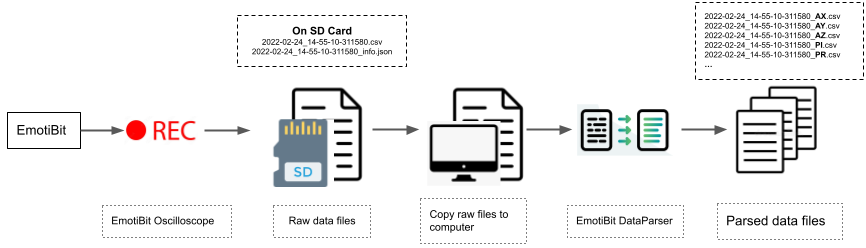
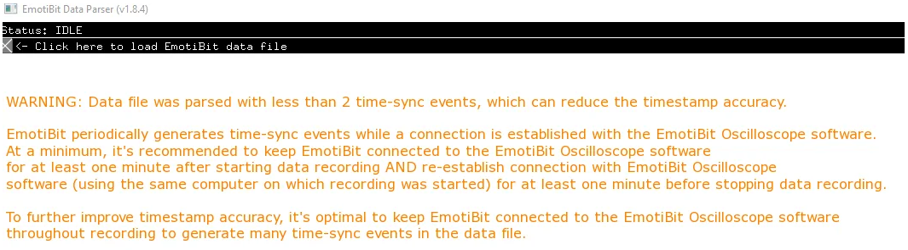

# Working with EmotiBit Data

# Table of Contents
- [Overview](#Overview)
- [EmotiBit Oscilloscope](#EmotiBit-Oscilloscope)
  - [Using EmotiBit Oscilloscope to Record Data](#Using-EmotiBit-Oscilloscope-to-Record-Data)
    - [Active recording session indicator](#Active-recording-session-indicator)
  - [EmotiBit Oscilloscope features](#EmotiBit-Oscilloscope-features)
  - [Settings files location](#Settings-files-location)
  - [EmotiBit Oscilloscope network settings](#EmotiBit-Oscilloscope-network-settings)
  - [Using LSL with EmotiBit Oscilloscope](#Using-LSL-with-EmotiBit-Oscilloscope)
    - [LSL output](#LSL-output)
    - [Timesync with LSL using marker stream](#Timesync-with-LSL-using-marker-stream)
  - [EmotiBit Oscilloscope display settings](#EmotiBit-Oscilloscope-display-settings)
- [EmotiBit DataParser](#EmotiBit-DataParser)
  - [Parse raw data using EmotiBit DataParser](#Parse-raw-data-using-EmotiBit-DataParser)
    - [Transfer file from SD-Card to computer](#Transfer-file-from-SD-Card-to-computer)
    - [Parse raw data file](#Parse-raw-data-file)
    - [Raw data format](#Raw-data-format)
    - [Parsed data file format](#Parsed-data-file-format)
    - [Parsing EmotiBit timestamps to LSL time](#Parsing-EmotiBit-timestamps-to-LSL-time)
    - [Batch Parsing](#Batch-parsing)
    - [A note on Timesyncs](#A-note-on-Timesyncs)
  - [EmotiBit file types](#EmotiBit-file-types)
  - [EmotiBit data types](#EmotiBit-data-types) 
    - [Data type sampling rates](#Data-type-sampling-rates)
- [Visualize parsed data](#Visualize-parsed-data)
  - [Visualization tools](#Visualization-tools)
- [Next steps](#Next-steps)
# Overview

On this page, we will talk about using EmotiBit to record data. We will also talk about various functions available in the 
EmotiBit software suite.



The EmotiBit workflow can be described as follows:
- Set up the EmotiBit as described in the Getting Started page.
- Use the EmotiBit Oscilloscope to record data.
  - The raw data is recorded as a single file on the SD-Card.
- Copy raw data files from SD-Card to computer.
- Use the EmotiBit DataParser to parse this raw data.
  - The DataParser generates one parsed data file for each data type.
- After the recorded data has been parsed, visualize the data.

# EmotiBit Oscilloscope
EmotiBit Oscilloscope offers the ability to stream data in real-time from EmotiBit to your computer along with an array of other features.

Start by opening the EmotiBit Oscillosocpe on your computer. If you need more help with opening the Emotibit Oscilloscope, 
you may refer to the instructions on the [Getting Started](./Getting_Started.md/#Running-EmotiBit-software) page.

## Using EmotiBit Oscilloscope to Record Data
Once you have succesfully set up your EmotiBit, you can start recording data using the EmotiBit Oscilloscope. If you have
not yet set up your EmotiBit, check our guide on the [Getting Started](./Getting_Started.md/#Running-EmotiBit-software) page.

To start a record session, follow these steps:
- Select the EmotiBit from the `EmotiBit Device List`.
  - If you have multiple EmotiBits on the network, select the EmotiBit you want to record data from.
- Once an EmotiBit is selected, the Oscilloscope starts streaming data.
- Click on the `Record Button` on the top console on the Oscillscope.
- Once a recording session has been started, the `Record Button` section becomes red.
- To end a recording, toggle the Recording button by clicking on it again.

### Active recording session indicator
You can check if a recording session is currently active by either checking the EmotiBit or the EmotiBit Oscilloscope.
- **Indication on the EmotiBit**
  - You will notice that the EmotiBit RED LED starts blinking if a recording session is active.
  - The EmotiBit RED LED will continue to blink till the active recording session has been stopped using the EmotiBit Oscillosocpe.
- **Indication on the EmotiBit Oscilloscope**
  - When you open the Oscilloscope, all available EmotiBits on the network will be listed under the `device list`. Select the EmotiBit you are interested in from the device list.
  - If a recording session is currently active, the name of the file being recorded appears below the `Record Button`. This name indicates the time when the recording was started.
    - *Pro-tip: You can check the length of active recording by subtracting the current time from the time displayed in the `Recording section` on the Oscillosocpe.*

[Click here to learn how to use the DataParser](#Parse-raw-data-using-EmotiBit-DataParser) to convert the raw data into parsed data files.
<br> If you want to learn about all the features offered by the EmotiBit Oscilloscope, check out the section [below](#EmotiBit-Oscilloscope-features).

## EmotiBit Oscilloscope features
- The Oscilloscope offers the following features:
![][EmotiBit-Oscilloscope]

[ToDo:Update the Gif above to represent the new oscilloscope]
  - <details><summary>Connecting to EmotiBit</summary>

    - The Oscilloscope displays all available EmotiBits on the network in a list.  
    - You can click on any EmotiBit in the list to connect to it. 
    </details>

  - <details><summary>Streaming real-time Data</summary>

    - The moment you connect to an EmotiBit, the EmotiBit Ocsilloscope will display the data being transmitted by the EmotiBit.
    - Once a connection between the Oscilloscope and EmotiBit has been established, the EmotiBit Blue LED turns ON.
      - The EmotiBit Blue LED stays on as long as the EmotiBit is connected to an Oscilloscope. 
    </details>
  
  - <details><summary>Recording Data</summary>
    
    - Select an EmotiBit from the list of available EmotiBits.
    - You can initiate a record session by clicking on the record button. When a record session is initiated, the EmotiBit will start recording the data on the onboard SD-Card as well as stream it on the Oscilloscope.
      - The EmotiBit Red LED starts blinking once a recording session has been initiated.
    - You are free to move in/out of the network, close the Oscilloscope, or connect to a new Oscilloscope.
    - We recommend using the EmotiBit in-network as much as possible, connected to the Oscilloscope. This helps in generating more time-syncs which improves timestamp accuracy.
    </details>
  
  - <details><summary>Log note(labeling data)</summary>
    
    - Users can annotate data by adding labels/notes in real time. 
    - Type in the Note in the `Log Note` text box and click on the `Log Note` button to add notes to the data being recorded.
    </details> 
    
  - <details><summary>Power Modes</summary>
    
    The EmotiBit has 4 power modes. All modes can be accessed using the EmotiBit Oscilloscope.
    - **Normal Mode**: In normal mode, the EmotiBit works with complete functionality, being able to record and transmit data.
    - **Low Power Mode**: In Low power mode, the EmotiBit can record but cannot transmit data in real-time. It, however, continues to get the time-sync pulses.
    - **WiFi Off**: The onboard WiFi shield is shut down in this mode. This saves power and enables longer recording sessions. 
      - A `short press` of the [EmotiBit button](https://github.com/EmotiBit/EmotiBit_Docs/blob/master/Getting_Started.md#emotibit-leds-and-buttons) toggles `normal mode` and `WiFi off mode`.
      - If using the EmotiBit in `WiFi off` mode, we recommend toggling the EmotiBit to `normal mode` (short EmotiBit Button press) towards the end of the recording. Once in `normal mode` you can reconnect to the EmotiBit using the EmotiBit Oscilloscope and stream data for ~30 seconds to collect timesync pulses towards the end of the recording.
    - **Sleep**: In sleep mode, EmotiBit stops any tasks it is performing and goes to sleep.
      - A `long press` of the [EmotiBit button](https://github.com/EmotiBit/EmotiBit_Docs/blob/master/Getting_Started.md#emotibit-leds-and-buttons) can activate the sleep mode.
      - We recommend switching the EmotiBit into `Sleep mode` instead of un-plugging the EmotiBit battery when not in use for short periods.
      - If the EmotiBit is being left un-used for a long duration, it is best to flip the Hibernate Switch to `HIB`.
      - Refer [EmotiBit LEDs and buttons section](./Learn_more_about_emotibit.md#LEDs-and-Buttons) for more information on the Hibernate switch.
    </details>
  
  - <details><summary>DC/DO counter</summary>

    `Data Clipping` and `Data Overflow` are metrics that are used to determine data integrity.
    
    - `Data Clipping`: A clipping event occurs when the data recorded by any sensor goes out of the predefined bounds. 
    - `Data Overflow`: An overflow event occurs when the internal data buffers overflow, which results in loss of data samples.
    </details>

  - <details><summary>Battery Level Indicator</summary>
  
    - The Battery Level indicator displays the charge available in the battery as a percentage. 
    - We recommend not letting the battery fall below 10% as it might begin to interfere with the sensor data acquisition.
    </details>

### Output List
- The output list shows the options available to transmit the data out of the EmotiBit Oscilloscope.
- Each output protocol uses settings specified in the unique file name, defined in the sections below.
- Depending on your operating system, the settings file can be found in the locations listed below
      - Windows: `C:\Program Files\EmotiBit\EmotiBit Oscilloscope\data\`
      - macOS: `EmotiBitOscilloscope/Contents/resources/`
      - Linux: `EmotiBit Oscilloscope/bin/data/`     - 
- <details><summary>OSC</summary>

  - **EmotiBit Oscilloscope v1.2.0 and up** support the ability to transmit incoming data from an EmotiBit to a user-defined output channel using the OSC protocol.
  - To enable OSC, just click on the `Output List` dropdown in the EmotiBit Oscilloscope and enable `OSC`.
  - The EmotiBit Oscilloscope reads in and transmits out the data according to the specifications provided in the `oscOutputSettings.xml` file. 
  - You can find the settings file in the path mentioned above.
  - You can modify the contents of this file to control the behavior of the OSC output stream.
  - A snippet of the default contents are shared below
    ```
    <patchboard>
      <settings>
        <input>
          <type>EmotiBit</type>
        </input>
        <output>
          <type>OSC</type>
          <ipAddress>localhost</ipAddress>
          <port>12345</port>
        </output>
      </settings>
      <patchcords>
        <patch>
          <input>PR</input>
          <output>/EmotiBit/0/PPG:RED</output>
        </patch>		
            <patch>
          <input>PI</input>
          <output>/EmotiBit/0/PPG:IR</output>
        </patch>	
        <patch>
          <input>PG</input>
          <output>/EmotiBit/0/PPG:GRN</output>
        </patch>
      </patchcords>
    </patchboard>	
    ```
  - As you can see, the `input` is set to an EmotiBit, which is streaming data to the oscilloscope.
  - The Oscilloscope takes this data and relays it over the IP-Address and Port specified. 
  - A `patch` connects an input stream to an output stream. In the snippet above, the input `PR` (PPG Red channel) stream is patched to the output stream called `/EmotiBit/0/PPG:IR`
    - The `<input>` tag should contain the Typetag of the data you want to relay. The available typetags can be found in the [section below](#EmotiBit-data-types).
    - The `<output>` tag should contain the name of the OSC stream you want to relay the data as.
  - For example, to add SCR (Skin conductance response) metrics to OSC, you would add the following lines to the relevant section of the `oscOutputSettings.xml` file.
    ```
    <patch>
    <input>SA</input>
    <output>/EmotiBit/0/SCR:AMP</output>
      </patch>
      <patch>
    <input>SR</input>
    <output>/EmotiBit/0/SCR:RIS</output>
      </patch>
      <patch>
    <input>SF</input>
    <output>/EmotiBit/0/SCR:FREQ</output>
    </patch>
    ```   
  - When using the OSC protocol, at the receiver, you must use the same IP-Address, Port number, and label name you used as the output label here. To get started, check out this example of [OSC Oscilloscope as a receiver](https://github.com/produceconsumerobot/ofxOscilloscope/tree/master/oscOscilloscopeExample). If you have enabled OSC data transmission on the Emotibit Oscilloscope, you can run the example in the above link to plot the data being relayed by the EmotiBit oscilloscope.
  </details>
    
- <details><summary>UDP</summary>
  
  - **EmotiBit Oscilloscope v1.7.1 and up** support the ability to transmit incoming data from an EmotiBit to a user-defined output channel using the UDP protocol.
  - To enable UDP, just click on the `Output List` dropdown in the EmotiBit Oscilloscope and enable `UDP`.
  - The EmotiBit Oscilloscope reads in and transmits out the data according to the specifications provided in the `udpOutputSettings.xml` file.
  - You can find the settings file in the path mentioned above. You can modify the contents of this file to control the behavior of the UDP output stream.
  - A snippet of the default contents are shared below
  ```
  <patchboard>
    <settings>
      <input>
        <type>EmotiBit</type>
      </input>
      <output>
        <type>UDP</type>
        <ipAddress>localhost</ipAddress>
        <port>12346</port>
      </output>
    </settings>
    <patchcords>
    </patchcords>
  </patchboard>		
  ```
  </details>

- <details><summary>LSL</summary>

  - **EmotiBit Oscilloscope v1.11.1 and up** support the ability to transmit incoming data from an EmotiBit to a user-defined LSL stream.
  - To enable UDP, just click on the `Output List` dropdown in the EmotiBit Oscilloscope and enable `LSL`.
  - The LSL stream details are provided in the `lslOutputSettings.json` file. You can find this settings file in the operating-system-specific location mentioned above. Modifying the contents on this file updates the LSL stream details being transmitted by the EmotiBit.
  - The **patchcords** section in the documentation ties the input EmotiBit stream to the name of the output LSL stream. A complete list of EmotiBit data typetags can be found [here](#EmotiBit-data-types). 
  </details>

## EmotiBit Oscilloscope settings

### Settings files location

Based on the operating system, users can find the settings files in the following locations:
- For Windows users(Users will also need to give the file "write privileges". Check out this [FAQ](https://www.reddit.com/r/EmotiBit/comments/urp7dq/how_do_i_edit_files_installed_by_emotibit/) to learn how):
  - `C:\Program Files\EmotiBit\EmotiBit Oscilloscope\data\`
- For mac users
  - `EmotiBitSoftware-macOS/EmotiBitOscilloscope.app/Contents/Resources/`
  - Note: Users need to right-click the `EmotiBitOscilloscope` application (*inside the software bundle just downloaded*) and click on `Show Package Contents`. You can then find the files in `Contents > Resources`
- For linux users
  - `EmotiBitSoftware-linux/ofxEmotiBit/EmotiBitOscilloscope/bin/data/`

### EmotiBit Oscilloscope network settings
The software release `v1.4.11` adds the ability for users to tweak their network settings using the `emotibitCommSettings.json` file.
Refer the [section above](#Settings-files-location) to locate this file on your system.

- <details><summary><b>emotibitCommSettings.json</b></summary>

  - `sendAdvertisingInterval_msec` allows users to specify how frequently (time in mS) they want the Oscilloscope to ping the network to find EmotiBit. The default setting should work in most cases and we recommend
changing this setting only if it is required by your network admin.
  - `checkAdvertisingInterval_msec` allows users to specify how frequently (time in mS) they want the Oscilloscope to search for EmotiBit responses on the network. 
Again, we recommend changing this setting only if it is required by your network admin.
  - Users can now choose between `broadcast` vs `unicast` advertising. You can also specify ip ranges to ping for unicast! This will be beneficial for users that: 
    - are working with routers that block broadcast(ex: iPhone hotspot). Check out the note below for using the latest Oscilloscope(v1.4.11) with iPhone hotspot.
    - perform poorly with unicast. The oscilloscope now uses broadcast by default, so it should just work... and work better!
  - Specifically in `unicast mode` there are 2 more options available. Most users will never have to change these settings, but if you are working
in a constrained network environment, these settings may help to conform to network admin requirements.
    - `nUnicastIpsPerLoop` specified the number of IPs you want to ping at time.
    - `unicastMinLoopDelay_msec` specifies the min time to wait before trying to ping IPs on the network again.
  - Ability to exclude or include networks while looking for EmotiBits.
    - `excludeList`: If you don't want EmotiBit Oscilloscope to look for EmotiBit in a particular network, add it to the excludeList
    - `includeList`: If you want EmotiBit Oscilloscope to look for EmotiBits ins specific networks, add it to the includeList

  **Special note for iPhone hotspot users**
	
    iPhone does not allow broadcasting on its hotspot. Since the new Oscilloscope(v1.4.11+) uses broadcast(for advertising) by default, users will have to make the following change in the emotibitCommSettings.json to use EmotiBit on iPhone hotspot.
	1. Locate the file (as suggested above) based on your operating system.
	2. change "broadcast" -> "enabled" to false
	3. change "unicast" -> "enabled" to true
	4. Save the file.
	5. Run the Oscilloscope app!

    The modified file should look like the snippet shown below.
	```
    {
      "wifi": {
        "advertising": {
          "sendAdvertisingInterval_msec": 1000,
          "checkAdvertisingInterval_msec": 100,
          "transmission": {
            "broadcast": {
              "enabled": true
            },
            "unicast": {
              "enabled": true,
              "ipMax": 254,
              "ipMin": 2,
              "nUnicastIpsPerLoop": 1,
              "unicastMinLoopDelay_msec": 3
            }
          }
        },
        "network": {
          "excludeList": [ "" ],
          "includeList": [ "*.*.*.*" ]
        }
      },
      "lsl": {
        "marker": {
          "name": "",
          "sourceId": ""
        }
      }
    }

	```
  </details>

### Using LSL with EmotiBit Oscilloscope
#### LSL output
You can use the EmotiBit Oscilloscope to relay incoming EmotiBit data to output LSL streams. Check out the [output list section](#Output-List) aboce for more details.

#### Timesync with LSL using marker stream
EmotiBit oscillosocpe can ingest an LSL marker stream and use that stream to timestamp
EmotiBit data being recorded to LSL time. A marker stream is specified by a `name` and `sourceId`. By default the EmotiBit Oscilloscope searches for a LSL marker stream with the name `DataSyncMarker` and sourceId `12345`. You can create this stream by referring this [example](https://github.com/EmotiBit/ofxLSL/#example-for-generating-marker-stream).

If you want the Oscilloscope to search for a different marker stream, please refer the steps below.

- <details><summary>Specifying LSL marker stream for EmotiBit Oscilloscope</summary>

  You need to specify the marker stream information in the `emotibitCommSettings.json` file. 
Refer the [section above](#Settings-files-location) to locate this file on your system.
 
  For Example, an LSL marker stream with **name** `DataSyncMarker` and **source_id** `12345` can be specified in the `emotibitCommSettings.json` as shown below
  ```
    {
      "wifi": {
        "advertising": {
          "transmission": {
            "broadcast": {
              "enabled": true
            },
            "unicast": {
              "enabled": false,
              "ipMax": 254,
              "ipMin": 2
            }
          }
        },
        "network": {
          "excludeList": [ "" ],
          "includeList": [ "*.*.*.*" ]
        }
      },
      "lsl": {
        "marker": {
          "name": "DataSyncMarker",
          "sourceId": "12345"
        }
      }
    }
  ```
  With the stream information specified, when you open the EmotiBit Oscilloscope, you can find the same information on the status bar (at the bottom of the Oscilloscope). The EmotiBit Oscilloscope will continue to search for the stream till it is detected. 
  	

  Once detected, the EmotiBit starts receiving markers from the stream and displays a `markers received` count on the status bar. You need at least 2 markers during the recording to generate LSL timestamps.
  

  Check out this [section](#Parsing-EmotiBit-timestamps-to-LSL-time) to enable the DataParser to add LSL timestamps in the parsed data.

  **Note: Please make sure that your marker stream has both a **name** and a **source_id**. Connecting to a stream that only has the **name** specified
  can cause the Oscilloscope to crash, if the marker stream disconnects un-expectedly. This however, does not affect any data being recorded on the EmotiBit!**
  </details>

### EmotiBit Oscilloscope display settings
Users can use the `ofxOscilloscopeSettings.xml` file to change other Oscillocsope settings.
Refer the [section above](#Settings-files-location) to locate this file on your system.

- <details><summary>Using ofxOscilloscopeSettings.xml file</summary>

  Each datastream is a `plot` on a `scope panel`. The example below shows the settings available for each scope.
  ```
  <scope>
      <samplingFrequency>25.000000000</samplingFrequency> ## represents the sampling rate of the signal
      <timeWindow>10.000000000</timeWindow>               ## duration of time represented in the scope
      <yMin>0.000000000</yMin>                            ## min. signal threshold for display
      <yMax>0.000000000</yMax>                            ## max. signal threshold for display
      <minYSpan>0.000000000</minYSpan>                    ## min. allowed (yMax-yMin)
      <plot>
          <plotId>0</plotId>                              ## Plot ID. !! DO not change this. It should always follow the information specified in inputSettings.xml
          <plotName>PPG:RED</plotName>                    ## Plot name displayed on the screen
          <plotColor>                                     ## Plot color in RGB channels
              <r>255</r>               
              <g>69</g>
              <b>78</b>
          </plotColor>
      </plot>
  </scope>
  ```
  Close any running Oscilloscope window. Change any setting in this file. Reopen EmotiBit Oscilloscope to see the changes take effect.
  
  As an example, if you are using the 100Hz PPG example, then the PPG plot settings look something like:
  ```
  <scope>
        <samplingFrequency>100.000000000</samplingFrequency>
        <timeWindow>10.000000000</timeWindow>
        <yMin>0.000000000</yMin>
        <yMax>0.000000000</yMax>
        <minYSpan>0.000000000</minYSpan>
        <plot>
            <plotId>0</plotId>
            <plotName>PPG:RED</plotName>
            <plotColor>
                <r>255</r>
                <g>69</g>
                <b>78</b>
            </plotColor>
        </plot>
    </scope>
	<scope>
        <samplingFrequency>100.000000000</samplingFrequency>
        <timeWindow>10.000000000</timeWindow>
        <yMin>0.000000000</yMin>
        <yMax>0.000000000</yMax>
        <minYSpan>0.000000000</minYSpan>
        <plot>
            <plotId>1</plotId>
            <plotName>PPG:IR</plotName>
            <plotColor>
                <r>128</r>
                <g>75</g>
                <b>181</b>
            </plotColor>
        </plot>
    </scope>
	<scope>
        <samplingFrequency>100.000000000</samplingFrequency>
        <timeWindow>10.000000000</timeWindow>
        <yMin>0.000000000</yMin>
        <yMax>0.000000000</yMax>
        <minYSpan>0.000000000</minYSpan>
        <plot>
            <plotId>2</plotId>
            <plotName>PPG:GRN</plotName>
            <plotColor>
                <r>120</r>
                <g>209</g>
                <b>192</b>
            </plotColor>
        </plot>
    </scope>
  ```
  </details>

# EmotiBit DataParser
The DataParser is used to convert the raw recorded data into parsed data files.<br>
Start by opening the EmotiBit DataParser on your computer. If you need more help with opening the Emotibit DataParser, 
you may refer to the instructions on the [Getting Started](./Getting_Started.md/#Running-EmotiBit-software) page.

## Parse raw data using EmotiBit DataParser

### Transfer file from SD-Card to computer
The data recorded using EmotiBit is stored on the SD-Card. You can transfer the data from the EmotiBit to the computer in 2 ways.
1. **Using SD card reader**
    - Remove the SD card from the EmotiBit.
    - Plug it into the provided SD-Card reader provided with the Essentials kit or All-in-one-bundle.
    - Plug the SD card reader into the computer. Once the Card is detected on the computer, you can simply copy the files to a location on your computer.
2. <details><summary><b>Using a FTP server on EmotiBit (**only available on ESP32 Feather Huzzah**)</b></summary>

    - With the EmotiBit switched on and running, plug it into the computer using the provided USB cable.
    - Make sure the EmotiBit is not recording data.
    - Open a Arduino Serial monitor. For more details, check out this [FAQ](https://www.reddit.com/r/EmotiBit/comments/vmtz6w/how_i_use_the_arduino_serial_monitor_with_emotibit/).
    - Select `baud rate`=2000000 and `No line ending` from the dropdown options.
    - Type `F` into the input message bar and press Enter.
    - You will see that the EmotiBit will enter FTP mode (red, blue, and yellow LEDs light up on EmotiBit).
    - 
    - You you can trasnfer the files from EmotiBit using an FTP client.
    - Download and install [Filezilla Client](https://filezilla-project.org/), if you do not already have it.
    - Open Filezilla and follow the connection setup instructions as shown in this [link](https://mischianti.org/simple-ftp-server-library-now-with-support-for-wio-terminal-and-sd/#Configure_client)
      - The `Host` IP address will be printed on the serial monitor.
      - The default **user name** is `ftp` and the default **password** is `ftp`. You can change these values in the firmware. In the future, these credentials will be accessible using the `config` file.
    - Once you connect to the FTP server, you can then drag any file from EmotiBit to any location on your computer (inside the FileZilla interface), and it will we copied over the WiFi!
    - 
	- Reset the EmotiBit to exit the FTP mode and enter normal operation.
    </details>

### Raw data format
The raw data is stored in the following format. The following steps discuss using the EmotiBit DataParser to parse raw data files.<br>

`EMOTIBIT_TIMESTAMP`,`PACKET#`,`NUM_DATAPOINTS`,`TYPETAG`,`VERSION`,`RELIABILITY`,`PAYLOAD`
- **EMOTIBIT_TIMESTAMP:** milliseconds since EmotiBit bootup
- **PACKET#:** sequentially increasing packet count
- **NUM_DATAPOINTS:** Number of data points in the payload
- **TYPETAG:** [type of data](#motibit-data-types) being sent
- **VERSION:** packet protocol version
- **RELIABILITY:** data reliability score out of 100 (for future use)
- **PAYLOAD:** data points

A sample of the raw data file is shown below.
- <details><summary>Sample raw data file</summary>

  ```
  531386,17296,1,RB,1,100,2024-09-18_22-59-45-827135
  531388,17297,4,EM,1,100,RS,RB,2024-09-18_22-59-45-827135.csv,PS,MN
  531473,17298,3,PI,1,100,112870,112866,112867
  531473,17299,3,PR,1,100,26870,26855,26857
  531473,17300,3,PG,1,100,3720,3704,3717
  531459,17301,2,EA,1,100,0.030269,0.030269
  531459,17302,2,EL,1,100,26425.000000,26425.000000
  531452,17303,1,T1,1,100,33.037
  531467,17304,1,TH,1,100,29.770
  531473,17305,3,AX,1,100,-0.436,-0.434,-0.433
  531473,17306,3,AY,1,100,-0.015,-0.015,-0.015
  531473,17307,3,AZ,1,100,0.967,0.968,0.970
  531473,17308,3,GX,1,100,-0.275,-0.244,-0.275
  531473,17309,3,GY,1,100,0.732,0.793,0.732
  531473,17310,3,GZ,1,100,-0.061,-0.061,-0.092
  531473,17311,3,MX,1,100,37,38,37
  531473,17312,3,MY,1,100,-56,-57,-56
  531473,17313,3,MZ,1,100,-56,-56,-57
  ```
  </details>


### Parse raw data file

The steps below describe how you can use the DataParser to parse the raw data file to generate individual parsed data files.
- Click on the `Load file` button to open a file browser. Navigate to the raw data(**csv**) file which you want to parse and select that file.
- The parser will show the progress as it parses the data. The DataParser quits automatically on completion.
- The parsed data files are created in the same directory as the original **raw data file**.

![][EmotiBit-DataParser]

For more details on the file types check out the section [below]().

### Parsed data file format
- The parsed data is stored in the following format

|LocalTimestamp | EmotiBitTimestamp | PacketNumber | DataLength | TypeTag | ProtocolVersion | DataReliability | Data | 
|---------------|---------------|---------------|---------------|---------------|---------------|---------------|---------------|
|Epoch time in seconds | EmotiBit time in milli-seconds (emotibit time resets everytime emotibit is rebooted) | Packet number the data point was extracted from (sequentially increases) | Number of data points in the packet | TypeTag of the data (see below) | Reserved for future extensibility | Reserved for future extensibility | Data points |

- The format of the parsed data file can be changed by modifying the `parsedDataFormat.json` file. 
  - <details><summary>parsedDataFormat.json file location</summary>
  
    - On Windows: `C:\Program Files\EmotiBit\EmotiBit DataParser\data`
    - On macOS: `EmotiBitSoftware-macOS/EmotiBitDataParser.app/Contents/Resources`
    - On Linux: `EmotiBitSoftware-linux/ofxEmotiBit/EmotiBitDataParser/bin/data`
    </details>
  - **Note: If this file is erroneously modified, for example, the modified file does not conform to JSON standard (a missing `,` or `[` or `{`), the EmotiBitDataparser will skip loading this file. The parsed output, in this case, will be missing the `LocalTimestamp` column.**

- <details><summary>Adding LSL timestamp column by modifying parsedDataFormat</summary>
  
  To include the appropriate LSL time in the parsed output, just set the **addToOutput** to `true` in the `parsedDataFormat.json` file. 
  Note: LSL timestamps are only relevant if you are using a [LSL marker stream with EmotiBit Oscillosocpe](#timesync-with-lsl-using-marker-stream).
  - Setting **LslLocalTimestamp** to `true` adds timestamps acording to the time on the local LSL clock of the system.
  - Setting **LslMarkerSourceTimestamp** to `true` adds timestamps according to the time set on the 
marker source generator system.
  For example, if you want to add the timestamps as per your local LSL clock (the clock on the system running the EmotiBit Oscilloscope), the file should look like as shown below.
  ```
  {
    "timestampColumns": [
      {
        "identifier": "TL",
        "columnHeader": "LocalTimestamp",
        "addToOutput": true
      },
      {
        "identifier": "LC",
        "columnHeader": "LslLocalTimestamp",
        "addToOutput": true
      },
      {
        "identifier": "LM",
        "columnHeader": "LslMarkerSourceTimestamp",
        "addToOutput": false
      }
    ]
  }
  ```
  When **addToOutput** is set to `true`, an additional column is added to the parsed output, with the column header set as the `columnHeader` specified in the file above.
  </details>

See below for a sample of the a parsed file of typetag AX (Accelerometer X axis)
- <details><summary>Parsed data file example</summary>
  
  ```
  LocalTimestamp,EmotiBitTimestamp,PacketNumber,DataLength,TypeTag,ProtocolVersion,DataReliability,AX
  1726714786.598369,531473.000,17305,3,AX,1,100,-0.436
  1726714786.598369,531473.000,17305,3,AX,1,100,-0.434
  1726714786.598369,531473.000,17305,3,AX,1,100,-0.433
  1726714786.638383,531513.000,17322,3,AX,1,100,-0.434
  1726714786.678397,531553.000,17322,3,AX,1,100,-0.433
  1726714786.718411,531593.000,17322,3,AX,1,100,-0.434
  1726714786.758425,531633.000,17337,2,AX,1,100,-0.437
  1726714786.798439,531673.000,17337,2,AX,1,100,-0.436
  1726714786.838453,531713.000,17354,3,AX,1,100,-0.432
  1726714786.878467,531753.000,17354,3,AX,1,100,-0.434
  1726714786.918481,531793.000,17354,3,AX,1,100,-0.435
  1726714786.958495,531833.000,17370,2,AX,1,100,-0.432
  1726714786.998509,531873.000,17370,2,AX,1,100,-0.435
  1726714787.038523,531913.000,17388,3,AX,1,100,-0.434
  1726714787.078537,531953.000,17388,3,AX,1,100,-0.436
  1726714787.118551,531993.000,17388,3,AX,1,100,-0.434
  1726714787.158565,532033.000,17402,2,AX,1,100,-0.434
  1726714787.198579,532073.000,17402,2,AX,1,100,-0.433
  1726714787.238593,532113.000,17419,3,AX,1,100,-0.435
  1726714787.278607,532153.000,17419,3,AX,1,100,-0.432
  1726714787.318621,532193.000,17419,3,AX,1,100,-0.434
  1726714787.358635,532233.000,17435,2,AX,1,100,-0.435
  1726714787.398649,532273.000,17435,2,AX,1,100,-0.433
  1726714787.438663,532313.000,17455,3,AX,1,100,-0.435
  1726714787.478677,532353.000,17455,3,AX,1,100,-0.434
  ```
  </details>

### Batch parsing
- The parser can currently be run from the command line with the filename (to be parsed) passed as an argument.
- We have created a [shell script](https://github.com/EmotiBit/ofxEmotiBit/blob/master/EmotiBitDataParser/bin/EmotiBitDataParser.sh) to leverage this functionality and "batch parse" multiple files in 1 go.
  - Just grab the script from the repository and run it with the correct arguments.
- As an example, you can place all your raw files in a folder, let's say `data`.
  - Then you can run the script as `./EmotiBitDataParser.sh -x "C:\\Program Files\\EmotiBit\\EmotiBit DataParser\\EmotiBitDataParser.exe" -d "path\\to\\data"`
  - The parser will then parse all the files present in the data folder.
- We plan to further bake this into the software by making this a part of the GUI and it will be rolled out in a future release.

### A note on Timesyncs
- We use periodic timesyncs from the EmotiBit Oscilloscope to improve the accuracy of the data timestamps on EmotiBit.The time syncing mechanism helps in correcting for any drift that may be introduced by the microcontroller clock.
- Timesync pulses are transmitted to Emotibit periodically, as long as the EmotiBit Oscilloscope is connected to EmotiBit. These timesyncs are written with the raw data on the SD-Card to help the DataParser with time calibration.
- The DataParser uses the timesyncs with the shortest Round-Trip-Times(RTT) to calibrate timestamps. The calibration works best if the raw data contains multiple timesyncs spaced throughout the recording. At minimum, the calibration requires 2 timesyncs.
- However, since timesyncs are only recorded while the EmotiBit is connected to the Oscilloscope, it is possible that the recorded data has fewer than 2 timesyncs. A scenario where the Oscilloscope was closed immediately after starting a recording session can lead to this situation.
- In cases where the EmotiBit DataParser finds fewer than 2 timesyncs, a warning will be displayed to the user after the file is parsed making them aware of the effect of having fewer than 2 timesyncs on the timestamp accuracy.
  - 
- <details><summary>What to expect when you have 0 timesync events in the recorded file</summary>
  
  - **The values in the LocalTimeStamp will start from 0**. This is because the data does not have any timesyncs to create a relation between
  EmotiBitTime and LocalTime.
  - The data parser needs at least 2 timesync events to interpolate/extrapolate LocalTime. Hence, there will be no time correction to 
  any drift experienced by the emotibit clock.
  </details>
- <details><summary>What to expect when you have 1 timesync event in the recorded file</summary>

  - The values in the LocalTimeStanp column **will start form the Local Time corresponding to the moment the recording was initiated**.
  - The data parser needs at least 2 timesync events to interpolate/extrapolate LocalTime. Hence, there will be no time correction to 
  any drift experienced by the emotibit clock.
  </details>

# EmotiBit file types
There are 3 types of files associated with EmotiBit
- Raw data file(**csv**)
  - Every recording sessions generates 1 raw data file.
  - This file is named with the start time of the recording session. Ex: `2019-01-30_11-57-13-492.csv`
- Information file(**json**)
  - Along with the raw data file, each recording session generates 1 `info` file.
  - It contains information like sampling rates and other important settings for each sensor/stream.
  - It shares the name of the raw file. For example, the `info` file for the above raw file will be named `2019-01-30_11-57-13-492_info.json`
  - <details><summary>sample _info.json file</summary>

    ```
    [{
    "info": {
        "name": "EmotiBitData",
        "type": "Multimodal",
        "source_id": "EmotiBit FeatherWing",
        "hardware_version": "V05c",
        "sku": "MD",
        "device_id": "MD-V5-0000410",
        "feather_version": "Adafruit Feather HUZZAH32",
        "feather_wifi_mac_addr": "54:66:cc:7e:dc:0c",
        "firmware_version": "1.12.1",
        "firmware_variant": "EmotiBit_stock_firmware",
        "created_at": "2024-11-14_11-54-36-135729"
    }
    }, {
    "info": {
        "name": "Accelerometer",
        "type": "Accelerometer",
        "typeTags": ["AX", "AY", "AZ"],
        "channel_count": 3,
        "nominal_srate": 25,
        "channel_format": "float",
        "units": "g",
        "setup": {
            "range": 8,
            "acc_bwp": 2,
            "acc_us": 2
        }
    }
    }, {
    "info": {
        "name": "Gyroscope",
        "type": "Gyroscope",
        "typeTags": ["GX", "GY", "GZ"],
        "channel_count": 3,
        "nominal_srate": 25,
        "channel_format": "float",
        "units": "degrees/second",
        "setup": {
            "range": 1000,
            "gyr_bwp": 2,
            "gyr_us": 2
        }
    }
    }, {
    "info": {
        "name": "Magnetometer",
        "type": "Magnetometer",
        "typeTags": ["MX", "MY", "MZ"],
        "channel_count": 3,
        "nominal_srate": 25,
        "channel_format": "float",
        "units": "microhenries",
        "setup": {}
    }
    }, {
    "info": {
        "name": "ElectrodermalActivity",
        "type": "ElectrodermalActivity",
        "typeTags": ["EA"],
        "channel_count": 1,
        "nominal_srate": 15,
        "channel_format": "float",
        "units": "microsiemens",
        "setup": {
            "eda_series_resistance": 0,
            "adc_bits": 16,
            "enable_digital_filter": false,
            "samples_averaged": 5,
            "oversampling_rate": 75,
            "eda_transform_slope": 722.0528564,
            "eda_transform_intercept": 1.4121972e7
        }
    }
    }, {
    "info": {
        "name": "SkinConductanceResponseAmplitude",
        "type": "ElectrodermalActivity",
        "typeTags": ["SA"],
        "channel_count": 1,
        "channel_format": "float",
        "units": "microsiemens"
    }
    }, {
    "info": {
        "name": "SkinConductanceResponseFrequency",
        "type": "ElectrodermalActivity",
        "typeTags": ["SF"],
        "channel_count": 1,
        "nominal_srate": 3,
        "channel_format": "float",
        "units": "count/min"
    }
    }, {
    "info": {
        "name": "SkinConductanceResponseRiseTime",
        "type": "ElectrodermalActivity",
        "typeTags": ["SR"],
        "channel_count": 1,
        "channel_format": "float",
        "units": "secs"
    }
    }, {
    "info": {
        "name": "Temperature1",
        "type": "Temperature",
        "typeTags": ["T1"],
        "channel_count": 1,
        "nominal_srate": 7.5,
        "channel_format": "float",
        "units": "degrees celcius",
        "sensor_part_number": "MAX30101",
        "setup": {
            "samples_averaged": 1,
            "oversampling_rate": 7.5
        }
    }
    }, {
    "info": {
        "name": "Thermopile",
        "type": "Temperature",
        "typeTags": ["TH"],
        "channel_count": 1,
        "nominal_srate": 7.5,
        "channel_format": "float",
        "units": "degrees celcius",
        "setup": {
            "samples_averaged": 1,
            "oversampling_rate": 7.5
        }
    }
    }, {
    "info": {
        "name": "PPG",
        "type": "PPG",
        "typeTags": ["PI", "PR", "PG"],
        "channel_count": 3,
        "nominal_srate": 25,
        "channel_format": "float",
        "units": "raw units",
        "setup": {
            "LED_power_level": 47,
            "samples_averaged": 16,
            "LED_mode": 3,
            "oversampling_rate": 400,
            "pulse_width": 215,
            "ADC_range": 4096
        }
    }
    }, {
    "info": {
        "name": "HeartRate",
        "type": "PPG",
        "typeTags": ["HR"],
        "channel_count": 1,
        "channel_format": "int",
        "units": "bpm"
    }
    }, {
    "info": {
        "name": "InterBeatInterval",
        "type": "PPG",
        "typeTags": ["BI"],
        "channel_count": 1,
        "channel_format": "float",
        "units": "mS"
    }
    }]
    ```
    </details>
	
- Parsed data files(**csv**)
  - the raw file is converted to parsed files by running the DataParser.
  - Each parsed file contains data for a specific data type.
  - The name for each parsed file is created by joining the `TypeTag` of the data type to the raw file name.
    - Ex: After running the data parser on `2019-01-30_11-57-13-492.csv`, the parsed data file containing the data for `PPG IR channel` 
    will be called `2019-01-30_11-57-13-492_PI.csv`
    - For more details on data types, see [EmotiBit Data Types](#emotibit-data-types) (below).

![][EmotiBit-File-Types]


# EmotiBit data types
Each data type represents a unique signal captured by EmotiBit and is represented by a unique `TypeTag`. The most up-to-date list of TypeTags can be found in https://github.com/EmotiBit/EmotiBit_XPlat_Utils/blob/master/src/EmotiBitPacket.cpp

For a quick look at the available data types, you can check out the table below. We periodically update this table as the EmotiBit firmware grows. **Additional details about the data stream (*units, sampling rate, data format, averaging etc*) can be found in the `_info.json` file created with each recording session.**

- <details open><summary><b>Biometric TypeTags</b></summary>

  |TypeTag    | Description          |
  |:-----:|----------------------|
  |EA     |EDA- Electrodermal Activity  |
  |EL     |EDL- Electrodermal Level     |
  |ER     |EDR- Electrodermal Response (EmotiBit V4+ combines ER into EA signal)  |
  |PI     |PPG Infrared          |
  |PR     |PPG Red               |
  |PG     |PPG Green             |
  |T0     |Temperature (only on EmotiBit Alpha/Beta V1, V2, V3)         |
  |T1     |Temperature          |
  |TH     |Temperature via Medical-grade Thermopile (only on EmotiBit MD)   |
  |AX     |Accelerometer X       |
  |AY     |Accelerometer Y       |
  |AZ     |Accelerometer Z       |
  |GX     |Gyroscope X           |
  |GY     |Gyroscope Y           |
  |GZ     |Gyroscope Z           |
  |MX     |Magnetometer X        |
  |MY     |Magnetometer Y        |
  |MZ     |Magnetometer Z        |
  |SA     |Skin Conductance Response (SCR) Amplitude        |
  |SR     |Skin Conductance Response (SCR) Rise Time |
  |SF     |Skin Conductance Response (SCR) Frequency |
  |HR     |Heart Rate        |
  |BI     |Heart Inter-beat Interval        |
  |H0     |Humidity (only on EmotiBit Alpha/Beta V1, V2, V3)     |

  </details>

- <details><summary><b>General Typetags</b></summary>

  |TypeTag    | Description                       |
  |:-----:|:----------------------------------|
  |EI     |EmotiBit Info Json                 |
  |DC     |Data Clipping, TypeTag in Payload  |
  |DO     |Data Overflow, TypeTag in Payload  |
  |B%     |Battery Percentage Remaining       |
  |BV     |Battery Voltage                    |
  |D%     |SD card percent capacity filled    |
  |RD     |Request Data, TypeTag in Payload   |
  |PI     |Ping                               |
  |PO     |Pong                               |
  |RS     |Reset                              |

  </details>

- <details><summary><b>Computer to EmotiBit TypeTags</b></summary>

  |TypeTag    | Description                       |
  |:-----:|:----------------------------------|
  |GL     |[GPS latitude and Longitude][GPS]  |
  |GS     |[GPS Speed][GPS]                   |
  |GB     |[GPS Bearing][GPS]                 |
  |GA     |[GPS Altitude][GPS]                |
  |TL     |Local Computer Timestamp           |
  |TU     |UTC Timestamp                      |
  |TX     |Crosstime, used for timestamp comparison   |
  |LM     |LSL Marker/message                 |
  |RB     |Record begin (Include timestamp in Data)   |
  |RE     |Record End                         |
  |UN     |User Note                          |
  |MH     |Mode Hibernate                     |
  |HE     |Hello EmotiBit, used to establish communication  |

  </details>

- <details><summary><b>Payload labels</b></summary>

  |TypeTag    | Description                       |
  |:-----:|:----------------------------------|
  |LM     |LSL_MARKER_SRC_TIMESTAMP - The LSL time in the marker generator system |
  |LR     |LSL_MARKER_RX_TIMESTAMP - The LSL time in the receiver system. This is a calculated value derived from LM and time correction (a constant created by the LSL architecture)  |
  |LD     |LSL_MARKER_DATA - the data stored by the LSL marker|
  |LC     |LSL_LOCAL_CLOCK_TIMESTAMP - The LSL time on the local computer the EmotiBit Oscilloscope is running on|

  </details>

### Data type sampling rates
The following table shows the sampling rates at which the sensors operate with the stock EmotiBit firmware.

| Function |Data Type| Sensor IC | Sampling Rate (samples per second)|
|----------|---------|-----------|--------------|
| Motion   |`AX` `AY` `AZ` `GX` `GY` `GZ` `MX` `MY` `MZ`|[BMI160](https://www.bosch-sensortec.com/products/motion-sensors/imus/bmi160/)+[BMI150](https://www.bosch-sensortec.com/products/motion-sensors/magnetometers/bmm150/)|25|
|PPG |`PI` `PG` `PR`| [MAX30101](https://www.analog.com/en/products/max30101.html)|25|
|Temperature |`T0` / `TH`|[MAX30101](https://www.analog.com/en/products/max30101.html) / [MLX90632](https://www.melexis.com/en/product/MLX90632/Miniature-SMD-Infrared-Thermometer-IC) |7.5|
|EDA|`EA` `EL` `ER`|[ADS1114](https://www.ti.com/product/ADS1114)|15|

# Visualize parsed data
Visualization tools can often help answer some immediate questions and hence, can be very useful when working with time-series data. Below we have outlined a number of tools that we think can be very successful.
## Visualization tools
- Text Editors
  - Notepad++(on Windows)
  - Text Edit(on mac)
- Spreadsheet softwares
  - Microsoft Excel
  - Google Sheets 
- [EmotiBit python data viewer](https://github.com/EmotiBit/EmotiBit_Biometric_Lib/tree/master/py/examples/dataviewer_example)
  - A tool created for visualizing all data channels in one window. 
  - ![][EmotiBit-PythonDataViewer]

# Next Steps

- EmotiBit Firmware variants
  - Once you are familiar with the EmotiBit data collection workflow, you may want to look at available firmware variants to adapt EmotiBit to your needs.
  - A good example is the EmotiBit 100Hz PPG variant! Check out more details [here](./Learn_more_about_emotibit.md/#emotibit-firmware-variants).

[EmotiBit-Oscilloscope]: ./assets/Visualizer_green_800px.gif "EmotiBit-Oscilloscope"
[EmotiBit-File-Types]: ./assets/EmotiBit_File_Types.png "EmotiBit-File-Types"
[EmotiBit-DataParser]: ./assets/DataParser.png "EmotiBit-Dataparser"
[EmotiBit-PythonDataViewer]: ./assets/PythonDataViewer.jpg "EmotiBit-PythonDataViewer"
